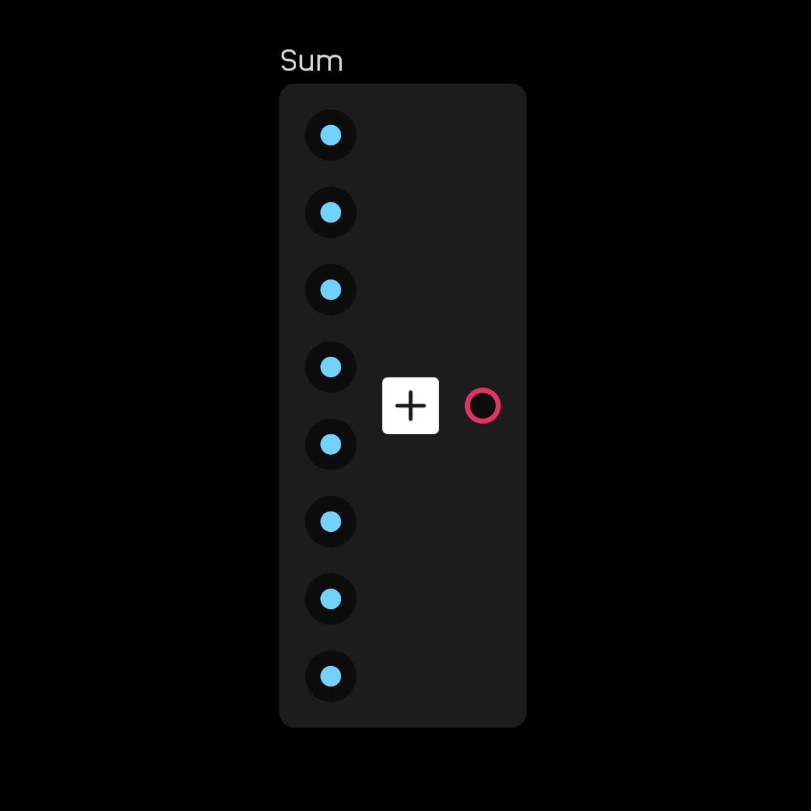
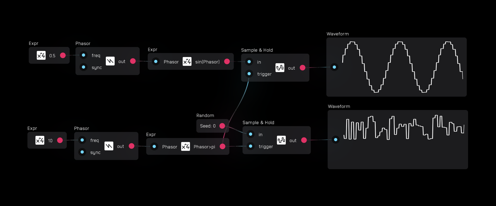
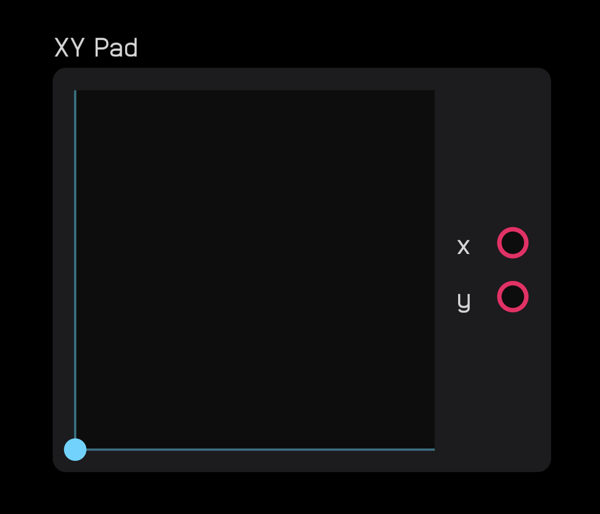
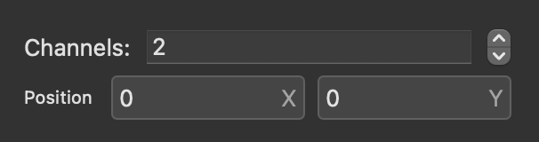

# nodes reference

## introduction to nodes


Everything in Audulus is built with `nodes`. There are 53 nodes in total.

Nodes are packets of code that do things. A node may have inputs, outputs, both, or none.

`Inputs` are on the left side of nodes and are blue. `Outputs` are on the right side of nodes and are red.

Nodes can be moved around the canvas, but they cannot be rotated.

You connect nodes together by dragging a wire from an output to an input. You cannot drag a wire from an input to an output. You can connect one output to as many inputs as you want.

You disconnect nodes by unhooking a wire from an input. Wires cannot be disconnected from an output. An input only accepts one wire. To connect multiple wires to one input, use an `add` node to first add the signals together.

Wires can go from any red output to any blue input, up, down, left, or right. However, overall signal flow in Audulus is from left to right.

Nodes send and receive signals through wires. Every signal is a number. [^1] Although all signals are numbers, there are several categories of signals. These categories are defined by their range, unit, and how they are used.

[^1]: Audulus signals are signed 32-bit floats.

The table below describes every type of signal that nodes use.

signal | range
:-- | :--
`any` | `any` signals can be any number and type of signal
`audio` | `-1 to 1`[^2]
`gate` | `0 or high` where `high` is any non-zero positive 32-bit number.
`hz`| `0 to sampleRate/2`[^3]
`integer` | an integer value
`midi value` | integers `0 to 127`
`mod`| `0 to 1`
`seconds` | `0 to 2^32-1`

[^2]: Audio signals can exceed the `-1 to 1` range, but they will be clipped to that range upon output.
[^3]: Hz values above `sampleRate/2` can be generated but are limited in use. Negative `hz` signals can be used to flip the phase of the phasor node, useful for through-zero FM.

Some nodes have attributes that are accessible in the `inspector panel`. Every node has an `(x, y)` position attribute in this panel which corresponds to its position in the patch bay.

Nodes can be packaged into `modules` and `submodules`. `Modules` are containers for nodes that allow you to create a graphical user interface front panel with knobs, sliders, buttons, ports, etc. `Submodules` are (child) `modules` inside (parent) `modules`. `Submodules` can help keep modules organized and they can be exposed on the front panel of a parent `module`.

Some nodes can be exposed, meaning they have some element that can appear on the UI of a `module`. Some are automatically exposed, like the nodes in the `module` menu like `knob` node, `slider` node, etc. Others, like the `text` node or `osc` node, have an expose toggle.

If a node can be exposed, extra x and y position text boxes will be visible on the Inspector panel where you can manually input its position on the front panel of the `module` UI.

Other nodes have attributes you can change directly on the node.

There are 10 different categories of nodes. The table below lists each category and provides a short description.

category | description
:-- | :--
`util` | various utilities
`math` | use math and logic to manipulate and create signals
`meter` | displays for monitoring signals
`midi`| MIDI utilities
`level`| tools for adjusting and analyzing signal levels
`dsp`| digital signal processing tools
`synth`| essential primitive-level synthesis tools
`module`| used for creating modules and submodules
`poly`| utilities for creating and managing polyphonic signals
`switch`| tools for routing signals

Some nodes count as outputs. Examples of outputs are `value`, `light`, and `dac` nodes.

If a node is not connected to an output, it will not be evaluated.

<br>

---


## util

**description**

`util` nodes are various utilities that perform some essential function. 

- The `adc` and `dac` nodes are used to get `audio` and `CV` in and out of Audulus. 
- The `text` node is used for labeling modules and commenting patches. 
- The `timer` node outputs time in seconds, useful for a variety of purposes including clocks, envelopes and driving automation. 
- The `zero cross` node is used to find the frequency in `Hz` of a signal based on when it crosses zero.

<br>

---


### adc


output | signal
:-- | :--
`adc` | `audio`

control | description
:-- | :--
`channel number` | access to 1 of 16 channels indexed from `0`

exposable | ❌
:-- | :--

**description**

The `adc` node is how you get `audio` and `CV` into Audulus from an external source. An external source could be a microphone, a DAW, or a CV input from a hardware modular synth.

The `adc` node outputs an `audio` signal, but in this case, all that means is that incoming signals are clamped between `-1 and 1`. The `adc` node is often used as an `audio` input, but it can also be used to pass a `gate` signal from a modular synth.

The `adc` node can access the first 16 inputs of any class-compliant audio interface.

The channels are indexed from `0`. Clicking or tapping on the channel number will increment it by 1 up to 15 when it will wrap around to 0 again.

In most cases, `0` is the left channel and `1` is the right channel.

<br>

---


### dac


input | signal
:-- | :--
`dac` | `audio`

control | description
:-- | :--
`channel number` | access to 1 of 16 channels indexed from `0`

exposable | ❌
:-- | :--

**description**

The `dac` node is how you get `audio` and `CV` out of Audulus and send it to an external output. An external output could be your headphones, speakers, a DAW, or a CV output to a hardware modular synth.

The `dac` node takes an `audio` signal input, but in this case, all that means is that outgoing signals are clamped between `-1 and 1`. The `dac` node is often used as an `audio` output, but it can also be used to pass a `gate` signal to a modular synth.

The `dac` node can access the first 16 outputs of any class-compliant audio interface.

The channels are indexed from `0`. Clicking or tapping on the channel number will increment it by 1 up to 15 when it will wrap around to 0 again.

In most cases, `0` is the left channel and `1` is the right channel.

The `dac` node does not include any DC-offset filtering. A constant DC offset can damage speakers. Most audio interfaces will filter a DC offset, but this offset can still cause distortion by decreasing the amount of headroom you have.

It is best practice to use a `dc blocker` node before a `dac` node unless you explicitly need to send a `mod` or `gate` signal to an external instrument.

<br>

---


### text


exposable | ✅
:-- | :--

**description**

The `text` node is used for commenting patches and labeling modules. Click or tap on the node and open the `inspector panel` (pictured below). You can then type in the text field and text will appear inside the node. The `text` node can also be exposed to the front panel of a module for labeling.


option | description
:-- | :--
`Align` | Choose from `Left`, `Center`, and `Right` aligned text
`Exposed` | Check the box to expose this node to the UI of the module it is contained within

The `text` node can be resized by tapping or clicking on the blue ball that appears when selecting the node and dragging the ball left or right.


Below are all of the characters that will render correctly in the `text` node.

```
ABCDEFGHIJKLMNOPQRSTUVWXYZ
abcdefghijklmnopqrstuvwxyz
ÄÅÃÁÂÀÆæâäáàåãÇçÐðÊËÉÈêëéè
ÍÎÏÌïîíìÑñÖØÓÔÒÕõöóòôøÜÚÛÙ
üûúùÝýÿßþÞ
0123456789
!"#$%&'()*+,-./:;<=>?@[\]^
_`{|}~£×¿®¬½¼¡«»©¢¥¤ı¦µ¯´¬
±¾¶§÷¸°¨•
```
Text size cannot be changed. The `canvas` node can do many manipulations with text that the `text` node cannot.

<br>

---


### timer


input | signal
:-- | :--
`trigger` | `gate`

output | signal
:-- | :--
`time` | `seconds` since last reset

exposable | ❌
:-- | :--

**description**

The `timer` node outputs a signal in `seconds` since its last reset. The node resets on the rising edge of an incoming `gate` signal.

The `timer` output increases smoothly from second to second. Its functional precision is `1/sampleRate seconds`. For example: at a sample rate of 44.1kHz the precision is `1/44,100` or approximately `0.00002 seconds`.

<br>

---


### zero cross


input | signal
:-- | :--
`in` | `any` but it must cross through or at least touch `0`

output | signal
:-- | :--
`out` | `hz`

exposable | ❌
:-- | :--

**description**

The `zero cross` node counts the time between current and previous zero-crossings and outputs that value as a `hz` signal. To be counted as a zero-crossing, the signal value must either pass through `0` or be `= 0` at some point during its cycle.

<br>

---


## math

**description**

The `math` nodes are some of the most powerful and versatile nodes. 

- The `expr` node has 40 available operators and functions for creating math expressions.
- The `sum` node adds two or more signals together.
- The `product` node multiplies two or more signals together.
- The `random` node outputs random values between 0 and 1.

<br>

---


### expr


arithmetic operator | description
:-- | :--
`x + y` | addition
`x - y` | subtraction
`x * y` | multiplication
`x / y` | division
`x^y` | exponentiation
`-x` | negation
`(x)` | parenthetical grouping

exponential function | description
:-- | :--
`exp(x)` | `e^x`
`exp2(x)` | `2^x`
`pow(x, y)` | exponentiation `x^y`
`sqrt(x)` | square root[^4]
`ln(x)` | natural log
`log2(x)` | log base 2
`log10(x)` | log base 10


[^4]: Cube roots and beyond are accessible like this: `x^(1/y)` where `x = radicand` and `y = degree`. 

boolean operator | description
:-- | :--
`x == y` | `x` is exactly equal to `y`
`x != y` | `x` is not `y`
`x < y` | `x` is less than `y`
`x <= y` | `x` is less than or equal to `y`
`x > y` | `x` is greater than `y`
`x >= y` | `x` is greater than or equal to `y`

common function | description
:-- | :--
`abs(x)` | absolute value
`floor(x)` | round down to integer
`ceil(x)` | round up to integer
`fract(x)` | `x - floor(x)`
`mod(x, y)` | remainder of `x / y`
`min(x, y)` | returns lesser of `x` and `y`
`max(x, y)` | returns greater of `x` and `y`
`clamp(x, a, b)` | restricts `x` to the interval `[a, b]`
`step(x, edge)` | `1` if `x > edge` otherwise `0`
`smoothstep(a, b, x)` | smooth step from `0 to 1` at the interval `[a, b]`
`mix(x, a, b)` | `0 to 1` at `x` smoothly transitions between the interval `[a, b]`

trigonometric function | description
:-- | :--
`sin(x)` | sine
`cos(x)` | cosine
`tan(x)` | tangent
`asin(x)` | inverse sine
`acos(x)` | inverse cosine
`atan(x)` | inverse tangent
`sinh(x)` | hyper sine
`cosh(x)` | hyper cosine
`tanh(x)` | hyper tangent
`asinh(x)` | inverse hyper sine
`acosh(x)` | inverse hyper cosine
`atanh(x)` | inverse hyper tangent

constant | description
:-- | :--
`pi` | π
`e` | Euler's number

exposable | ❌
:-- | :--

**description**

The `expr` node is the most versatile node. It does math and basic programming operations.

Double clicking on any input will create an `expr` node.

You enter equations into the `inspector panel`, pictured below. You do not need to add an `=` sign after your expression. 


You can drag and drop various selected functions into the text field, or if you know their syntax, type them directly into the text box.

Entering letters or words will create variables as inputs, as pictured below.


Syntax errors are reported underneath the input text area in the `inspector panel`.

Variables are case-sensitive, meaning `x` is not the same as `X`. Spaces and underscores are not allowed. For long variables, you can use camel case. For example: `thisIsALongVariable`. You can also use underscores for variable names. For example: `_variable_Name`.

Variables can contain numbers, but they must start with a letter or underscore. `input1` or `_input1` will generate an input but `1input` will not. Variables cannot contain symbols other than underscore.

Certain variable names are reserved, like `mod`, `e`, and `pi`. If you need to use them as variables you can capitalize the first letter, like this: `Mod`, `E`, `Pi`.

You can call a variable multiple times within an expression, like `x * x * x`.

Spaces between variables and operators and within functions are optional. `x*y` is the same as `x * y` and `clamp(x,0,1)` is the same as `clamp(x, 0, 1)`.

Functions can be nested, like `max(0, min(x, 1))`.

Divide-by-zero functions return a `0`. In other rare cases it is possible to create an expression that outputs a `nan` value, or "Not a number." The node producing the `nan` will immediately self-disconnect from your signal chain to prevent damage to speakers. A `nan` will be displayed in the `value` node, as pictured below.


Expressions like the `1/3` in `x * (1/3)` are evaluated once during start-up and replaced by a float in the background of Audulus, saving some compute time.

<br>

---


### sum


input | signal
:-- | :--
`in` | `any`
`in` | `any`
`...` | `any`

output | signal
:-- | :--
`sum` | `any`

exposable | ❌
:-- | :--

**description**

The `sum` node adds two or more signals together.

In the `inspector panel` you can specify how many channels you want to add together. The maximum is `256`.


When you increase the number of channels, the number of inputs increases accordingly.



<br>

---


### product


input | signal
:-- | :--
`in` | `any`
`in` | `any`
`...` | `any`

output | signal
:-- | :--
`out` | `any`

exposable | ❌
:-- | :--

**description**

The `product` node multiplies two or more signals together.

In the `inspector panel` you can specify how many channels you want to multiply together. The maximum is `256`.


When you increase the number of channels, the number of inputs increases accordingly.


<br>

---


### random


output | signal
:-- | :--
`out` | `mod`

exposable | ❌
:-- | :--

The `random` node outputs a new random number between `0 and 1` for every sample. In other words, it produces `white noise.`

The `Seed` value can be changed in the `inspector panel`, pictured below. Changing the `Seed` is necessary in cases where you have two or more `random` nodes in a patch and want them to produce a different string of random numbers.


If the `Seed` remains the same, every time the patch is reopened, the same string of random numbers will be produced.

<br>

---


## meter

**description**

The `meter` nodes are vital for displaying information about signals.

- The `meter` node displays a green to red bar meter between 0 and 1 for each poly channel.
- The `waveform` node displays a graph of a waveform. Best for low frequency signals.
- The `value` node displays numbers, useful for number displays on UIs as well as debugging.
- The `light` and `rgb light` nodes are great for adding light indicators to modules.
- The `scope` node behaves like an oscilloscope, well-suited for analyzing audio rate signals.
- With the `shader` and `canvas` nodes you can use your own code to create your own beautiful custom meters, visualizers, and UI elements using GLSL and Lua.

<br>

---


### meter


input | signal
:-- | :--
`in` | `audio`

exposable | ✅ 
:-- | :--

**description**

The `meter` node displays the amplitude of a signal. The input works in a range of `-1 to 1`. However, `0 to 1` will display the same as `0 to -1`, as you can see below:


In the `inspector panel` the `meter` node can be resized by altering the height and width parameters, as seen below. It is also exposable.


If both `W` and `H` values are `0`, then the node defaults to its standard size and will automatically resize to fit UI elements. The node can be resized however you want, but it cannot be rotated.


If you wire a `poly` signal to a `meter` node, it automatically creates one meter per channel. 


<br>

---


### waveform


input | signal
:-- | :--
`in` | `audio`

exposable | ✅
:-- | :--

**description**

The `waveform` node allows you to see signals change over time. It has a fixed 5-second window and moves from left to right.

Since it works with the `audio` range, the top limit of the node is `1`, the center is `0`, and the bottom is `-1`.


The `waveform` node works best with low frequency signals. If you want to examine audio-rate signals, use a `scope` node.


<br>

---


### value


input | signal
:-- | :--
`in` | `any`

exposable | ✅
:-- | :--

**description**

The `value` node displays the current value of any signal.

In the `inspector panel`, you can set precision from `0` to `0.0000`, and an option to alight `Left`, `Right`, or `Center`. The `value` node is also exposable.


Changing precision can be useful for UI displays. For example, a sequencer's `current step` display makes more sense as a whole number, not a decimal.


If you wire a `poly` signal to a `value` node, it automatically creates one value display per channel. 


<br>

---


### light


input | signal
:-- | :--
`in` | `gate`

exposable | ✅ automatic
:-- | :--


**description**

The `light` node turns on when the incoming signal is `high` (any non-zero positive number). Otherwise it stays off.


<br>

---


### rgb light


input | signal
:-- | :--
`r` | `mod`
`g` | `mod`
`b` | `mod`

exposable | ✅ automatic
:-- | :--


**description**

The `rgb light` node has 3 inputs: one for red `r`, one for green `g`, and one for blue `b`.


Each input is clamped to a value between 0 and 1.


Any color can be created by sending different values between 0 and 1 to each input. For example, if you send a value of 1 to red and a value of .5 to green, the color of the rgb light will be orange.


<br>

---

### scope


input | signal
:-- | :--
`x` | `audio`
`y` | `audio`
`r` | `mod`
`g` | `mod`
`b` | `mod`
`s` | `mod`

exposable | ✅
:-- | :--


**description**

The `scope` node is akin to an oscilloscope. It can visualize high frequency waveforms, phase relationships, and Lissajous curves that you otherwise could not with the `waveform` node.

A cursor draws a dot with a color of `{r, g, b}` at the coordinates `(x, y)` where both `x` and `y` have a range of `-1 to 1`. The point `(0, 0)` is the center of the display.


The `p` variable refers to the persistence of the line drawn where `0` means only the current position of the cursor is shown and `1` means the cursor will draw a line that persists infinitely. `p` is akin to feedback where values between `0` and `1` will cause the line to fade quickly or gradually over time.

There can be a large difference between what an `p` value of `0.9`, `0.99`, and `0.999` look like, so experiment with what works best for your use.

In the `scope` node's `inspector panel` there are options to change both the `Size` and resolution (`Image Size`) of the scope.


The default size is `W = 200` and `H = 200` with an image size of `W = 512` and `H = 512`. 

For a crisp, clean look, make `Image Size` at least double that of `Size`. For low-resolution, stair-stepped looks, make `Image Size` smaller than the `Size.`


<br>

---


### shader


exposable | ✅
:-- | :--


**description**

The `shader` node is an OpenGL shader that allows you to write your own shader using GLSL, a programming language dedicated to shader graphics.

Although the default example has `r` `g` `b` inputs, you are not limited to just those inputs. You can have 0 inputs or as many as you need to run your code.

You write code in the `inspector panel`.


At the bottom of the `inspector panel` you can also find `Size` and `Image Size` parameters.


Error messages, if any, appear above these parameters.


<br>

---


### canvas


exposable | ✅
:-- | :--


**description**

The `canvas` node allows you to draw vector graphics using Lua, a simple interpreted programming language.

Although the default example has no inputs or outputs, you can create as many as you'd like by declaring them in the `inspector panel` above the code block.


To create inputs and outputs, you must enter each variable with a space in between.


Below the field where you declare variables you can use Lua code to draw things on the `canvas` node.


Below the code block are a list of Lua functions for various things, available vector graphic elements, transformations, Audulus theme colors, etc. You can drag and drop these into your code.


Below the functions are options to change the `Size` of the `canvas` node and `Save Data` between patch loads.


*Note: unlike other nodes, the `canvas` node runs at a rate determined by graphics settings, not audio. Although it is possible to make ports and pass data to use with audio, the different time base can make it unsuitable for time-critical control paths. As a meter node, its intended purpose is to draw visual things.*

<br>

---


## midi

**description**

The `midi` nodes send and receive MIDI signals in and out of Audulus.

- The `keyboard` allows you to play Audulus synths with an external MIDI controller or feed in MIDI notes from a DAW.
- The `note send` node sends MIDI notes out of Audulus to hardware or DAWs.
- The `cc send` node sends MIDI CC messages from Audulus to hardware or DAWs.
- The `trigger` node can both act like a button within Audulus and can also receive on/off MIDI messages.

<br>

---


### keyboard


output | signal
:-- | :--
`Hz` | `Hz`
`gate` | `gate`

control | description
:-- | :--
`Legato/Poly(2,4,8,16)` | sets the number of voices
`Omni/(1-16)` | sets the MIDI channel

exposable | ❌
:-- | :--


**description**

The `keyboard` node receives input from MIDI keyboards, DAWs, and other input MIDI devices.

It outputs a `Hz` value for the note and a `gate` signal for note on/off. The height of the gate represents the velocity.

There are also two controls on the `keyboard` node. The first cycles through `Legato` and `Poly(2,4,8,16)`. 

`Legato` means only one note (the last played) will be outputted. `Poly 2` means 2 notes can be played at once, `Poly 4` means 4, and so on.

Poly settings relate directly to the poly nodes in Audulus. Higher poly counts multiply CPU usage, so only set it to the count you need. You also might need a `poly mix` node at some point further down in your signal path to mix the poly signal into a 1-channel signal.

The `Omni/(1-16)` control specifies which incoming MIDI channel is referenced. On `Omni`, any messages from any of the channels will come through. You can also set the keyboard node to listen to a specific channel `1-16`.

<br>

---


### note send


input | signal
:-- | :--
`note` | `midi value`
`gate` | `gate`
`velocity` | `midi value`

exposable | ❌
:-- | :--


**description**

The `note send` node sends MIDI note, gate, and velocity data from Audulus to external instruments.

The `note` and `velocity` inputs correspond to the `0-127` integer values expected by MIDI. Inputs are floored, so if the value is between `0` and `1`, `0` is the output.

The `gate` input sends a note on/off signal where `high` is on and `0` is off.

<br>

---


### cc send


input | signal
:-- | :--
`value` | `midi value`
`number` | `midi value`
`trigger` | `gate`

exposable | ❌
:-- | :--


**description**

The `cc send` node sends MIDI CC value from Audulus to external instruments.

When the `trigger` input goes high, the signal present at the `value` input is sent to the `number` CC.

<br>

---


### trigger


control | description
:-- | :--
`button` | outputs `gate` when pressed

exposable | ✅ automatic
:-- | :--


**description**

The `trigger` node outputs a gate when its button is pressed. The button can be clicked, tapped, or assigned to an external hardware MIDI signal in MIDI mapping mode.

<br>

---


## level

**description**

The `level` nodes are tools helpful for manipulating the level of a signal.

- The `spline` node transforms a `mod` signal to follow the line you draw.
- The `mapper` node can change the range and curve of a signal. Similar to the spline node with a simpler set of points.[^5]
- The `env follow` node follows the amplitude (loudness) of an incoming signal and outputs it as a `mod` envelope signal.

<br>

---


### spline


input | signal
:-- | :--
`in` | `mod`

out | signal
:-- | :--
`out` | `mod`


control | description
:-- | :--
`spline` | create breakpoints to draw spline

exposable | ✅
:-- | :--


**description**

The `spline` node allows you to draw a line using two or more breakpoints and then trace over that line using a `mod` input.

Breakpoints are added by double clicking or tapping on the blank field inside the node. Once created, they can be dragged around anywhere inside the field.


The coordinate system determining the output is `(in, line)`. The bottom left of the field is `(0, 0)` and the top right is `(1, 1)`. The output of the node is the `y` value of the line given `x` input.

In the example below, identical spline nodes are driven by two different LFO shapes. The top is a saw wave and the bottom is a triangle wave.


<br>

---


### mapper


input | signal
:-- | :--
`in` | `mod`

out | signal
:-- | :--
`out` | `mod` [^5]

[^5]: The output of the `mapper` node can overshoot the maximum and minimum of the `mod` signal by `~0.12`.

control | description
:-- | :--
`mapper` | move one of three breakpoints up or down to shape curve

exposable | ✅
:-- | :--


**description**

The `mapper` node allows you to change the response of an incoming modulation signal depending on the curve drawn in the node's field.

Below are some of the possible shapes you can draw using the mapper node.


The coordinate system determining the output is `(in, line)`. The bottom left of the field is `(0, 0)` and the top right is `(1, 1)`. The output of the node is the `y` value of the line given `x` input.

The image below shows how the different shapes transform the incoming saw LFO.


As you can see in the above image, the mapper node can overshoot the modulation signal. This exception is a maximum of approximately `+/- 0.12`.


<br>

---


### env follow


input | signal
:-- | :--
`in` | `audio`

out | signal
:-- | :--
`out` | `mod` [^6]

[^6]: In most cases, the `env follow` node is used to extract an amplitude envelope of an `audio` signal, and `abs(audio) = mod`. However, in reality the `env follow` node outputs `abs(any)` with some minor filtering to smooth transitions between samples.

exposable | ❌
:-- | :--


**description**

The `env follow` node extracts an envelope from an incoming audio signal and transforms it into a modulation signal. It does this by taking the absolute value of the incoming signal and applying a small amount of filtering to smooth transitions between samples.

<br>

---


## dsp

**description**

DSP is an acronym that means digital signal processing. The `dsp` nodes are essentials for creating filters and manipulating signals at a conceptually low level.

- The `unit delay` node delays a signal by a single sample and marks precisely where a feedback delay happens within a feedback loop.
- The `biquad` node is a building block for creating custom biquad filters.
- The `low-pass` and `high-pass` nodes are conveniently packaged, 1-pole non-resonant filters.
- The `delay line` node can delay a signal up to 20 seconds.
- The `dc blocker` node prevents a signal with a DC-offset from harming speakers.
- The `sample rate` node outputs the current sample rate, useful in many calculations where the precise sample rate is needed.
- The `resample` node allows you to up- and then down-sample a signal to run certain parts of a module at a higher sample rate.
- The `memory` node allows you to record, playback, and import audio or control signals.

<br>

---


### unit delay


input | signal
:-- | :--
`in` | `any`

out | signal
:-- | :--
`out` | `any`

exposable | ❌
:-- | :--


**description**

The `unit delay` node delays an incoming signal by `1` sample. It also explicitly tells Audulus where to insert a single sample feedback delay within a feedback loop. 

If a `unit delay` is not inserted somewhere within a feedback loop, Audulus will guess where to put it. Much of the time this is ok, but in some cases, like when creating audio filters, you need to be explicit about where the feedback delay goes.

<br>

---


### biquad


input | signal
:-- | :--
`in` | `any`
`a1` | a1 coefficient
`a2` | a2 coefficient
`a3` | a3 coefficient
`b1` | b1 coefficient
`b2` | b2 coefficient


out | signal
:-- | :--
`out` | `any`

exposable | ❌
:-- | :--


**description**

The `biquad` node allows you to create all different types of biquadratic filters. The filters included in the module library are based on [this classic set](https://webaudio.github.io/Audio-EQ-Cookbook/audio-eq-cookbook.html). 

Calculate the coefficients for biquad node inputs using `expr` nodes.

<br>

---


### low-pass


input | signal
:-- | :--
`in` | `any`
`alpha` | `mod`

out | signal
:-- | :--
`out` | `any`

exposable | ❌
:-- | :--


**description**

The `low pass` node is a simple non-resonant 1-pole `6dB/oct` low-pass filter. The `alpha` input is the smoothing factor where `1 = no filtering` and `0 = maximum filtering`. 

<br>

---


### high-pass


input | signal
:-- | :--
`in` | `any`
`alpha` | `mod`

out | signal
:-- | :--
`out` | `any`

exposable | ❌
:-- | :--


**description**

The `high pass` node is a simple non-resonant 1-pole `6dB/oct` high-pass filter. The `alpha` input is the smoothing factor where `1 = maximum filtering` and `0 = no filtering`. 

<br>

---


### delay line


input | signal
:-- | :--
`in` | `any`
`time` | `seconds`

out | signal
:-- | :--
`out` | `any`

exposable | ❌
:-- | :--


**description**

The `delay line` node delays an incoming signal by a set number of seconds, determined by the value at the `time` input.

<br>

---


### dc blocker


input | signal
:-- | :--
`in` | `audio`

out | signal
:-- | :--
`out` | `audio`

exposable | ❌
:-- | :--


**description**

The `dc blocker` node removes any DC offset from an `audio` signal. 

<br>

---


### sample rate


out | signal
:-- | :--
`sample rate` | `Hz`

exposable | ❌
:-- | :--


**description**

The `sample rate` node outputs the current sample rate in `Hz`.

<br>

---


### resample


in | signal
:-- | :--
`in` | `any`

out | signal
:-- | :--
`out` | `any`

exposable | ❌
:-- | :--


**description**

The `resample` node lets you run a portion of a patch at a higher sample rate, also known as supersampling.

In the `inspector panel` you can choose from different multiples of the base sample rate from `1x` to `16x`. Higher sample rates use more CPU time.


For example, given a base sample rate of `44.1 kHz`, `4x` sample rate would be `176.4 kHz`.

To properly use the `resample` node, you have to have two `resample` nodes in your patch, one to mark where you want to begin supersampling and one to mark where you want to downsample back to the original sample rate, as well as a pre-downsampling low-pass filter with a cutoff set to half the base sample rate.


Nodes that are super-sampled have a multiple in parentheses next to their titles, like `Resample (4x)`.


<br>

---


### memory


in | signal
:-- | :--
`read index` | `any` (positive)
`write index` | `any` (positive)
`write value` | `any` 
`write enable` | `gate` 

out | signal
:-- | :--
`out` | `any`

exposable | ❌
:-- | :--


**description**

The `memory` node can read, write, and store `audio` and control signals. Information is stored in the `memory` node as a series of samples.

The `read index` is the sample number currently outputted, indexed from `0`.

The `write index` is the sample number currently selected to be (over)written, indexed from `0`.

The `write value` is the value of the sample to be written.

The `write enable` input will, if held `high`, write the `write value` to the `write index`.

Reading and writing to the `memory` node can happen at different index values at the same time.

You can also import audio to the memory node. On Mac, you do this by dragging an `.AIFF` or `.WAV` file from a Finder window into the space marked `Drop audio file here`. There is also a check box labeled `Save Data` that, when checked, will save the contents of the `memory` node in between patch loads.

You can also set the memory node buffer size with the Samples pulldown in the `inspector panel`. This can reduce the file size for patches when you do not need the maximum buffer size.


<br>

---


## synth

**description**

The `synth` nodes are low-level building blocks specific to audio synthesis.

- The `osc` node outputs one of 4 classic anti-aliased waveforms.
- The `phasor` node outputs an un-aliased phasor signal from `0 to 2π` useful for creating custom oscillators, clocks, etc.
- The `sample & hold` node can sample an input signal, store it, and hold that value at its output.
- The `adsr` node generates an envelope according to an incoming `gate` signal.


<br>

---


### osc


in | signal
:-- | :--
`Hz` | `Hz`
`amp` | `mod`
`sync` | `gate` or `audio`
`shp` | `mod` 

out | signal
:-- | :--
`out` | `audio`

control | description
:-- | :--
`waveform selector` | selects one of 4 waveforms

exposable | ✅
:-- | :--


**description**

The `osc` node outputs as `audio` one of four anti-aliased elemental waveforms, selectable on the panel of the node: sine, square, triangle, and saw.

The `osc` node is intended as an audio-rate oscillator. This means it is anti-aliased. Using the `osc` node as an LFO can lead to some unpredictable behavior with overshooting caused by the anti-aliasing.

The `Hz` input controls the speed of the oscillator from `0` to `sampleRate/2 Hz`. 

The `amp` input controls the amplitude of the waveform. For example: An amplitude value of `1` will set the output of the `osc` node to range between `-1 and 1`, whereas a value of `0.5` will oscillate between `-0.5 and 0.5`.


The `sync` input will restart the waveform on the rising edge of an incoming `gate` or `audio` signal. It is a hard sync, meaning it will reset regardless of where it is in its cycle.


The `shp` input changes the shape of the square and saw waves. For the square wave, `shp` controls the pulse width from `50% to 100%`. For the saw wave, `shp` will transform the saw wave into a supersaw which, when modulated, simulates the chorusing effect of two detuned saw waves.


The waveform selector is exposable.


<br>

---


### phasor


in | signal
:-- | :--
`freq` | `Hz` or `-Hz`
`sync` | `gate` or `audio`

out | signal
:-- | :--
`out` | `0 to 2π`

exposable | ❌
:-- | :--


**description**

The `phasor` node outputs a phasor from `0 to 2π` with 64-bit internal precision.

The `phasor` node is not anti-aliased, making it suitable for creating custom LFOs. If you want to create a custom VCO with a `phasor` node, refer to the `resample` node section to see how to anti-alias its output. You can use an `expr` node to shape and scale the output of the `phasor` node.


The `sync` input will reset the phasor on the rising edge of a `gate` or `audio` signal.


Positive `Hz` values at the `freq` input will run the `phasor` from `0 to 2π`, while negative `Hz` values will reverse the direction, running from `2π to 0`.


<br>

---


### sample & hold


in | signal
:-- | :--
`in` | `any`
`trigger` | `gate`

out | signal
:-- | :--
`out` | `any`

exposable | ❌
:-- | :--


**description**

The `sample & hold` node will sample a value at its input on the rising edge of a `gate` signal at the `trigger` input and hold that value at its output until the `trigger` input is gated again.

You can think of it like a single-sample `memory` node.

In the `inspector panel` you can select the `Save Data` checkbox to save the held value in between patch loads. This is good for control signals like counters when you wish to save the setting with your patch. 


In the example below, on the top, a `phasor`-based sine generator is being sampled at `10Hz`, and underneath, the `sample & hold` node is sampling random values produced by a `random` node.




<br>

---


### adsr


in | signal
:-- | :--
`gate` | `gate`
`a` | `seconds`
`d` | `seconds`
`s` | `mod`
`r` | `seconds`

out | signal
:-- | :--
`out` | `mod`

exposable | ❌
:-- | :--


**description**

The `adsr` node outputs an envelope when the `gate` input is held `high`.

The `a` input is the attack time, `d` is decay time, `s` is sustain level, and `r` is release time.

As long as the `gate` input is held `high`, the output of the `envelope` node increases from `0` to `gate height` over `a` seconds, decreases to the `s` level over `d` seconds, then once the gate goes `low`, decreases from the `s` level back to `0` over `r` seconds.

Below you can see the `envelope` node going through its full cycle superimposed on the incoming `gate` signal.


<br>

---


## module

**description**

The `module` nodes important elements for creating `modules` and `submodules`.

- The `module` node encases nodes into a `module` or `submodule`.
- The `input` and `output` nodes allow signals to flow into and out of `modules` and `submodules`.
- The `knob`, `xy pad`, `slider`, `toggle`, and `touch pad` are all elements you can interact with that you can set up to control what's going inside a `module`.


<br>

---


### module


exposable | ✅
:-- | :--


**description**

The `module` node lets you encase nodes inside of a UI.

In the `inspector panel`, you have options to name the module, define its size, whether or not it is exposed, when it is exposed if it should hide its `inputs` and `outputs`, and a field to enter a description of what it does.


Exposed elements within a `module` node will appear automatically on the UI. On ipadOS you can move them around by clicking or tapping the `lock icon` to enter `Edit Module` mode. On macOS select `Edit Module` with cmd-E or via View menu > Edit Module. 


By default, a `module` resizes to fit all exposed UI elements. You can define an explicit size for a `module` by setting W/H to something other than 0. In the example below, the first `module` has a dimension of `0x0` and the size of the module is determined by where the `input` and `output` nodes are placed. In the second example, the module has a fixed size of `200x200` and the output can be placed wherever without shrinking the size of the module. In the third example, you can see how with a fixed size, you can even put UI elements outside of modules, which can be useful for both creative and practical purposes.


There are two classes of things you can create with the `module` nodes: `modules` and `submodules`.

The difference between them is that `modules` are meant to be interacted with while `submodules` are like custom nodes used to create `modules`. Below you can see some `modules` on the left and `submodules` on the right.


You can open any `module` and see how it works inside. This is the interior of the `8-Step Sequencer` which has in itself a `Begin-End Counter + Direction` `submodule` in the top right. You can also see in the top right of the menu bar a directory showing `root >` `8-Step Sequencer`. This means we are inside of the sequencer.


Below is the inside of the `Begin-End Counter + Direction submodule` that is inside of the `8-Step Sequencer`. Notice that the directory now reads `root >` `8-Step Sequencer >` `Begin-End Counter + Direction`.


There is no limit to the number of `module` nodes you can nest in one another, though it is rare to need more than 5 levels.

`Modules` themselves can also be exposed to the UI of `module` nodes. This means you can create synthesizers from individual module elements. Below is a screenshot of a synthesizer `module` on the left made mostly of other `modules` and a few extra `nodes` that you see on the right.


<br>

---


### input


out | signal
:-- | :--
`out` | `any`

exposable | ✅ automatic
:-- | :--


**description**

The `input` node is used to get signals into a `module` node. It must be placed inside the `module` node. 

It can be renamed in the `inspector panel`.


<br>

---


### output


in | signal
:-- | :--
`in` | `any`

exposable | ✅ automatic
:-- | :--


**description**

The `output` node is used to get signals out of a `module` node. It must be placed inside the `module` node. 

It can be renamed in the `inspector panel`.


<br>

---


### knob


out | signal
:-- | :--
`out` | `mod`

control | description
:-- | :--
`knob` | move with up/down or left/right motion

exposable | ✅ automatic
:-- | :--


**description**

The `knob` node is used to modify other nodes. It outputs a `0 to 1` `mod` signal. This signal can be scaled and shaped by math nodes like `expr`, or level nodes like `mapper`, and `spline` nodes.

There are several options for the `knob` node in the `inspector panel`. You can directly set the `Value`, change the `Style`, `Icon`, color, and `MIDI CC` and `Channel`.


There are six `Style` options for the `knob` node that change its shape: `Standard`, `Mini`, `Large`, `Drive`, `Mix`, and `Bipolar`. The three color options are azure, green, and red.


You can also select one of 16 animated `Icon` options: `Cutoff`, `Res`, `Drive`, `Freq`, `Level`, `Offset`, `PW`, `Explog`, `Length`, `Random`, `Density`, `Attack`, `Decay/Release`, `Sustain`, `Waves`.


Wires can be attached directly to knobs. When a wire is attached to a knob, a blue circle appears at the center. The input signal of the wire will be clamped to the `0 to 1` `mod` signal range.


<br>

---


### xy pad



out | signal
:-- | :--
`x` | `mod`
`y` | `mod`

control | description
:-- | :--
`xy pad` | click or tap anywhere on field

exposable | ✅
:-- | :--


**description**

The `xy pad` node outputs two `mod` signals that correspond to the `(x, y)` coordinates of where you click or touch. This point is marked by a colored dot.


In the `inspector panel` you can change the `Size` of the node and its color.


You can make the node smaller, larger, or rectangular.


<br>

---


### slider


out | signal
:-- | :--
`out` | `mod`

control | description
:-- | :--
`slider` | click or tap to move up or down

exposable | ✅ automatic
:-- | :--


**description**

The `slider` node is used to modify other nodes. It outputs a `0 to 1` `mod` signal. This signal can be scaled and shaped by `expr`, `mapper`, and `spline` nodes.

When the `slider` node is zeroed (turned all the way down) a square appears in the center of the small circle.


In the `inspector panel` you can change the color of the slider to azure, green, or red, and assign `MIDI CC` and `Channel`.


<br>

---


### toggle


out | signal
:-- | :--
`out` | `gate`

control | description
:-- | :--
`toggle switch` | click or tap to switch

exposable | ✅ automatic
:-- | :--


**description**

The `toggle` node outputs a `0 or 1` gate signal. When the switch is set to the left, the output is `0`, and when it's set to the right, it is `1`.

In the `inspector panel` you can set the color of the switch as azure, green, or red.


<br>

---


### touch pad


out | signal
:-- | :--
`x` | `mod`
`y` | `mod`
`touch` | `gate`

control | description
:-- | :--
`touch pad` | click or tap anywhere on field

exposable | ✅
:-- | :--


**description**

The `touch pad` node outputs two `mod` signals that correspond to the `(x, y)` coordinates of where you click or touch. This point is marked by a blue circle.


In the `inspector panel` you can change the `Size` of the node and the number of `Channels` (for iOS multitouch).


You can make the node smaller, larger, or rectangular.


<br>

---


## poly

**description**

The `poly` nodes create and manage multi-channel "polyphonic" signals. Poly channels can be composed of audio or control signal types.

- The `combine` and `split` nodes allow you to merge several mono signals into one cable or separate a poly signal into its repsective channels.
- The `poly mix` node mixes a multi-channel poly signal down to a 1-channel signal.
- The `channel index` node outputs a poly signal of integers indexed from `0`.
- The `channel count` node outputs the current number of poly channels at its input.

<br>

---


### combine


in | signal
:-- | :--
`0` | `any`
`1` | `any`
`...` | `any`

out | signal
:-- | :--
`out` | `any`

exposable | ❌
:-- | :--


**description**

The `combine` node takes from `2` up to `256` mono signals and combines them into one multi-channel "polyphonic" signal.

In the `inspector panel` you can set the number of channels.


<br>

---


### split


in | signal
:-- | :--
`in` | `any`

out | signal
:-- | :--
`0` | `any`
`1` | `any`
`...` | `any`

exposable | ❌
:-- | :--


**description**

The `split` node takes a multi-channel poly signal and splits it into `1` to `256` mono signals.

In the `inspector panel` you can set the number of channels.




<br>

---


### poly mix


in | signal
:-- | :--
`0` | `any`
`1` | `any`
`...` | `any`

out | signal
:-- | :--
`out` | `any`

exposable | ❌
:-- | :--


**description**

The `poly mix` node sums all channels of a poly signal.

<br>

---


### channel index


out | signal
:-- | :--
`out` | `integers 1 - 256`

exposable | ❌
:-- | :--


**description**

The `channel index` node creates a poly signal with `1` to `256` channel index integers from 0 to n-1 channels. Used in combination with the `channel count` and math `expr` nodes, this node is good for performing iterative math operations across poly signals.

In the `inspector panel` you can set the number of `Channels`.


<br>

---


### channel count


out | signal
:-- | :--
`out` | `integers 1 - 256`

exposable | ❌
:-- | :--


**description**

The `channel count` node outputs the number of channels in a signal as an integer.


<br>

---


## switch

**description**

The `switch` nodes route signals and turn them on or off.

- The `mux` node sends one of several inputs to one output.
- The `demux` node sends one input to one of several outputs.
- The `spigot` node allows you to turn off a section of a patch to prevent it from using CPU resources when not needed.

<br>

---


### mux


in | signal
:-- | :--
`sel` | `any`
`0` | `any`
`1` | `any`
`...` | `any`

out | signal
:-- | :--
`out` | `any`

exposable | ❌
:-- | :--


**description**

The `mux` node routes one of `2` to `256` inputs to a single output according to the `sel` value, which is indexed from `0`.

In the `inspector panel` you can set the number of inputs.


When the `sel` value is equal to or greater than `0` but less than `1`, then the `0` input is sent to the output. When the `sel` value is equal to or greater than `1` but less than `2`, then the `1` input is sent to the output, and so on.

If the `sel` value exceeds the number of inputs, then it will wrap around to the beginning. That means a `mux` node with 2 inputs and a `sel` value of `2` will send the `0` input to the output.

If the `sel` value is negative, the selection wraps around backwards. So a `mux` node with 2 inputs and a `sel` value of `-1` will send the `1` input to the output.


<br>

---


### demux


in | signal
:-- | :--
`sel` | `any`
`in` | `any`

out | signal
:-- | :--
`0` | `any`
`1` | `any`
`...` | `any`

exposable | ❌
:-- | :--


**description**

The `demux` node routes one signal to `2` or up to `256` outputs according to the `sel` value, which is indexed from `0`.

In the `inspector panel` you can set the number of outputs.


When the `sel` value is equal to or greater than `0` but less than `1`, then the input is sent to the `0` output. When the `sel` value is equal to or greater than `1` but less than `2`, then the input is sent to the `1` output, and so on.

If the `sel` value exceeds the number of outputs, then it will wrap around to the beginning. That means a `demux` node with 2 outputs and a `sel` value of `2` will send the input to the `0` output.

If the `sel` value is negative, the selection wraps around backwards. So a `demux` node with 2 inputs and a `sel` value of `-1` will send the input to the `1` output.


<br>

---


### spigot


in | signal
:-- | :--
`active` | `gate`
`in` | `any`

out | signal
:-- | :--
`out` | `any`

exposable | ❌
:-- | :--


**description**

The `spigot` node turns off processing for all nodes to the left of it in the signal path that are not connected to some form of output like a `meter` or `dac` node.

When the `active` input is `0`, nothing passes, and processing is halted. When the `active` input is `high`, the signal passes and everything is processed normally.


Nodes that are not processing show `inactive` next to their name when in `timing mode`. As you can see below, the first `osc` node is shut off by the `spigot` node whereas the second is not.


Beware that if you have any kind of `meter` or other type of terminal output node connected to a node or series of nodes that you want to turn off using a spigot node, the node will continuously wake up `spigot` node and not turn off.


<br>


