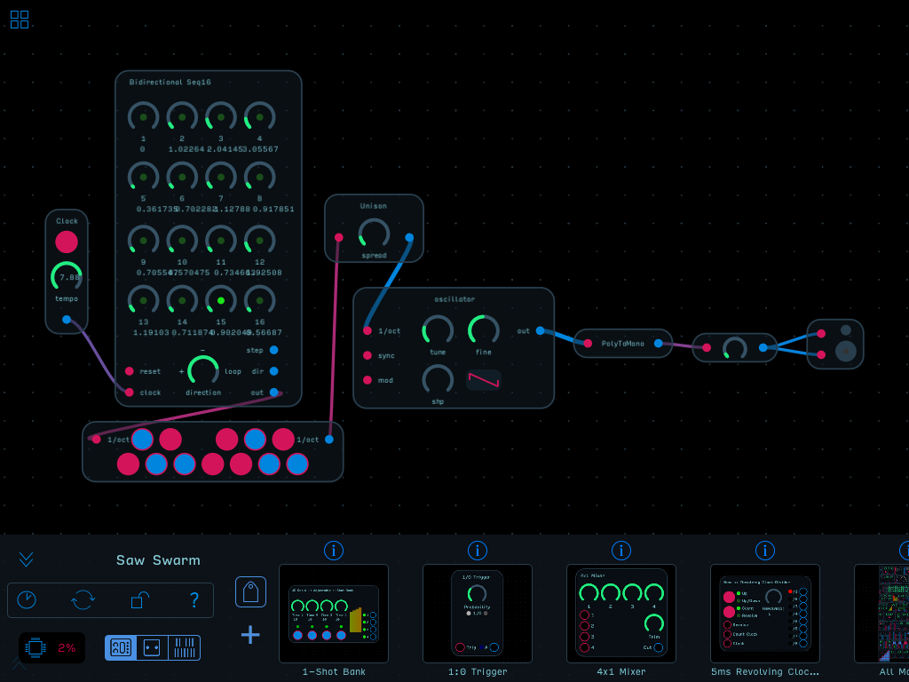
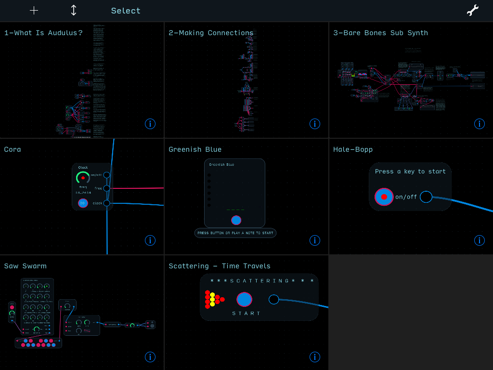

<link href="docs.css" rel="stylesheet"></link>

Welcome to Audulus!

&nbsp;&nbsp;&nbsp;&nbsp;&nbsp;Audulus. A Modular Audio Processing App for iPad, iPhone, Mac, Linux, and Windows. Created by Developer Taylor Holliday. Promoted by Mark Boyd, Audulus Evangelist. 
&nbsp;&nbsp;&nbsp;&nbsp;&nbsp;With Audulus, you can build synthesizers
from first principles, design new sounds, or process audio &mdash; all with
real-time, low-latency processing suitable for live performance.

 
To get started, begin with the UI Basics for your platform (<a href="#ui-basics-ipadiphone">iOS</a> or <a href="#ui-basics-mac">Mac/Windows</a>).

### Join the Audulus Mailing List

First, be sure to sign up for the Audulus mailing list!

<!-- Begin MailChimp Signup Form -->

<form action="//audulus.us9.list-manage.com/subscribe/post?u=2c81276aefb1edcfbb9934c74&amp;id=aae8478e6c" method="post" id="mc-embedded-subscribe-form" name="mc-embedded-subscribe-form" class="validate" target="_blank" novalidate>
    

	

	<label for="mce-EMAIL">Email Address </label>
	<input type="email" value="" name="EMAIL" class="required email" id="mce-EMAIL">

	

		

		

	
    <!-- real people should not fill this in and expect good things - do not remove this or risk form bot signups-->
    
<input type="text" name="b_2c81276aefb1edcfbb9934c74_aae8478e6c" tabindex="-1" value="">

    
<input type="submit" value="Subscribe" name="subscribe" id="mc-embedded-subscribe" class="button">

    

</form>

<!--End mc_embed_signup-->

We will send you information about new Audulus features, and updates from the Audulus community.

### Get Help

If you need help or have found a bug, contact us at:

*We will respond within 24 hours - often sooner.*  When making a bug report, please: 

-	Attach the patch you were working on when you encountered the bug.
-  Give as much detailed information as you can about how to reproduce the bug.

*We are also available to help you "debug" your Audulus patches.* If Audulus is working fine, but your patch is not, please post it on the [Audulus forum](http://forum.audulus.com) and we'll do our best to help you fix it! 

---

## UI Basics (iPad/iPhone)

### Patch Editor

The Patch Editor is Audulus's main view. It consists of an infinite canvas for creating patches, with toolbar at the bottom.  

- The canvas grows and shrinks to fit the size of the patch.  If you have just one small node in a patch, you will not be able to zoom out.  You need to add at least 2 nodes or modules and space them apart to give yourself some "breathing room."

Open and close the toolbar using the  and  chevron buttons. Exit to the patch browser using the  button. (This button is also used to exit a subpatch. More on that below.)

- The toolbar exists primarily for adding new modules to your patch, but it also contains the node browser and an on-screen multi-touch keyboard. 
- *We highly recommend that new users create patches with modules* from the Audulus Module library, in order to speed up patch construction.
- You can think of nodes as the "atoms" of Audulus. Modules are more like molecules.
- That said, some nodes, like the expression node or the light node, cannot be built up into a module and must be used as nodes.
 
### The iPad/iPhone Audulus UI at a glance

-   Overall signal flow is left-to-right (you can reverse the direction with a Via Tab).
-   Pinch with two fingers to zoom in and out of your patch.
-   Drag with two fingers to pan.
-   Drag with one finger on the background to lasso-select multiple nodes. ( *See note 1 below* )
-   Double-tap on a node to zoom in for editing.
-   Double-tap on the background and Audulus will zoom to fit the entire patch comfortably in view.
-   Many operations use context menus - tap and hold to bring up the context menu.
-   To make a connection, zoom in and drag from an output to an input. *Connections can only be made from an output to an input.*
-   To disconnect, drag the connection away from the input.
-   To "hot swap" or live patch, keep your finger held down and wave the output wire over an input or knob. This is similar to performing with patch cables on a modular, but you'll never wear out your inputs in Audulus!  Audulus is also optimized to prevent clicking/popping connection noise, so go crazy with it!
-   To make a long connection, drag to the edge of the screen. Audulus will zoom out, widening your field of view. Move your finger away from the edge of the screen, and Audulus will zoom back in, centering around your finger, so you can place the connection.
-   If you are zoomed too far out to make a connection, the inputs and outputs will visibly "lock" or "close." Zoom back in and they will "open" again, and you can now make and break connections as well as turn knobs.  If you have knobs and triggers mapped to MIDI, this is a non-issue.
-   Speaking of mapping and controllers: Audulus will automatically detect your MIDI keyboard or control surface. 
-   To map a knob or a trigger to MIDI, press and hold the element you want to map and select "Learn Midi CC," then twist/press the corresponding knob/button on your control surface, and the controls will thereafter be linked.

> *Note 1:* The lasso gives you surgical control over what you select, allowing you to accurately clip out portions of others' designs for use in your own. Much of the progress that is made in the Audulus community happens when people leapfrog with shared knowledge.  The lasso tool makes that process *much* easier.

### Toolbar buttons

-    **Lock Mode** - Locks the nodes in
    place. This is useful for performing.
-    **Timing Mode** - Toggles
    timing mode. Timing Mode shows the percentage of CPU time each node
    in your patch takes to compute.
-    **Help** - Shows the Audulus documentation.

### Patch Browser

The Patch Browser allows you to create, delete, duplicate, and share patches.

-   *"+"* - Upper left corner - Creates a new patch.

-    **Collapse** - Collapses the
    patch thumbnails down to just their names, for browsing large
    collections of patches by name.
-   **"Select"** - Toggles the Patch Browser's **Selection Mode** - When
    in Selection Mode, tapping on a patch thumbnail will select the
    patch and activate the Share, Duplicate, and Delete buttons.
    Multiple patches may be selected at once. 
    - **Note:** *It is very common to forget to exit this mode - you will not be able to create or enter a patch while in* **Selection Mode**.
-    **Share** - Shares selected patches
    via email when in **Selection Mode.**
-    **Duplicate** - Duplicates
    selected patches when in **Selection Mode.**
-    **Delete** - Deletes selected
    patches when in **Selection Mode.**
-    **Settings** - Shows Audulus'
    settings.

---

## UI Basics (Mac/Windows)

The Desktop Audulus UI at a glance:

-   Overall signal flow is left-to-right (you can reverse the direction with a Via Tab).
-   Many operations use right-click context menus (or control+click if you
    have one button)
-   To create a new node/module, right-click on the background. A menu will pop up that gives you access to all the nodes and modules.  The Module Library is found at the bottom of the menu. ( *See Note 1* )
-   To zoom, use the mouse wheel or pinch with two fingers on your trackpad.
-   To pan, use two fingers on your trackpad, or hold the Option/Alt key and drag.  You can also zoom out, hover your mouse over a new focal point, and zoom back in - this may seem an odd way to navigate at first, but it is much faster than simply panning because it requires less mouse movement.
-   *Apple Magic Mouse users:* swipe on the mouse to pan, hold the Control key and swipe vertically to zoom. You may need to turn off "Use scroll gesture with modifier keys to zoom," in the Zoom section of the Accessibility control panel in System Preferences.
-   To select a node/module, just click on it!
-   To select multiple nodes/modules, hold shift while clicking each one individually, or use the lasso tool as described above.
-   To make a connection between nodes/modules, drag a connection from an output to an input. You *cannot* draw a connection from an input to an output.
-   To disconnect, drag a connection away from an input.
-   To learn more about how to use a particular node, right click and select "Help."

> *Note 1:*

---

## Intro videos

<iframe src="http://player.vimeo.com/video/148324131" width="480" height="270" frameborder="0" webkitAllowFullScreen mozallowfullscreen allowFullScreen></iframe>

<iframe src="http://player.vimeo.com/video/148319769" width="480" height="270" frameborder="0" webkitAllowFullScreen mozallowfullscreen allowFullScreen></iframe>

<iframe src="http://player.vimeo.com/video/148358980" width="480" height="270" frameborder="0" webkitAllowFullScreen mozallowfullscreen allowFullScreen></iframe>

## Polyphony

Polyphonic processing in Audulus works seamlessly. A connection between
nodes is polyphonic if it is rendered thicker. It also ceases oscillating between red/blue, for obvious reasons.  Nodes are automatically
capable of polyphonic processing. So for example, feed a **Distortion**
node with a polyphonic connection and the distortion will be applied
separately to each voice in the connection.

Currently, you can only access the first 4 notes held with the QuadToMono node, though this will change in the future - the QuadToMono node will have an arbitrary number of internal channels in a future version of Audulus 3.X.  To reassemble 4 signals into one Poly signal, use the MonoToPoly node.  Again, in a future version of Audulus 3.X, MonoToPoly will have an arbitrary number of inputs.

---

## Building Custom Modules

Starting with the Patch node, you can create your own custom modules for Audulus.  You can think of the Patch node as an enclosure - the box or faceplate that the "circuit" of your synth sits in. You can create as many layers as you want, but usually 3-5 will suffice for even the most mind-bogglingly complex designs. ( *See Note 1* )

1. Create a sub-patch using the Patch Node (Subpatch -> Patch)
2. Enter the sub-patch with double-tap/click on the Patch node.
3. Create a Knob node.
5. Exit the sub-patch and you'll see your knob on the front panel - knobs are exposed automatically by default.  If you need an "internal trimpot," use the Constant node, which is not exposable.
6. Enter the sub-patch again and add a Light node, then bring up the context menu on the Light node and tap/click "Expose."
7. Exit the sub patch and now you'll see the knob and the light occupying the same space on the UI.
6. Open the context menu on the Patch node by pressing/clicking on a blank spot of the Patch node, and select Edit UI.
7. Arrange the Knob and Light nodes where you want them.  Notice how the boundaries of the patch grow to accomodate the elements it contains.
8. Open the Path Node's context menu again and select "Lock UI" to finish editing the UI.
9. When arranging many UI elements at once, they may all be in a jumble on top of one another.  It may be best to expose elements one at a time, especially when placing multiple Light nodes.  Audulus cannot read your mind and needs to be told explicitly where to put UI elements.  This is sometimes a long process, but the great thing is you only have to do it once per module. If you want to bring an element on "top" of another (say, a knob that has a waveform node in the background, as the Waveform Via does), you have to know that the last element created is the one that is "on top."  To "bring to front," as you might in Photoshop, you have to select the node you want to be on top, delete it, and then re-create it. It is now the last thing created, and thus, the element that is most "on top."
10. Also, try this: create a Patch node, then add any module from the library next to it.  Enter the module you picked out and select all of its contents, call up the context menu and select "Copy."  Exit the module and then enter the Patch node you just created, and paste what you copied. Exit the Patch node and you will see that all of the UI elements are already neatly arranged!  Use this to your advantage.
11. If you're a beginner, try designing your instrument or effect using the modules in the Module Library rather than the nodes. The Modules are designed to be easier to use. The nodes are precise building blocks, more appropriate for advanced users.
12. Finally, *remember to clear your history before uploading your patch to the forum!*

> *Note 1:* In very, very large designs, it becomes necessary to use modules to lighten the GUI load, especially if you are working on iOS.

See you at the forum!  Happy patching!

---

## Audulus Audio Unit (Mac Only)

[Download Audio Unit](http://content.audulus.com/Audulus%20Audio%20Unit%203.3.pkg)

To install Audulus as an Audio Unit plugin, download the installer
package above.

The installer package will install the Audio Anit to either a
user-specific (`~/Library/Audio/Plug-Ins/Components`) or a system-wide
(`/Library/Audio/Plug-Ins/Components`) location.

The Audulus Audio Unit will appear under the manufacturer name
"Audulus". Both 32-bit and 64-bit versions are included in the plugin.

Audulus.app must be present in the Applications folder for the Audio Unit to work.

