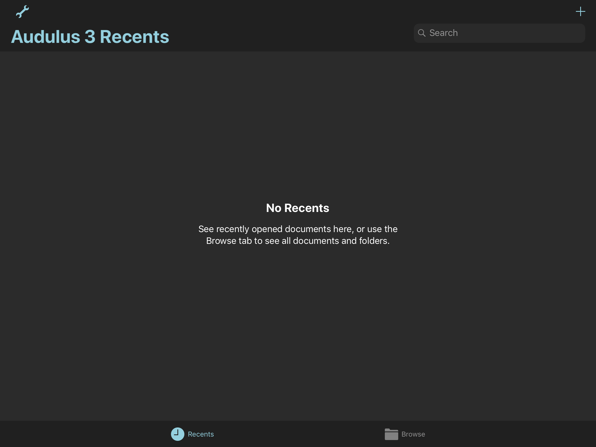
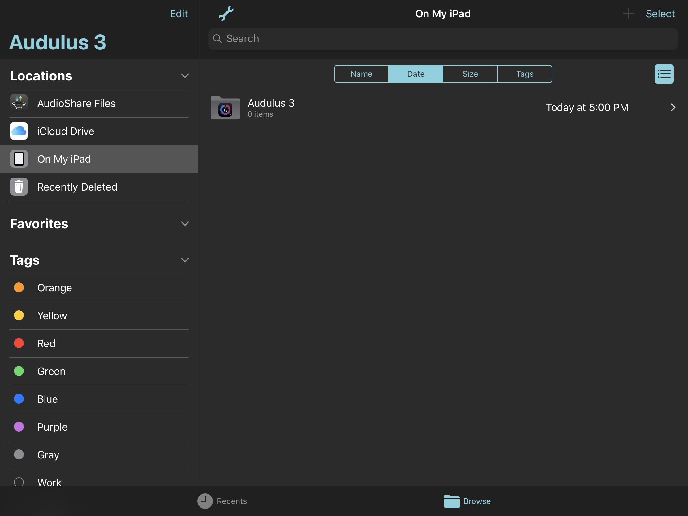
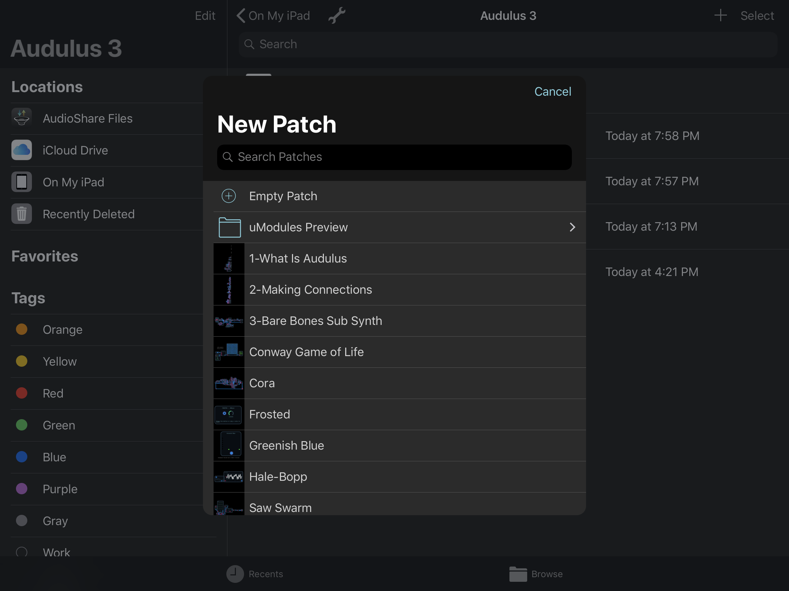
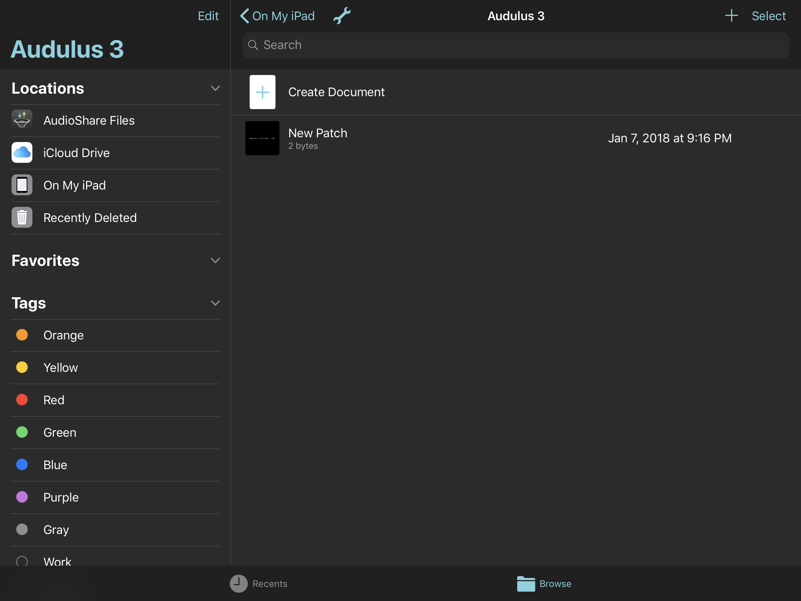
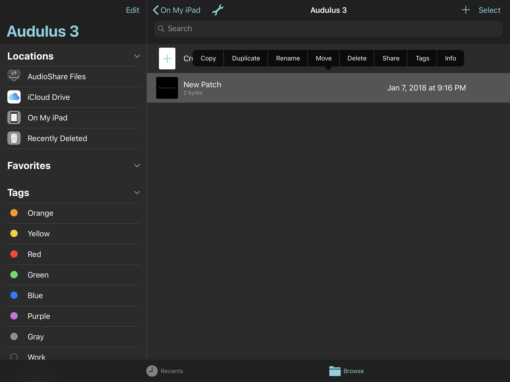
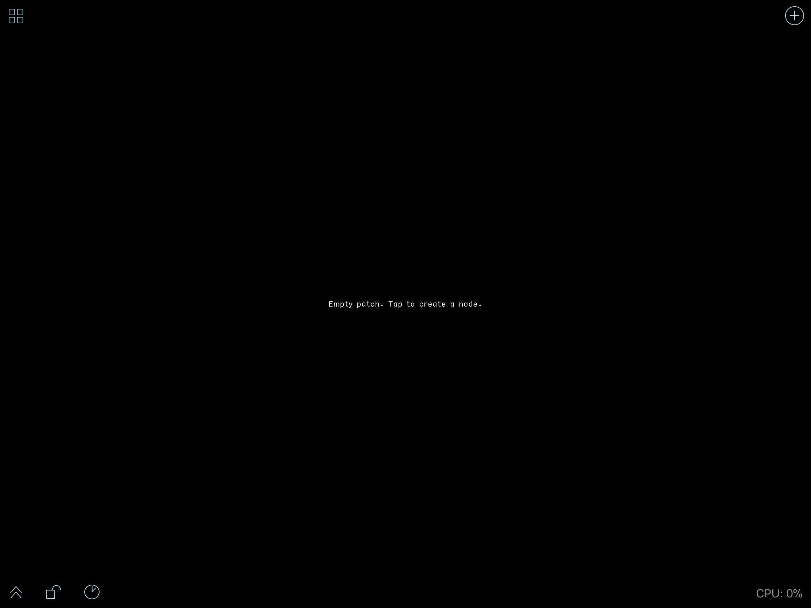
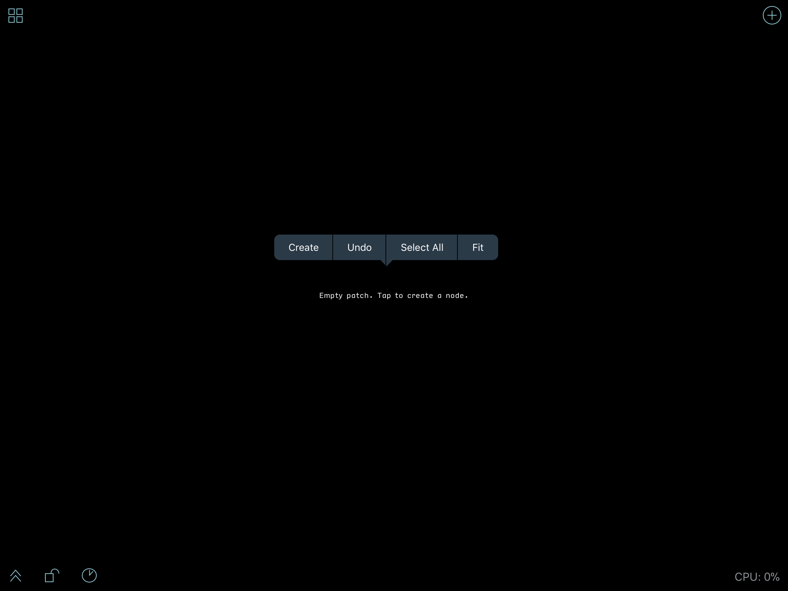
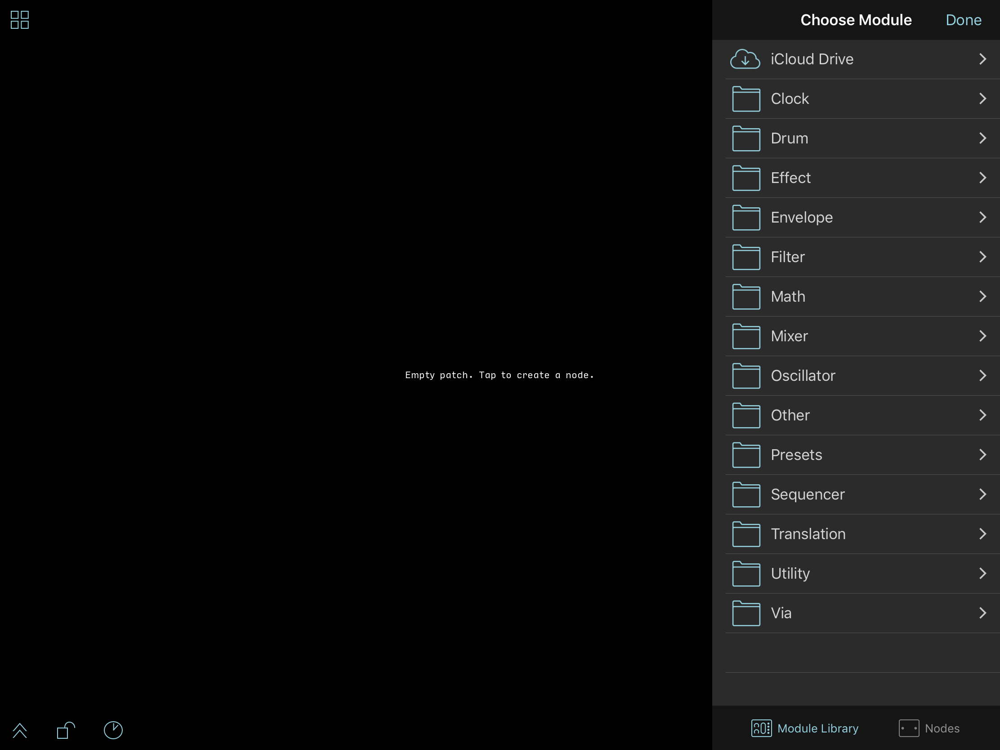
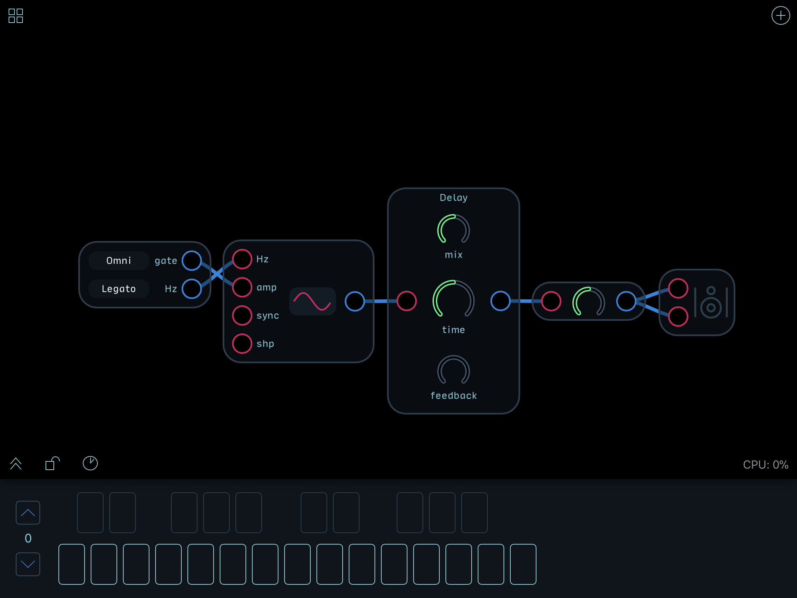

*Welcome to Audulus!*

&nbsp;&nbsp;&nbsp;&nbsp;&nbsp;Audulus. A Modular Audio Processing App for iPad, iPhone, Mac, Linux, and Windows. Created by Developer Taylor Holliday. Promoted by Mark Boyd, Audulus Evangelist. 
&nbsp;&nbsp;&nbsp;&nbsp;&nbsp;With Audulus, you can build synthesizers
from first principles, design new sounds, or process audio &mdash; all with
real-time, low-latency processing suitable for live performance.

 
To get started, begin with the UI Basics for your platform (<a href="#ui-basics-ipadiphone">iOS</a> or <a href="#ui-basics-mac">Mac/Windows</a>).

### Join the Audulus Mailing List

First, be sure to sign up for the Audulus mailing list!

<!-- Begin MailChimp Signup Form -->

<form action="//audulus.us9.list-manage.com/subscribe/post?u=2c81276aefb1edcfbb9934c74&amp;id=aae8478e6c" method="post" id="mc-embedded-subscribe-form" name="mc-embedded-subscribe-form" class="validate" target="_blank" novalidate>
    

	

	<label for="mce-EMAIL">Email Address </label>
	<input type="email" value="" name="EMAIL" class="required email" id="mce-EMAIL">

	

		

		

	
    <!-- real people should not fill this in and expect good things - do not remove this or risk form bot signups-->
    
<input type="text" name="b_2c81276aefb1edcfbb9934c74_aae8478e6c" tabindex="-1" value="">

    
<input type="submit" value="Subscribe" name="subscribe" id="mc-embedded-subscribe" class="button">

    

</form>

<!--End mc_embed_signup-->

We will send you information about new Audulus features, and updates from the Audulus community.

### Get Help

If you need help or have found a bug, contact us at:

*We will respond within 24 hours - often sooner.*  When making a bug report, please: 

-	Attach the patch you were working on when you encountered the bug.
-  Give as much detailed information as you can about how to reproduce the bug.

*We are also available to help you debug your Audulus patches.* If Audulus is working fine, but your patch is not, please post it on the [Audulus forum](http://forum.audulus.com) and we'll do our best to help you fix it! 

---

## Contents

* Will be replaced with the ToC, excluding the "Contents" header
{:toc}

## UI Basics (iPad/iPhone)
 
### The iPad/iPhone Audulus UI at a glance

-   Overall signal flow is left-to-right (you can reverse the direction with a Via Tab).
-   Pinch with two fingers to zoom in and out of your patch.
-   Drag with two fingers to pan.
-   Drag with one finger on the background to lasso-select multiple nodes. ( *See note 1 below* )
-   Double-tap on a node to zoom in for editing.
-   Double-tap on the background and Audulus will zoom to fit the entire patch comfortably in view.
-   Many operations use context menus - tap and hold to bring up the context menu.
-   To make a connection, zoom in and drag from an output to an input. *Connections can only be made from an output to an input.*
-   To disconnect, drag the connection away from the input.
-   To hot-swap or live patch, keep your finger held down and wave the output wire over an input or knob. This is similar to performing with patch cables on a modular, but you'll never wear out your inputs in Audulus!  Audulus is also optimized to prevent clicking/popping connection noise, so go crazy with it!
-   To make a long connection, drag to the edge of the screen. Audulus will zoom out, widening your field of view. Move your finger away from the edge of the screen, and Audulus will zoom back in, centering around your finger, so you can place the connection.
-   If you are zoomed too far out to make a connection, the inputs and outputs will visibly "lock" or "close." Zoom back in and they will "open" again, and you can now make and break connections as well as turn knobs.  If you have knobs and triggers mapped to MIDI, this is a non-issue.
-   Speaking of mapping and controllers: Audulus will automatically detect your MIDI keyboard or control surface. 
-   To map a knob or a trigger to MIDI, press and hold the element you want to map and select "Learn Midi CC," then twist/press the corresponding knob/button on your control surface, and the controls will thereafter be linked.

> *Note 1:* The lasso gives you surgical control over what you select, allowing you to accurately clip out portions of others' designs for use in your own. Much of the progress that is made in the Audulus community happens when people leapfrog with shared knowledge.  The lasso tool makes that process *much* easier.

### Patch Browser

The Patch Browser allows you to create, delete, duplicate, sort, and share patches.

The Patch Browser has two views accessible by tabs at the bottom of the screen: Recents and Browse.

The Patch Browser (and Audulus as a whole, on both iPhone and iPad) can be viewed in either landscape or portrait mode. In landscape mode, extra menu options are open by default on the left. In portrait mode, you have to tap the Browse icon again to make them appear.

The last patches opened will appear under the Recents tab pictured below. Since this is your first time opening Audulus, nothing will appear here.

The Browse tab, pictured below, will allow you to access example patches and tutorials, as well as organize patches you create using the integrated iOS 11 Files features.

It is recommended that you turn on iCloud Drive access for Audulus. iCloud will automatically backup and sync your Audulus patches across all of your devices.

You can sort by name, date, size, and tags. Tap twice to sort by ascending or descending. You may need to pull down on the browser to reveal the sort options.

You can also sort by icon or list view using the list icon in the upper right below the Search Bar.

The Wrench icon will allow you turn Background Audio on or off. If you wish to use Audulus with other apps, this must be enabled.

Select On My iPad under Locations and open the Audulus 3 folder by tapping on it. You will be presented with a new screen where you can create new patches, new folders, sort, rename, and organize.

You can create a new Audulus patch by tapping Create Document, or by tapping the + symbol in the upper right corner next to Select.

When you tap on either, you will be presented with a screen that contains example patches, tutorials, and an option to create a new Empty Patch at the top.

**NOTE: Some of the example patches may be too processor intensive for you to use on your hardware - especially if you are using an older iPad or iPhone. If you hear any crackling while using a patch, this is not a bug. It just means that the patch is too processor intensive. There are plenty of examples and tutorials that will work on all platforms though.**

When you tap on an option, that patch will be created in the Patch Browser. 

To rename the patch or access a number of other functions, long press on the patch and release. A context menu pictured below will appear.

### Patch Editor

Tap on it to open the patch. If you created a new patch, it will look like this when you do.

In the top right of the screen is the Patch Browser icon. Tap it to exit the patch and return to the Patch Browser.

In the bottom right is a CPU usage meter. This will display the amount of CPU time your patch is using. This CPU meter does not monitor other apps, so if you have more apps open, do not expect it to accurately reflect the total CPU time usage.

The clock icon will reveal how much of the total CPU time each node or module is using as a percentage.

Tap the background to reveal a context menu with the option Create. You can also reveal the Module & Node Browser by tapping the + symbol in the upper right corner.

The menu that appears is the Module Library and Node browser. On iPad, it will be on the right side of the screen, but on iPhone, it will take up the entire screen. On iPad, it will stay open until you close it by pressing Done, but on iPhone, it will close each time you create something.

The Module Library is a good starting place for people who want to quickly make a modular synth patch. All the modules presented are created using nodes. Building with nodes is recommended only for advanced users of Audulus, or those who want to start learning how to make their own modules from scratch.

That said, to do an Audulus version of "Hello, world!" tap on the node tab at the bottom of the browser. Create a Keyboard node, an Oscillator node, a Delay node, a Level node, and a Speaker node, then wire them up as pictured below. Once they are wired together, close the Node Browser and open the onscreen keyboard by tapping the chevron (arrow) in the bottom left corner. Play with the delay parameters and tap on the oscillator waveshape to 

For an introduction to modular synthesis using modules found in the module library and an introduction to how to create your own modules using nodes, [refer to this Audulus forum post] (http://forum.audulus.com/discussion/1524/audulus-tutorial-livestream-modular-synthesis-101-with-audulus-pt-1/p1). 

The video was captured on the computer version of Audulus, but the right-click menu you see is identical to the structure of the Module Library. The forum post contains a patch that you can play with while you watch the video (login required).

---

## UI Basics (Mac/Windows)

The Desktop Audulus UI at a glance:

-   Overall signal flow is left-to-right (you can reverse the direction with a Via Tab).
-   Many operations use right-click context menus (or control+click if you
    have one button)
-   To create a new node/module, right-click on the background. A menu will pop up that gives you access to all the nodes and modules.  The Module Library is found at the bottom of the menu. ( *See Note 1* )
-   To zoom, use the mouse wheel or pinch with two fingers on your trackpad.
-   To pan, use two fingers on your trackpad, or hold the Option/Alt key and drag.  You can also zoom out, hover your mouse over a new focal point, and zoom back in - this may seem an odd way to navigate at first, but it is much faster than simply panning because it requires less mouse movement.
-   *Apple Magic Mouse users:* swipe on the mouse to pan, hold the Control key and swipe vertically to zoom. You may need to turn off "Use scroll gesture with modifier keys to zoom," in the Zoom section of the Accessibility control panel in System Preferences.
-   To select a node/module, just click on it!
-   To select multiple nodes/modules, hold shift while clicking each one individually, or use the lasso tool as described above.
-   To make a connection between nodes/modules, drag a connection from an output to an input. You *cannot* draw a connection from an input to an output.
-   To disconnect, drag a connection away from an input.
-   To learn more about how to use a particular node, right click and select "Help."

---

## Audulus Audio Unit (Mac Only)

[Download Audio Unit](http://content.audulus.com/Audulus%20Audio%20Unit%203.3.pkg)

To install Audulus as an Audio Unit plugin, download the installer
package above.

The installer package will install the Audio Unit to either a
user-specific (`~/Library/Audio/Plug-Ins/Components`) or a system-wide
(`/Library/Audio/Plug-Ins/Components`) location.

The Audulus Audio Unit will appear under the manufacturer name
"Audulus". Both 32-bit and 64-bit versions are included in the plugin.

Audulus.app must be present in the Applications folder for the Audio Unit to work.

