## All Modules
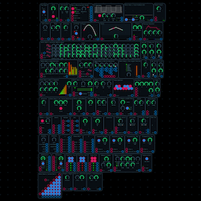

This is all of the modules in one place!

## 5ms RCD
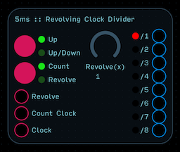

This module takes an incoming clock signal and routes it to 8 outputs.  If no Count Clock or Revolve input is applied, the clock signal is pulse-divided by the output number.  Out 1 then is (Clock Hz/1), Output 2 is (Clock Hz/2), …, and Out 8 is (Clock Hz/8).  A blue light turns on when the signal is high.  You’ll notice that for every 8 clock pulses from output 1, you’ll get one pulse from output 8.  

When a clock signal is applied to the Count Clock input, an internal counter counts from 0-7 up or up/down (depending on your selection), and internally switches the output routing as if you were shifting where the output jacks were being routed to.  With a Count of 1, Output 1 becomes Output 8, Output 2 becomes Output 1, etc.  With a Count of 2, Output 1 becomes Output 7, Output 2 becomes Output 8, Output 3 becomes Output 1, etc.  

A red light indicates which output is passing the undivided clock signal.  This light may change to purple if it syncs with the blue high output indicator.

Like Count, Revolve also switches the order of inputs, but it can do so in whatever order you’d like.  Attach a knob or sequencer for direct control.  The Revolve(x) control is an internal multiplier for the revolve signal.  If a triangle wave counts up and down, that triangle wave with Revolve(2) would count up twice, then down twice.

## Clock
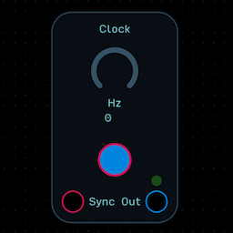

The clock outputs a pulse.  The higher the Hz value, the faster the pulse.  You can turn it on and off with the button.

Inputs on modules designed to accept a clock pulse are labelled “Clock.”  

The Sync input can be used to synchronize multiple clock sources to a master clock.  The master clock’s Output feeds into the slave clocks’ Sync input.  Every time the master clock pulses, it resets the slave clocks.

## Divided Clock
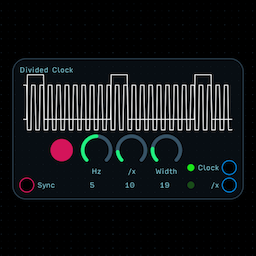

This is a clock and a pulse divider packaged together for convenience.  There’s an On/Off button, a Hz control for the clock speed, a divide by x knob, and a pulse width control.  The Clock Output is the undivided clock signal, and the /x Output is the clock Hz divided by the value set by the /x knob.  The sync input allows this clock to be slaved to a master clock.

## Prob Div Clock
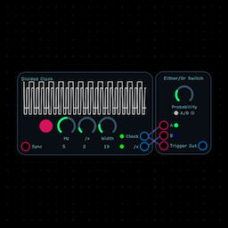

This patch is a combination of a Divided Clock module and an Either Or/Switch that is choosing between the undivided and divided signals in a random way, biased by the Probability knob.  For more information about each module, see their corresponding metadata.

## Prob Fight Clock
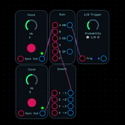

This patch subtracts two clock signals and uses that product to drive an Either/Or trigger module, creating a unique rhythmic probabilistic clock.  For more information about each module, see their corresponding metadata.

## Pulse Divider
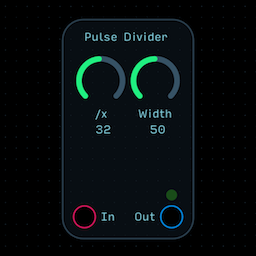

A pulse divider takes a clock input and divides its frequency according to the /x knob.  The width knob controls the pulse width of the divided signal.

## Tap Tempo
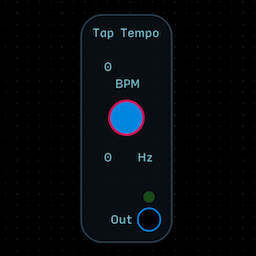

The tap tempo infers the time between two button presses and outputs that time as a static value in Hz.  You can use it to add a tap tempo control for delays, clocks, tremolos, etc.

## Touch Feedback Clock
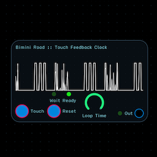

The Touch Feedback Clock allows you to quickly and naturally dial in rhythmic clock sequences, and warp them with the Loop Time knob.  

It works by attaching a trigger to a delay node with the feedback turned all the way up.  If the loop time is set too low, or the delays pile up enough so that they start to smear together, you may end up with an “always on” clock signal that will need to be reset.

The Reset button clears the delays, but it takes the length of the Loop Time to clear them out - that’s why there is a Wait/Ready light above it.  When Ready is lit, you’re clear to enter a new input. 

Really interesting things happen when you start tap a sequence, pull the loop time down, then expand the loop time again.

## Bitcrusher
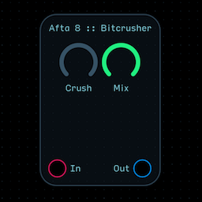

This Bitcrusher represents one two ways to “crush” a wave to add digital distortion.

This method uses resolution reduction by reducing the precision of the 32-bit floating point input.

The Crush knob decreases resolution as its value is increased.  The Mix knob mixes the dry and wet signals 
together.

## Distortion
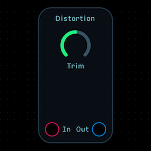

This is a repackaging of the distortion node as a module.  For more info, see the Audulus node documentation.

The trim knob decreases the Output level.

## Ms. Torsion

This is a simple distortion with 4 variables.  

- Crush is a dry/wet mix knob.
- Gnash raises the cutoff point of the LPF on the distortion.
- Bite increases the Q value of the LFP curve
- Grind shifts the distortion an octave up.

## Rate Reduction
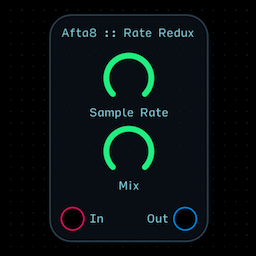

Sample Rate Reduction is a type of digital distortion, usually found working in concert with a Bitcrusher.

This method reduces the sample rate on an input from the default 44.1k (or your host’s sample rate) to a lower sample rate.

## Wavefolder
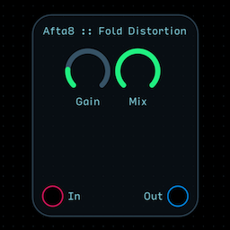

Distorts a signal via wave-folding. Gain determines the number of folds. Mix mixes in the folded version of the wave.

## Waveshaper
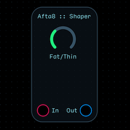

Distorts a signal by wave-shaping. The Fat/Thin knob controls the timbre of the distortion.

## Pitch Shift
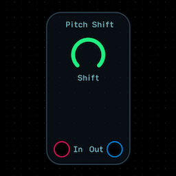

This is a repackaging of the pitch shift node as a module.  For more info, see the Audulus node documentation.

## Ring Modulator
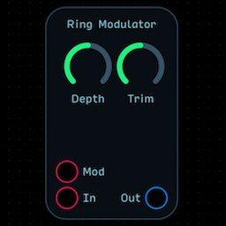

Ring modulation multiplies a signal (Input) with a carrier signal (Mod Input).  In most pedal-based ring modulators, the carrier is a sine wave, but this design allows you to plug in whatever signal you’d like.

The Depth knob controls the amount of modulated signal mixed back in with the original dry signal.

The Trim knob controls the output level.

## Unison
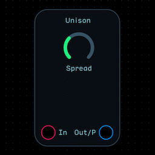

Unison takes an input signal and turns it into a 4-channel polyphonic signal with 1 unaffected channel and 3 detuned channels.  The Spread knob controls how detuned the 3 channels are.

Its output is polyphonic, as indicated by the /P.  All modules in a signal chain after this module will run in polyphonic mode.

## Pan Scan
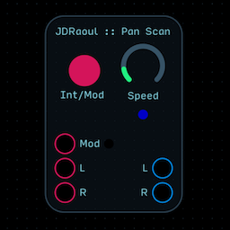

This is an autopanner.  It will swap the left and right signals back and forth according to either the internal LFO (Int) or an external modulation signal (Mod).  The Hz of the internal LFO can be adjusted with the Speed knob.

## Tremolo
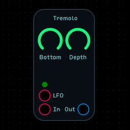

Tremolo is an amplitude modulation effect.  For this module to function, you need to plug in an LFO shape of your choice.

The Bottom knob adds a static value to the LFO, translating the LFO upwards and preventing it from turning the signal all the way down.

The Depth knob is a mix of the dry/wet signals.

## Reverb (M2S)
.png)

This is a repackaging of the Reverb node as a module.  For more info, see the Audulus node documentation.

## Reverb (S2S)
.png)

This is a repackaging of 2 Reverb nodes as a module.  For more info, see the Audulus node documentation.

## Envelope Generator
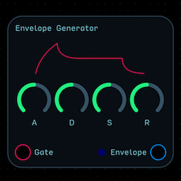

This is a repackaging of the envelope node as a module.  For more info, see the Audulus node documentation.

## High-Low Pass Filter
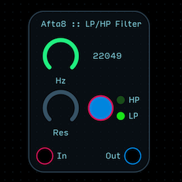

This is a switchable High Pass/Low Pass filter module with resonance control.

## Attenuator
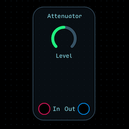

This is a repackaging of the level node as a module.  For more info, see the Audulus node documentation.

## Crossfader
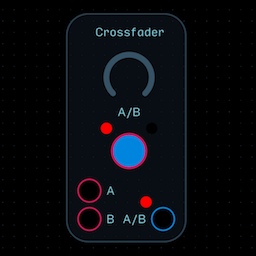

This is a repackaging of the crossfade node as a module.  For more info, see the Audulus node documentation.

For convenience, a switch has been added.  The switch will only work properly if the A/B knob is turned all the way down.

## Mapper
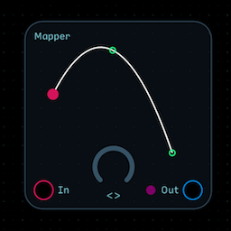

This is a repackaging of the Mapper node as a module.  For more info, see the Audulus node documentation.

## Range
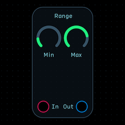

This is a repackaging of the range node as a module.  For more info, see the Audulus node documentation.

## Scaler
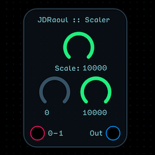

The scaler takes a 0-1 input and scales it between two values set by the knobs directly above.  The top knob sets the maximum value for the knob on the right.  

For example, the default setting would take a 0-1 input and turn it into a 0-10,000 output.  If you adjusted the left knob to 100, the output would now range between 100-10,000 without clipping.

## Slew Limiter
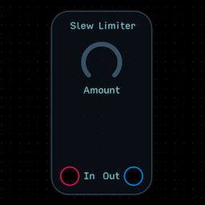

This slew limiter resists changes from a high to low state.  It does not resist changes from a low to a high state.  Thus, an trigger impulse fed to the Input, with a high slew amount, would look like an instantaneous rise and a slow fall.

Usually you will find a slew limiter between a control source like a keyboard or sequencer and an oscillator in order to add glide or portamento.

## Spline
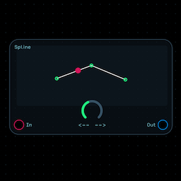

This is a repackaging of the spline node as a module.  For more info, see the Audulus node documentation.

## Pan
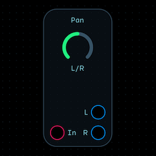

Allows you to adjust the perceived location of a sound left or right within the stereo field.

It is essentially an inverted crossfade node.

## Invert
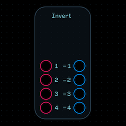

Multiplies the incoming signal by -1.  

Four channels are available for convenience.

## Multiply
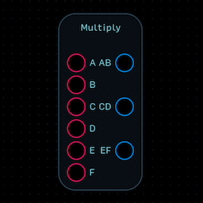

Multiplies two inputs to create one output.  To divide a signal, multiply it by a number that is greater than 0 and less than 1.

Four channels are available for convenience.

## Sum
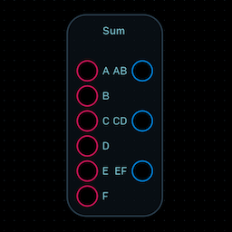

Adds two inputs to create one output.  To subtract, add a negative signal.

Four channels are available for convenience.

## Count Up-Down
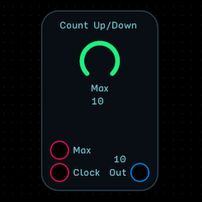

This module counts up to and then down from a maximum number defined by the Max knob plus the value applied to the Max input.  The speed of counting is determined by a clock signal.

## Count Up
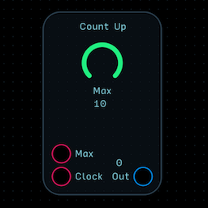

This module counts up to a maximum number defined by the Max knob plus the value applied to the Max input.  The speed of counting is determined by a clock signal.

## Comparator
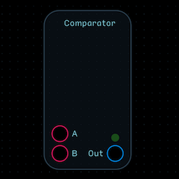

The comparator outputs a 1 if input A is greater than or equal to input B.

## 1-0 Trigger
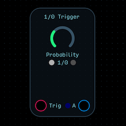

The 1/0 Probability Trigger is a biased coin flipper whose output is set to 1 or 0 every time a trigger pulse is applied at the Trig input.  It is biased by the Probability fader which can favor either 1 (on) or 0 (off).  For a true coin-flipper, set the knob to 0.5.

A truly essential module for humanizing things like drum patterns.

## Either-Or Switch

The Either/Or Probability Switch is a biased coin flipper whose that sends input A or B to the output every time a trigger pulse is applied at the Trig input.  It is biased by the Probability fader which can favor either the A or B output to send the 1 signal to.  For a true coin-flipper, set the knob to 0.5.

A truly essential module for humanizing things like drum patterns.

## Either-Or Trigger
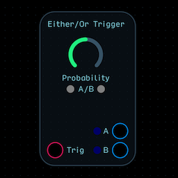

The Either/Or Probability Trigger is a biased coin flipper whose that sends a 1 to either the A or B output every time a trigger pulse is applied at the Trig input.  It is biased by the Probability fader which can favor either the A or B output to send the 1 signal to.  For a true coin-flipper, set the knob to 0.5.

A truly essential module for humanizing things like drum patterns.

## Humanizer

## e
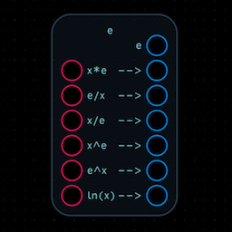

This is a convenient package of most of the functions you’d want to accomplish using the special number e.

## Golden Ratio
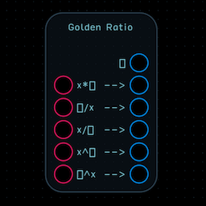

This is a convenient package of most of the functions you’d want to accomplish using the special number phi, i.e., the Golden Ratio.

## Pi
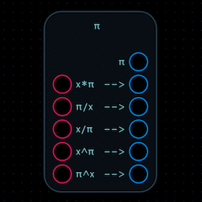

This is a convenient package of most of the functions you’d want to accomplish using the special number pi.

## Fibonacci Seq
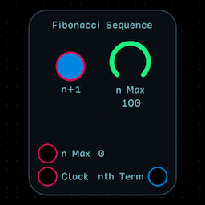

This is a purpose-built count up module tuned to output the Fibonacci sequence.  The n+1 value advances the sequence one number at a time, up to the n value set by the n Max knob plus the n Max mod input.  To count up automatically, apply a clock signal to the clock input.

## Pentatopic Seq
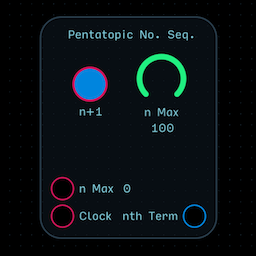

This is a purpose-built count up module tuned to output the pentatopic number sequence.  The n+1 value advances the sequence one number at a time, up to the n value set by the n Max knob plus the n Max mod input.  To count up automatically, apply a clock signal to the clock input.

## Tetrahedral Seq

This is a purpose-built count up module tuned to output the tetrahedral number sequence.  The n+1 value advances the sequence one number at a time, up to the n value set by the n Max knob plus the n Max mod input.  To count up automatically, apply a clock signal to the clock input.

## Triangular Seq
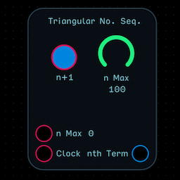

This is a purpose-built count up module tuned to output the triangluar number sequence.  The n+1 value advances the sequence one number at a time, up to the n value set by the n Max knob plus the n Max mod input.  To count up automatically, apply a clock signal to the clock input.

## M-S 8x2 Mixer
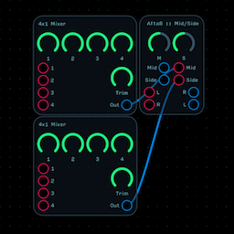

This patch uses a Mid-Side module and two 4x1 Mixer modules to allow you to 4 signals into each channel.  Try using this when combining multiple oscillators.  For more information about each module, see their corresponding metadata.

Note: The inputs of the Mid/Side module are unused in this application.

## M-S Comparator
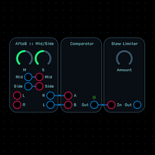

This patch uses a Mid-Side module and a Comparator running through a Slew Limiter.  Its output is 1 if A is greater than B - otherwise, it outputs zero.  The slew limiter increases the amount of time it takes the signal to go from high (1) to low (0).  For more information about each module, see their corresponding metadata.

## M-S Glitter Verb
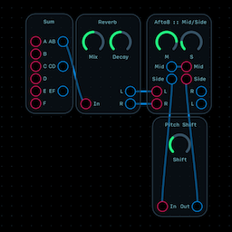

This patch uses a Mid-Side module and a Mono to Stereo Reverb module in conjunction with a Pitch Shift module on the Side channel to allow you to mix in a wide glittery reverb sound.  To mute the reverb on the middle channel, connect the AB output to the Mid input tap on the Mid-Side module.  For more information about each module, see their corresponding metadata.

## M-S HP-LP Filter
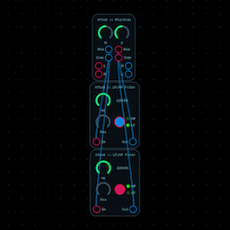

This patch uses a Mid-Side module and two HP/LP filter modules to allow you to filter the Mid and Side signals independently.  Try using it after a stereo delay.

For more information about each module, see their corresponding metadata.

## M-S Processor
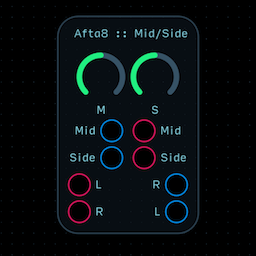

Unlike stereo processing, which allows you to apply effects independently to the left and right channels, mid-side processing allows you to apply effects independently to the perceptual middle and sides of a stereo field.  This type of processing us most useful when placed after a stereo effect, like a stereo delay or a reverb.  

As is, the module  - you can widen or narrow the stereo field using the M and S controls.  Raising the S knob and lowering the M knob will widen the stereo image.  Lowering the S knob and raising the M knob will focus the stereo field towards the center.  This is useful especially after a reverb effect, where you can push the reverb out to the side of the stereo image and get huge sounding patches that you just can’t get from stereo panning alone.

To insert effects into the Mid or Side chain independently, break the connection between the tapped inputs and outputs and treat them as you would any effect loop - but now, instead of a stereo delay that ping-pongs the signal from left to right, you can have a mid-side delay that echoes a few times in the middle and fades out to the sides - or the other way around!

Typically in mixing, you may split the middle signal and add more bass, while adding highs to the sides, to create a sound that has a tight, focused bass component and a airy and wide high component.  Also popular is Mid-Side compression, especially at the mastering stage.

## M-S Reverb
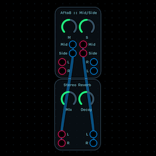

This patch uses a Mid-Side module and a Stereo Reverb module to allow you to control the stereo width of the effect.  For more information about each module, see their corresponding metadata.

## M-S Tremolo
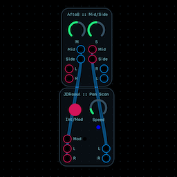

This patch uses a Mid-Side module and JDRaoul’s Pan Scan module module to create a Mid-Side tremolo effect.  For more information about each module, see their corresponding metadata.

## 4x1 Mixer

This is a repackaging of the mixer node as a module.  For more info, see the Audulus node documentation.

The trim knob decreases the output level.

## Cyclone Matrix

The Cyclone Matrix is first and foremost a matrix mixer.  There are 8 inputs and 7 outputs.  Why only 7?  Because at least two inputs have to be added together.

It may look strange because it is not a square field, but it does not need to be square because Input 1 + Input 8 is the same as Input 8 + Input 1.  The inputs ascend left to right from 1-8, and the outputs are arranged 1-7 again, from left to right.

The bottom left button adds Input 1 (to the left) and Input 2 (above) and sends the sum to output 1 (below).

The next column over has two buttons, and they add input 3 (above) to input 2 (left) or input 1 (left bottom).  The pattern continues this way up through input 8.

That’s the mixer part - this is the Cyclone part: The spin input is the “Revolve” input from the 5ms Revolving Clock Divider applied to a matrix mixer.  It simulates rearranging the inputs of the mixer.  As such, the inputs get added differently to one another from step to step.  To spin completely, the Spin input needs a cycling signal of at least 0-7.

## White Noise

This is a repackaging of the noise node as a module.  For more info, see the Audulus node documentation.

## Crossfade Oscillator

The Modulating wave crossfades between Wave A and Wave B. Each of these 3 waves  (Mod, A, B) can be sawtooth, triangle, sinusoidal or square. Square waves have variable pulse widths (PWSA, PWSB). The x knob multiplies the frequency of the modulating wave.

Note: This oscillator is not anti-aliased.  Any oscillator created with phasor nodes does not have built-in anti-aliasing like the oscillator node does.  This isn’t a good or bad thing - just something to be aware of when using it or designing your own oscillators.

## Organ Oscillator

This additive oscillator is ripped straight from the pages of Sound on Sound’s Synth Secrets series, which was in turn ripped straight from a Hammond Organ.  Though it obviously doesn’t function the same way (Hammonds use rotating metal fan blades for its oscillators), it has the same harmonics as a Hammond does - instead of drawbars, they are knobs (though the meters to the right give a similar “drawbar” feedback).  

Attach an envelope and a Leslie simulator and you’ve got a Hammond organ clone.

## Oscillator

This is a repackaging of the oscillator node as a module.  For more info, see the Audulus node documentation.

This module is tuned to accept the 1/Oct standard - the output of the Scale Quantizer.

## Sum Noise Add Synth

This is a complete, fully-voiced 4 oscillator additive synthesizer.

This module is tuned to accept the 1/Oct standard - the output of the Scale Quantizer.

## Rectifier

Rectification is a way of turning an AC signal (-1 to 1) into a DC signal (+/- 0 to 1).  If you don’t know what rectification does, rather than reading a description of it, just plug a Sine LFO into the input and attach waveform meters to the outputs.

For clarification: Shift N-P/P-N means “Shift negative values to positive values/vice versa.”  This is an unusual type of rectification that you probably wouldn’t see used in electronics.

## Rectifying LFO

This LFO has 5 waveshapes (Saw, Sine, Square, Triangle, and Reverse Ramp) and their corresponding rectified outputs (leaving out rectifications that duplicate other wave shapes).  It is intentionally left unlabelled to encourage exploration, and because it looks cooler that way.

The 5 inputs are sync inputs for each LFO.

## Reverse Saw LFO

This LFO outputs a reverse saw wave between 0-1.  The Trim knob lowers the maximum value of the LFO (e.g., set half way, its range is 0-0.5).

LFOs in this library are set operate from 0 to 1 (DC) by default instead of -1 to 1 (AC) because a majority of functions in Audulus are tuned to work between 0 and 1.  

To create an AC signal, multiply the LFO output by 2 and subtract 1.

## Saw LFO

This LFO outputs a saw wave between 0-1.  The Trim knob lowers the maximum value of the LFO (e.g., set half way, its range is 0-0.5).

LFOs in this library are set operate from 0 to 1 (DC) by default instead of -1 to 1 (AC) because a majority of functions in Audulus are tuned to work between 0 and 1.  

To create an AC signal, multiply the LFO output by 2 and subtract 1.

## Sine LFO

This LFO outputs a sine wave between 0-1.  The Trim knob lowers the maximum value of the LFO (e.g., set half way, its range is 0-0.5).

LFOs in this library are set operate from 0 to 1 (DC) by default instead of -1 to 1 (AC) because a majority of functions in Audulus are tuned to work between 0 and 1.  

To create an AC signal, multiply the LFO output by 2 and subtract 1.

## Square LFO

This LFO outputs a square wave between 0-1.  The Trim knob lowers the maximum value of the LFO (e.g., set half way, its range is 0-0.5).

LFOs in this library are set operate from 0 to 1 (DC) by default instead of -1 to 1 (AC) because a majority of functions in Audulus are tuned to work between 0 and 1.  

To create an AC signal, multiply the LFO output by 2 and subtract 1.

## The Longest Time LFO

This is a very slow sinusoidal LFO built to control installation pieces.

NOTE: The LFO currently will only go down to 1 day per cycle, but this will be fixed in a later version.

## Triangle LFO

This LFO outputs a triangle wave between 0-1.  The Trim knob lowers the maximum value of the LFO (e.g., set half way, its range is 0-0.5).

LFOs in this library are set operate from 0 to 1 (DC) by default instead of -1 to 1 (AC) because a majority of functions in Audulus are tuned to work between 0 and 1.  

To create an AC signal, multiply the LFO output by 2 and subtract 1.

## 1-Shot Bank

This is a bank of four 1-shot sample & hold nodes with adjustable decay times.

Try routing it to step value knobs on a running sequencer - great way to add variety to a repeating sequence with just a tap.

To make the module count down from one instead of up, invert the output (multiply it by -1), add that product to 1, and send that sum to a knob or control input.  

To add different curves to the decay over time, use log or exponential functions.  

To turn it into a kind of decaying modulating saw wave, feed it through a delay node.  Add a slew limiter to that and you can round off the transitions.

Note: When you think about Audulus as a live iOS performance centerpiece or companion, consider how much you can do with just one decaying or increasing value to an entire modular patch with just one tap on your screen.  Now multiply that by four, and that’s what this module can do for you.

## Sample & Hold

This is a repackaging of the sample & hold node as a module.  For more info, see the Audulus node documentation.

A One Shot button is added for convenience, and the module can also be pinged at the Trigger input.

## Bass-ic Sequencer

The Bass-ic Sequencer is your average, everyday, all-purpose step sequencer.  It’s meant to be a go-to for your driving bass line needs.

The sequencer advances a step for every pulse it receives at the Clock input.

Each numbered knob controls the value of a step, and is reflected in the meters to their right.  If you set the range beyond 0-1, the meters will not function correctly - this is ok, and will give you greater octave range, but it’s just an inherent limitation of this simple design.

The maximum number of steps can be changed with the Steps knob.  If you set the Steps knob’s maximum beyond 8, it will wrap around (e.g., a max of 12 with run through 1-8, then 1-4, then 1-8, then 1-4, and so on).

The current step is highlighted by the red light, and the max step is illuminated by the blue light.

It is tuned to be run through the scale quantizer module before being plugged into an oscillator.  

Tip: For evolving, never-repeating lines, attach separate LFOs with different shapes to each step knob and tune some LFOs to go fast and others to go slow.

## Euclidean Sequencer

This sequencer uses an algorithm to generate patterns.  Feed it a clock signal and it will produce recallable patterns that are perfect for quickly dialing in a great sounding drum pattern.  Just use one sequencer per piece (snare, bass, hat, etc), and experiment with different settings for each.

There isn’t enough space here for a full discussion on how the algorithm itself does what it does, so if you’re interested in learning more, look up Godfried Toussaint’s paper on Euclidean rhythms, freely available on the internet.

## RCD Fib Sequencer

This sequencer uses the Fibonacci sequence to generate melody lines.

This sequencer uses a Divided Clock module to drive a Rotating Clock Divider Module that advances the n-value of a bank of 8 Fibonacci Sequence modules, all of which are summed and then divided (by the trim on the mixer), fed through a slew limiter, a quantizer, another slew limiter, and then you have your 1/oct.  The gate was taken from the clock, but it can be taken from any of the clock sources in the patch.

For more information about each module, see their corresponding metadata.

## RCD Slew Seq

This sequencer uses four clocks to drive two Revolving Clock Divider modules.  The top RCD’s outputs are fed to 8 inputs on the first two 4x1 Mixer modules.  The bottom RCD’s outputs are run individually through slew limiters and then used to control the mixing level of each of the 8 pulses from the top RCD.  The signal is run through another slew limiter, then a quantizer, and finally another slew limiter for a final 1/oct output.  I picked an output on the bottom RCD for the sequencer’s gate, but really, it could be connected to any of the clock outputs.  In Revolve mode, the quantizer’s output is fed back into the Revolve input, creating some interesting growling and purring textures.  Channel 3 on the 3rd 4x1 Mixer module adds value to the sequence with the knob attached to the text via, translating the range of notes upwards.  Every knob and button except channel 4 on the 3rd 4x1 Mixer is interactive in this sequencer.  Feel free to make or break connections, especially the sync connections on the clocks.  For more information about each module, see their corresponding metadata.

## Sum Sequencer

This patch uses four sequencers who signals have been mixed together and sent through a Scale Quantizer module.  The Crossfade modules switch between the divided and undivided clock signal.  You can also fade between them and get a semi-random movement.  A feedback control (marked by the text via), allows you to use the sum of the four sequencers to control the pulse width of the divided clock signal.  Because it works in a feedback loop, it can provide pretty interesting rhythms at different positions and with each sequencer set to different step lengths.

For more information about each module, see their corresponding metadata.

## The Warpeggiator

The Warpeggiator is a quadraphonic arpeggiator that goes way beyond fixed patterns and note orders.  It uses the first four keypresses during any one gate signal to set the values of steps on a sequencer.  Why is this cool?  Because if you have your keyboard in latch mode, you can press a chord, let it go, and then change the bass notes while the top 2 notes stay where they are.  Perfect for keyboardist multi-taskers.

The pattern control lets you determine which note in a chord will change first on a new input, so you could tweak it and then keep the bass notes the same while changing the high notes.

The Feedback knob adjusts the amount of the Warpeggiator gets fed back into switching the pattern control.  It takes a nice driving melody into an alternate dimension in an instant.

The Warpeggiator is in its native habitat when paired with the Touch Feedback Clock.  Set the TFC to something weird and experiment with the directionality of the Warpeggiator’s sequence with the forwards/backwards/pendulum knob (marked >/</><).

The Warpeggiator can be synced at the Reset input.  Try feeding it a slow pulse with the TFC going nuts on the clock input - you’ll thank me later.

Why is it only quadrophonic?  Well, the idea is that you hold a 4 note chord with your left hand, and your right hand is then free to play a melody over it (with another keyboard node set to full polyphony and through a different oscillator chain).

## Demultiplexer

This is a repackaging of the demux node as a module.  For more info, see the Audulus node documentation.

A button has been added to switch between the Select knob and the Mod input for control.

## Momentary Close

This module is a bank of 4 momentary close switches.  It can be used to temporarily break a connection while pressing a button.

## Mometary Open

This module is a bank of 4 momentary open switches.  It can be used to temporarily make a connection while pressing a button.

## Multiplexer

This is a repackaging of the mux node as a module.  For more info, see the Audulus node documentation.

A button has been added to switch between the Select knob and the Mod input for control.

## Toggle Mute

This module is a bank of 4 toggle mute switches.  It can be used to switch and hold a connection open or closed.

## DAW Time

This is a repackaging of the DAW node as a module.  For more info, see the Audulus node documentation.

## Master Output

This is a repackaging of the speaker node as a module.  For more info, see the Audulus node documentation.

Meters have been added for convenience.

## Keyboard (1:oct)
.png)

This is a repackaging of the keyboard and pitch bend nodes as a module.  For more info, see the Audulus node documentation.

Included for convenience is a separate slewed output.  

Both frequency outputs on this module are tuned to 1/oct, which the scale quantizer expects to see.  Using the scale quantizer to ignore out of key notes is a quick and easy way to prevent stray taps on iPhone or iPad (or wrong notes on a small midi keyboard).

## Keyboard (Hz)
.png)

This is a repackaging of the keyboard and pitch bend nodes as a module.  For more info, see the Audulus node documentation.

Included for convenience is a separate slewed output.  

## Quantizer

The quantizer accepts a 1/oct input and forces it to conform to a scale.  Notes do not get turned off, but rather are forced to conform to the scale you’ve inputted.

Do not underestimate this module.  It can be used to tweak running sequences on the fly or instantly change the key of a song (by using two quantizers with different settings between a synced mux/demux combination).

## Hz Plotter Via

This is a Frequency Plotter via - it displays the frequency changes of the signal throughput over time with a waveform meter.  A knob is provided as a zoom in/out control.

Vias are connection tabs that are useful for prototyping and clarifying connections in very large patches or designs.

They are good for prototyping because you can use a knob to tune a patch and then easily swap it for a value expression - effectively using it as an internal trim pot.

They are good for clarifying connections because they can route one node’s output across a patch and then hook up to, say, a mux node, rather than having 8 long connections run all the way across the patch adding visual clutter.

## Lit Via

This is a via with a light indicator.

Vias are connection tabs that are useful for prototyping and clarifying connections in very large patches or designs.

They are good for prototyping because you can use a knob to tune a patch and then easily swap it for a value expression - effectively using it as an internal trim pot.

They are good for clarifying connections because they can route one node’s output across a patch and then hook up to, say, a mux node, rather than having 8 long connections run all the way across the patch adding visual clutter.

## Metered Via

This is a via with a meter indicator.

Vias are connection tabs that are useful for prototyping and clarifying connections in very large patches or designs.

They are good for prototyping because you can use a knob to tune a patch and then easily swap it for a value expression - effectively using it as an internal trim pot.

They are good for clarifying connections because they can route one node’s output across a patch and then hook up to, say, a mux node, rather than having 8 long connections run all the way across the patch adding visual clutter.

## Pulse Light Via

This is a pulse light via.  Use it to indicate the relative strength of a signal over time.  A knob is provided as a scale control for the brightness.

Vias are connection tabs that are useful for prototyping and clarifying connections in very large patches or designs.

They are good for prototyping because you can use a knob to tune a patch and then easily swap it for a value expression - effectively using it as an internal trim pot.

They are good for clarifying connections because they can route one node’s output across a patch and then hook up to, say, a mux node, rather than having 8 long connections run all the way across the patch adding visual clutter.

## Text Via

This is a text via.  Use it to name a connection.

Vias are connection tabs that are useful for prototyping and clarifying connections in very large patches or designs.

They are good for prototyping because you can use a knob to tune a patch and then easily swap it for a value expression - effectively using it as an internal trim pot.

They are good for clarifying connections because they can route one node’s output across a patch and then hook up to, say, a mux node, rather than having 8 long connections run all the way across the patch adding visual clutter.

## Timer Via

This is a timer via - it displays the time since last ping of its throughput.

Vias are connection tabs that are useful for prototyping and clarifying connections in very large patches or designs.

They are good for prototyping because you can use a knob to tune a patch and then easily swap it for a value expression - effectively using it as an internal trim pot.

They are good for clarifying connections because they can route one node’s output across a patch and then hook up to, say, a mux node, rather than having 8 long connections run all the way across the patch adding visual clutter.

## Value Via

This is a value via.  Use it to display the value of its throughput.

Vias are connection tabs that are useful for prototyping and clarifying connections in very large patches or designs.

They are good for prototyping because you can use a knob to tune a patch and then easily swap it for a value expression - effectively using it as an internal trim pot.

They are good for clarifying connections because they can route one node’s output across a patch and then hook up to, say, a mux node, rather than having 8 long connections run all the way across the patch adding visual clutter.

## Via Tab

This is a via tab.  Use it in finished designs where you want to prevent accidental movement.

Vias are connection tabs that are useful for prototyping and clarifying connections in very large patches or designs.

They are good for prototyping because you can use a knob to tune a patch and then easily swap it for a value expression - effectively using it as an internal trim pot.

They are good for clarifying connections because they can route one node’s output across a patch and then hook up to, say, a mux node, rather than having 8 long connections run all the way across the patch adding visual clutter.

## Waveform Via

This is a waveform via.  Use it to display the waveform of its throughput.  A knob is provided as a zoom in/out control.

Vias are connection tabs that are useful for prototyping and clarifying connections in very large patches or designs.

They are good for prototyping because you can use a knob to tune a patch and then easily swap it for a value expression - effectively using it as an internal trim pot.

They are good for clarifying connections because they can route one node’s output across a patch and then hook up to, say, a mux node, rather than having 8 long connections run all the way across the patch adding visual clutter.

## ZeroCross Via

This is a ZeroCross via - it displays the frequency of the signal throughput over time.

Vias are connection tabs that are useful for prototyping and clarifying connections in very large patches or designs.

They are good for prototyping because you can use a knob to tune a patch and then easily swap it for a value expression - effectively using it as an internal trim pot.

They are good for clarifying connections because they can route one node’s output across a patch and then hook up to, say, a mux node, rather than having 8 long connections run all the way across the patch adding visual clutter.

