# Module Library Reference

This is an overview of all of the modules in the Audulus module library. They are categorized by type and subcategory.

 
## Attenuator

Attenuator modules shrink or expand, translate up or down, or otherwise modify an incoming signal. The most basic attenuator is a volume control, but attenuators can be used for many things. The most useful attenuator is the Modulation Attenuate-Offset module, which is most often use to translate LFOs and envelopes into a particular range to wiggle a knob on a filter or effect.

 
### Audio

A collection of audio attenuators and attenuverters scaled to work properly with audio signals. Audio signals in Audulus range from a maximum of -1 to 1.

---
**Audio Attenuverter**  

Input | Signal Range
:------------- | :-------------
Audio   | `-1 to 1`

Output | Signal Range
:------------- | :-------------
Audio   | `-1 to 1`

Knob | Function | Notes
:------------- | :------------- | :-------------
*   | Attenuverter | `0 = Input*-1` `0.5 = Input*0` `1 = Input*1`
+   | Offset |`0 = Input+0` `0.5 = Input+0.5` `1 = Input+1`

Translates -1 to 1 audio signals. The * control is an attenuverter. At 0, the input audio signal is inverted. At 1, the signal is passed unaffected. In between 0 to 1 the control acts like an attenuator. The + control is an offset. It translates the entire wave up by 0 to 1. If the outgoing wave exceeds 1, the signal is clipped.

 
### Modulation

A collection of modulation attenuators and attenuverters scaled to work properly with audio signals. Modulation signals in Audulus range from a maximum to 0 to 1.

---
**Modulation Attenuate-Offset**  

Input | Signal Range
:------------- | :-------------
Modulation   | `0 to 1`

Output | Signal Range
:------------- | :-------------
Modulation   | `0 to 1`

Knob | Function | Notes
:------------- | :------------- | :-------------
  | Attenuator | `0 = Input*0` `0.5 = Input*0.5` `1 = Input*1`
   | Offset |`0 = Input+0` `0.5 = Input+0.5` `1 = Input+1`

Translates the 0 to 1 modulation signal by attenuating (shrinking or expanding) and offsetting (moving up or down). This is one of the most important modules in Audulus. Use it to dial in the precise amount of modulation you want in whatever range you want. This module will clip any signal outside of the range of 0 to 1.

---
**Modulation Centered Attenuator**  

Input | Signal Range
:------------- | :-------------
Modulation   | `0 to 1`

Output | Signal Range
:------------- | :-------------
Modulation   | `0 to 1`

Knob | Function | Notes
:------------- | :------------- | :-------------
*   | Centered Attenuator | `0 = ((Input*2-1)*0)/2+0.5` `0.5 = ((Input*2-1)*0.5)/2+0.5` `1 = ((Input*2-1)*1)/2+0.5`

Attenuates a 0 to 1 modulation signal around a 0.5 center point. Useful for modulating the fine tune control of an oscillator for a vibrato effect so that the vibrato is perfectly centered around the base pitch.

---
**Positive Domain Attenuverter**  

Input | Signal Range
:------------- | :-------------
Modulation   | `0 to 1`

Output | Signal Range
:------------- | :-------------
Modulation   | `0 to 1`

Knob | Function | Notes
:------------- | :------------- | :-------------
-/+   | Attenuverter | `0 = Input*-1+1` `0.5 = Input*0` `1 = Input*1` 

Attenuates and inverts any 0 to 1 modulation signal. From 0 to 0.5, the incoming modulation signal is inverted. From 0.5 to 1, the incoming modulation signal is unaffected. Use this module to create a reverse effect on a filter by inverting an incoming envelope modulating the filter’s cutoff.

---
**Modulation to Octave Attenuate-Offset**  

Input | Signal Range
:------------- | :-------------
Modulation | `0 to 1`

Output | Signal Range
:------------- | :-------------
Octave | `-5 to 5`

Knob | Function | Notes
:------------- | :------------- | :-------------
* | Attenuate | `0 = Input*0` `0.5 = Input*2.5` `1 = Input*10` 
+ | Offset | `0 = Input-5` `0.5 = Input+0` `1 = Input+5` 

Meter | Displays
:------------- | :-------------
Value | `Input` 
Value | `Attenuate`
Value | `Offset`
Value | `Output`

Translates 0 to 1 modulation signals into -5 to 5 octave signals. This is another very important utility module. Use it between a 0 to 1 modulation sequencer and an oscillator to adjust the pitch range that the sequencer outputs. The attenuate control converts the 0 to 1 modulation signal into a 0 to 10 octave signal. If you want to have a sequencer output a maximum range of 2 octaves, set this control so that the multiplication factor is 2. If you want a 5 octave range, set it so that the multiplication factor is 5. The offset control translates the range of pitches up and down from -5 to 5. Combining the two controls, if you want a sequencer to play a bass line, you could set the maximum octave range to 2 on the attenuator, and shift the sequence down with the offset until it sits in the right octave for you. For a lead arpeggiator, you might set the attenuator to 4 and shift the offset down to the lowest note you want to hit in the arpeggiator.

---
**Modulation to Octave Shift-Attenuate-Offset**  

Input | Signal Range
:------------- | :-------------
Modulation | `0 to 1`

Output | Signal Range
:------------- | :-------------
Octave | `-5 to 5`

Knob | Function | Notes
:------------- | :------------- | :-------------
oct | Octave Shift | `0 = Input-5` `0.5 = Input + 0` `1 = Input+5`
* | Attenuate | `0 = Input*0` `0.5 = Input*2.5` `1 = Input*10` 
+ | Offset | `0 = Input-5` `0.5 = Input+0` `1 = Input+5` 

Meter | Displays
:------------- | :-------------
Value | `Input` 
Value | `Attenuate`
Value | `Offset`
Value | `Octave Shift`
Value | `Output`

Same as the Modulation to Octave Attenuate-Offset except it adds a control to shift the octave being played up or down. You can use this for quick easy shifts in octave that would be more difficult to program with the Modulation to Octave Attenuate-Offset alone.

 
### Octave

A collection of octave attenuators and translators scaled to work properly with the octave signal. Audible frequencies range from about -5 to 5, though the octave signal can go both higher and lower than this.

---
**Octave Attenuate-Offset**  

Input | Signal Range
:------------- | :-------------
Octave | `-5 to 5`

Output | Signal Range
:------------- | :-------------
Octave | `-5 to 5`

Knob | Function | Notes
:------------- | :------------- | :-------------
* | Attenuate | `0 = Input*0` `0.5 = Input*0.5` `1 = Input*1` 
+ | Offset | `0 = Input-5` `0.5 = Input+0` `1 = Input+5`

Similar to the Modulation Attenuate-Offset module, but works instead with octave signals. Use it to create moving chord sequences by shifting octave signals up from the base note and sending them to another oscillator or two. Use the attenuate knob to shrink or expand the range of the incoming octave signal for interesting effects.

---
**Octave Output -5 to 5**  

Output | Signal Range
:------------- | :-------------
Octave | `-5 to 5`

Knob | Function | Notes
:------------- | :------------- | :-------------
note | Attenuate | `0 = -5` `0.5 = 0` `1 = 5` 

Creates a signal that ranges from -5 to 5. Use it to test oscillators by sweeping them through their frequency range, or attach a complex LFO to the pitch knob and create weird sci-fi sounds.

---
**Octave Shift-Attenuate-Offset**  

Input | Signal Range
:------------- | :-------------
Octave | `-5 to 5`

Output | Signal Range
:------------- | :-------------
Octave | `-5 to 5`

Knob | Function | Notes
:------------- | :------------- | :-------------
* | Attenuate | `0 = Input*0` `0.5 = Input*0.5` `1 = Input*1` 
+ | Offset | `0 = Input-5` `0.5 = Input+0` `1 = Input+5`

Similar to the Modulation Attenuate-Offset module, but works instead with octave signals. Use it to create moving chord sequences by shifting octave signals up from the base note and sending them to another oscillator or two. Use the attenuate knob to shrink or expand the range of the incoming octave signal for interesting effects.

Same as the Octave Attenuate-Offset but also includes an octave shift knob as seen in the Modulation to Octave Shift-Attenuate-Offset module.

---
**Octave Shift**  

Input | Signal Range
:------------- | :-------------
Octave | `-5 to 5`

Output | Signal Range
:------------- | :-------------
Octave | `-5 to 5`

Knob | Function | Notes
:------------- | :------------- | :-------------
oct | Octave Shift | `0 = Input-5` `0.5 = Input+0` `1 = Input+5` 

Shifts an incoming octave signal up and down by octaves. Use it to create thick sounding leads by stacking two oscillators using the same sequence one or two octaves apart.

 
## Building

Building modules are not often used by themselves, but are instead used to create other modules. One of the most used building modules is the Octave to Hz converter. It takes an incoming octave signal and converts it in the Hz value to control an oscillator or filter cutoff. Another common building module is the Count Up module, which counts to a specified number each gate pulse and then resets. You will find them most often in sequencers. Another very common set of building modules are the light nodes which are used to both indicate what type of signal is inputted our outputted and to display the signal strength.

 
### Binary

Binary building modules use binary numbers as a way to store information. They are typically used to store chains of on/off patterns as decimals to be reconverted to binary in a pattern sequencer.

---
**Pattern to Decimal Code**  

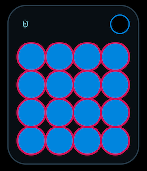

Output | Signal Range
:------------- | :-------------
Decimal Code | `0 to 65535`

Button | Function | Notes
:------------- | :------------- | :-------------
4x4 Button Grid | Pattern Entry | The pattern begins in the top left and goes left to right, top to bottom.

Turns a 16 step pattern into a decimal number that can be used to create rhythmic patterns with modules like the Pattern Bank Sequencer. The module looks at the 16 beat pattern as if it were at 16 digit binary number and simply converts that binary number into a decimal. In the Pattern Bank Sequencer, the decimal is re-converted into the binary number. The binary number is then broken apart into individual 0 (skip) or 1 (hit) messages for the sequencer.

 
### Counter

Counters are modules that count up or down in sequence when pulsed with a gate or somehow count time. They are most often used in sequencers.

---
**Elapsed Time**  

Input | Signal Range
:------------- | :-------------
Time | `0 to infinity`

Output | Signal Range
:------------- | :-------------
Time | `0 to infinity`

Meter | Displays
:------------- | :-------------
Value | `Elapsed Time` 

Displays the elapsed time since a timer has been reset. It converts the timer’s output of seconds into hours, minutes, seconds, and milliseconds.

---
**Up Counter**  

Input | Signal Range
:------------- | :-------------
Gate | `0 or 1`

Output | Signal Range
:------------- | :-------------
Count | `0 to any 32-bit number`

Counts up with each incoming gate pulse from 0 to a specified number and then resets. Commonly used for step sequencers.

---
**Up-Down Counter**  

The same as the Up Counter except it counts up to a number then down back to 0 at each gate pulse. Commonly used for ping-pong mode in a sequencer.

 
### Curve

Curve modules apply a shape to the normally linear output of a knob or incoming 0 to 1 modulation signal. They are useful for adding logarithmic or exponential responses to knobs on volume controls and filter cutoffs, or shaping the output of an envelope. They can also be used as audio effects to apply distortion to incoming audio signals.

---
**Curve Exp-Lin-Log**  

Fades between an exponential, linear, and logarithmic response. Commonly used on the output of an envelope to change its response. Greatly affects the sound of VCFs and VCAs.

---
**Curve Exponential**  

Fades between slightly exponential `(x*x)` to highly exponential `(x*x*x*x)`.

 
### Detector

Detector modules analyze incoming signals and detect something about them. The most basic and common detector is the audio peak detector, which flashes red when an audio signal exceeds the maximum -1 to 1 output range. Another commonly used detector is the Change Detector which outputs a short pulse whenever a value change is detected at its input.

---
**Audio Peak Detector**  

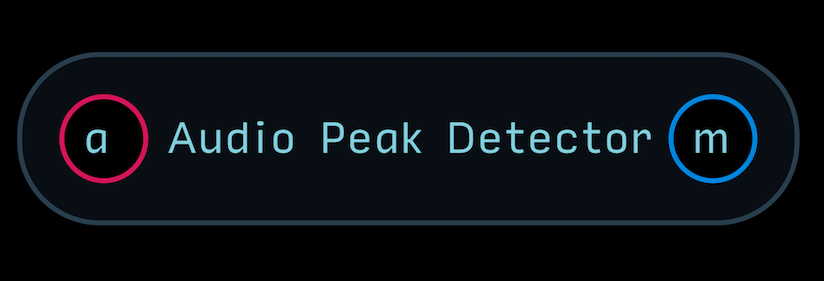

Flashes red when an incoming audio signal exceeds the -1 to 1 output range. Commonly used on audio and CV output modules.

---
**Change Detector**  

Outputs a gate pulse whenever a change in value is detected at its input. A common application is to attach the detector to a knob so that whenever the knob is turning, a light will will stay illuminated. When x time has elapsed, the light will turn off. The output will be a quick burst of on/off gates, not a steady stream of on or off. To smooth out this burst of gates, use the Gate Smear module. This detector works in single-sample mode, so it is very fast and will detect changes from one sample to another.

---
**High-Low Detector**  

Detects the high and low point of an incoming signal. Very useful for ranging the output of VCO modules to the standard -1 to 1 especially when the VCO module contains multiple mixed oscillators. The reset input sets the detector back to 0 to reanalyze. The two outputs output the high (top) and low (bottom) values.

---
**Up-Down Detector**  

Similar to the Change Detector, except it analyzes whether the signal is moving from a lower value to higher value, or higher value to lower value.

 
### Gate

These modules output 0 to 1 gate signals most often used to trigger sequencers or events.

---
**1-Frame Pulse**  

Takes an incoming 0 to 1 gate signal and converts it into a short ~300 sample pulse. A frame is the unit of time that Audulus processes in unless explicitly told to process in single sample mode. The pulse will only last ~300 samples no matter how long the incoming gate lasts. In most cases, this is the shortest useful gate length in Audulus.

---
**Gate to 10ms Pulse**  

Translates an incoming gate into a 10ms pulse which is a standard minimum pulse length recognized by many hardware sequencers.

 
### Input-Output

These modules are a collection of common input and output lights, indicators, and signal clippers. Light nodes will have to be exposed and placed within the input-output on a module. If for some reason the light appears below or beneath the output, enter the module, cut the light, then paste it. This will make it appear on top.

---
**Audio Clip Light Output**  

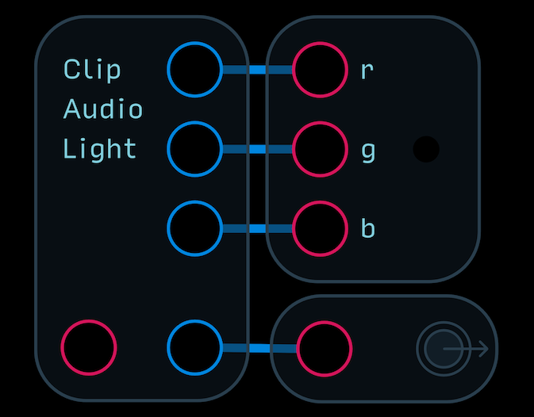

This module is a combination of the Audio Light Output module and a clamp expression that clips the output signal if it exceeds the standard -1 to 1 range for audio signals. It is almost exclusively found in VCAs, but can be put into any module where both hard clipping and an output audio light are desired. When clipping is detected, the light will flash white.

---
**Audio Light Input-Output**  

This collection of modules serve as audio input and output lights. When the light flashes red, the signal is positive. When it flashes blue, the signal is negative. Quickly oscillating audio signals will appear as a scintillating purple. If you do not need one or the other, simply delete it.

---
**Gate Input-Output**  

This collection of modules serve as gate input and output lights. If you do not need one or the other, simply delete it.

---
**Modulation Input-Output**  

This collection of modules serve as modulation input and output lights. If you do not need one or the other, simply delete it.

---
**Octave Input-Output**  

This collection of modules serve as octave signal input and output indicators. When placed inside a module, simply expose the “o” and center it in the input or output. If you do not need one or the other, simply delete it.

 
### Knob

These modules are meant to be paired with 0 to 1 knobs for use inside modules. When a Knob node is created, by default, its range is 0 to 1. Thought you can change this range, it is helpful to keep them all 0 to 1 so that they can interface with 0 to 1 modulation signals. These modules translate the 0 to 1 signal from knobs into different ranges and do various other fun tricks like acting as switches or number creators.

---
**-x to x**  

Attach a Knob node to the knob input and a number to the x input. The output will then range from -x to x. For example: If you attach 2 to x, the output of the module will be -2 to 2.

---
**0 to x**  

Attach a Knob node to the knob input and a number to the x input. The output will then range from 0 to x. For example: If you attach 5 to x, the output of the module will be 0 to 2.

---
**Center Range**  

Attach a Knob node to the knob input and a number to the Center(x) and Range(y) input. When the knob is centered at 0.5, the output of the module will be the value at Center(x). The Range(y) defines the entire sweep of the knob. For example: If you attach 2 to Center(x) and 6 to Range(y), the output of the module will be from -1 to 5, outputting a 2 when the knob is centered at 0.5.

---
**Integer Maker 0 to 999**  

Attach Knob nodes to the 100’s, 10’s, and 1’s inputs. Each knob will control the corresponding digit of a 3 digit number from 0 to 999, outputted by the module at x.

---
**Integers 0 to x**  

Attach a Knob node to the knob input and an integer to the x input. The knob will sweep from 0 to x in integer steps. For example: If you attach 9 to x, the module will output integers from 0 to 9 as you sweep the knob.

---
**Pulses Per Turn**  

Attach a Knob node to the knob input and a positive integer to the pulses per turn input. As you sweep the knob, the module will output an on/off gate pulse that many times per whole turn.

---
**x to y**  

Attach a Knob node to the knob input and two different numbers to x and y. The knob will sweep from x to y. For example: attach -1 to x and 10 to y. The module will output -1 to 10 as the knob is turned. The lower number does not need to come first, either. You could attach 100 to x and -100 to y, and the knob will sweep backwards from 100 to -100. You can also attach special numbers like pi or e to the inputs.

---
**x to y or z Switch**  

Attach a Knob node to the knob input and two numbers to x and y. The module will sweep from x to y as long as the knob’s value does not exactly equal 0 (turned all the way down). When the knob is turned all the way down, the signal present at the z input passes to the output.

---
**xyz Switch**  

Similar to the x to y or z Switch, the xyz switch will output x when the knob is turned all the way down, y when the knob is somewhere in between 0 and 1, and z when the knob is turned all the way up. A common configuration would be to attach the Knob to the knob input and the y input, with different signals attached to x and z.

 
### Light
These modules take an input signal and translate them into signals for the RGB light node.

---
**Audio Light**  

Analyzes an incoming -1 to 1 audio signal and displays the positive portion as red and negative portion as blue. Useful for indicating an audio output.

---
**Polar Light**  

Analyzes an incoming 0 to 1 modulation signal and displays it as blue for 0 to 0.5 and red from 0.5 to 1. Useful for light indicators on attenuverters.

 
### Loop

These modules create a feedback loop within a module. Feedback can be used in many different ways: to create audio or modulation distortion, or to force a portion of your design into single-sample mode.

---
**Force Single Sample Loop**  
Creates a loop that forces a portion of your module to run in single sample mode. Useful for when the operation of feedback requires faster processing than the ~300 sample frame rate.

 
### Octave

The octave signal is the equivalent to the 1 volt per octave linearized pitch scale standard in modular synthesizers but with a twist. Instead of 0 volts = lowest note and 10 volts = highest note, the octave signal in Audulus is centered at 0, where 0 = A4 = 440Hz. Going up or down by integers changes the octave, so 1 = A5 = 880Hz and -1 = A3 = 220Hz. The advantage of this system is that you can create synced oscillators that go far into the LFO range while still staying in tune with the master oscillator - very useful for FM synthesis. For practical purposes, VCOs are ranged from -5 to 5 to cover a standard 10 octave range.

---
**Octave to Hz with Linear Audio FM and Tune Controls**  

A basic starter kit for creating a VCO module in Audulus. This module is the same as the Octave to Hz with Octave Shift and Fine Tune Controls module with an added section for frequency modulation (FM) input that accepts -1 to 1 audio signals. Linear FM means that the frequency modulation will respond the same in low and high octaves (as opposed to exponential FM).

---
**Octave to Hz with Octave Shift and Fine Tune Controls**  

 

A basic starter kit for creating a VCO module in Audulus. The octave input is translated into the Hz value that the Oscillator and Phasor node needs. The octave control shifts the octave of the oscillator up or down by -5 to 5 octaves. Expose the value meter to display the octave shift on your VCO. The fine tune control shifts the oscillator down by a semitone (0) or up by a semitone (1).

 
### Presets

These modules use spline nodes to store preset values for use in other modules. Simply add spline break points inside the modules and attach outputs to the controls you want to create presets for. Attach a knob to the preset knob to bring the preset scanner onto the front panel UI of your module.

---
**Preset 2**  

 

A preset module with 2 outputs.

---
**Preset 4**  

 

A preset module with 4 outputs.

---
**Preset 8**  

 

A preset module with 8 outputs.

---
**Preset 16**  
A preset module with 16 outputs.
 

 
### Random

These modules create random strings of numbers which can be used as audio noise or as random modulations.

---
**True Random**  

 

Creates true random numbers that are not algorithmically generated like those from the Random node. The Random node creates a string of pseudo-random numbers from a starting point called a seed. 

The problem with this is that a patch utilizing a Random node will sound exactly the same whenever the patch is opened. This module solves that problem by using the microphone input to generate noise, which can then be sampled to create true randomness. 

The noise floor of an audio input is amplified by a large factor and pushed through a sine waveshaping expression to create what is essentially white noise. The audio input used by True Random can be shared with an instrument without interfering with its operation, or inducing noise into the audio path. 

The audio channel used can be changed inside the module at the ADC node input. By default, the noise is sampled at 20kHz. To create a true random sample & hold, just combine this module with a clocked sample and hold.

 
### Rectifier
These modules take incoming signals and rectify them. Rectification is a term borrowed from electronics. When you want to convert an alternating current (AC) to a direct current (DC), you use a rectifier. AC is equivalent to Audulus’ audio signal, and DC is equivalent to Audulus’ modulation signal. There are two basic types of rectification - full-wave and half-wave. Full wave rectification flips the negative portion of the wave around so that, for example, a sine wave would appear to be rolling, bouncing hills. Half wave rectification simply clips off the negative portion of the wave. Rectifiers are useful for waveshaping your modulation signals to get unique patterns you otherwise would not normally be able to get.

---
**Audio Rectifier**  

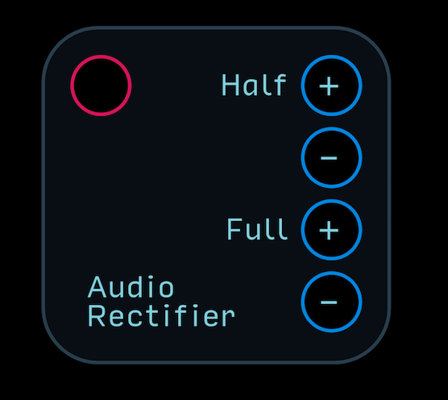 

Rectifies an audio signal in 4 different ways.  
Half + outputs the half-wave rectified positive signal.  
Half - outputs the half-wave rectified negative signal.  
Full + outputs the full-wave rectified positive signal.  
Full - outputs the full-wave rectified negative signal.  

---
**Modulation Rectifier**  

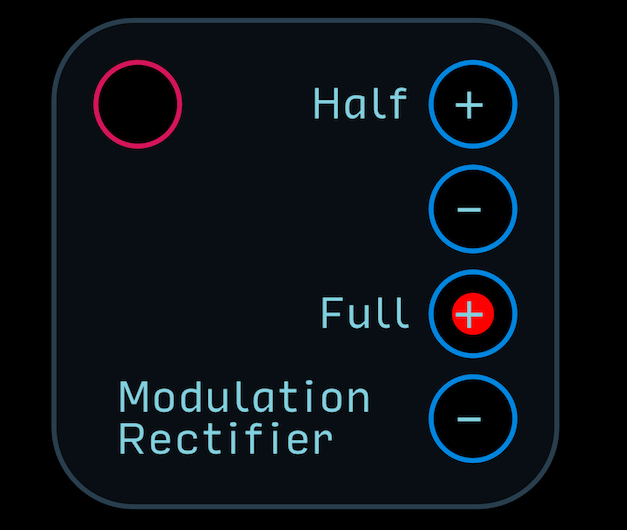 

Converts a modulation signal to an audio signal and then rectifies it in 4 different ways.  
Half + outputs the half-wave rectified positive signal.  
Half - outputs the half-wave rectified negative signal, but translated into the 0 to 1 modulation range.  
Full + outputs the full-wave rectified positive signal.  
Full - outputs the full-wave rectified negative signal - an inverted version of the full-wave positive signal translated into the 0 to 1 modulation range.  

---
**Rectifying Signal Reflector**  

Uses a set of expressions to combine two modulation signals into a unique modulation wave. When x is greater than y, the output of the module is x-y. When y is greater than x, the output of the module is y-x. When the output of the module is greater than 0.5, the module outputs a gate. The x and y knobs control the level of each modulation signal before being compared. The attenuate control attenuates the overall output of the module. The offset control does not offset the main output signal, but instead offsets the output that is located beneath the offset control. This output is meant to be looped back and attached to the x or y control to create really wild unpredictable results.

 
### Signal

These modules compare and create signals. The category is broad and contains modules that otherwise do not fit into any of the other building categories.

---
**Return Greater**  

Compares signals x and y and outputs whatever signal is greater.

---
**Return Lesser**  

Compares signals x and y and outputs whatever signal is lesser.

---
**Value Distributor**  

Creates eight 0 to 1 modulation signals that are distributed in a user-defined manner around linear and exponential shapes. The bal or balance control adjusts the tilt of the distribution from left to equal to right. The shape control applies an exponential curve to the distribution. The peak control changes which output has the highest peak. The gain control adjusts the total range of the value distribution. An example use of this module would be to use each 8 outputs to control the boost or cut of an 8 band equalizer.

 
### Spline

These are preset spline nodes mainly for use in oscillators. Driven by a 0 to 1 saw LFO, they translate the saw into whatever shape depicted on the spline. The output of the spline will have to be translated into the -1 to 1 audio range if using them as audio oscillators.

**Triangle Spline Node**  

A spline with a perfect triangle shape.

 
###Templates
These are module templates that can be used to quickly build up a custom module of your own.

---
**VCO Template**  

This is a basic VCO template that includes an octave input, audio output, and tuning controls. Just add your own custom oscillator and adjust the UI to taste.

 
### Translation

These modules take a one signal and transform it into another type of signal. The most common of these is the Octave to Hz translator, which converts the linearized octave pitch signal in Audulus to the exponential Hz pitch value. You will find these translator modules in every single VCO module in Audulus’ module library. Another common translation module are the truncate modules, which cut off values of a number past a certain digit. This is useful when you only want to display a value to a certain precision.

#### Audio

These modules translate -1 to 1 audio signals into other signal types.

---
**Audio to Modulation**  

Translates -1 to 1 audio signals to 0 to 1 modulation signals.

 
#### BPM

These modules translate BPM (beats per minute) signals into other signal types.

---
**BPM to Hz**  

Translates BPM signals into Hz values.

 
#### dB

These modules translate dB (decibel) signals into other signal types.

---
**dB to Amplitude**  

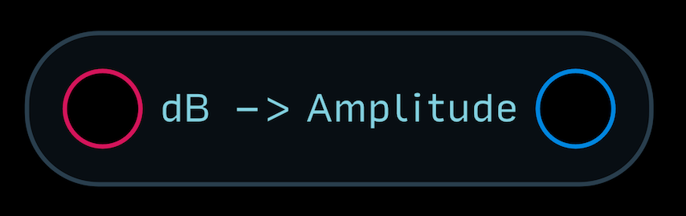

Translates dBs into an amplitude signal.

 
#### Feedback Delay

These modules translate the Feedback Delay period into other signal types.

---
**Feedback Delay to Seconds**  

Translates the Feedback Delay time into seconds.

 
#### Hz

These modules translate Hz (hertz) signals into other signal types.

---
**Hz to BPM**  

Translates Hz into BPM.

---
**Hz to Note Number**  

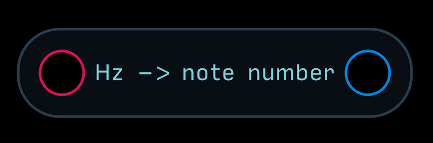

Translates Hz to Note Number, as defined by an 88-note piano keyboard.

---
**Hz to Octave**  

Translates Hz into the octave signal.

---
**Hz to Seconds**  

Translates Hz into seconds.

#### Modulation

These modules translate the 0 to 1 modulation signal into other signal types.

---
**Modulation to Audio**  

Translates the 0 to 1 modulation signal into a -1 to 1 audio signal.

---
**Modulation to Radians**  

Translates the 0 to 1 modulation signal into the 0 to 2pi radian signal.

#### Note Number

These modules translate the note number, as defined by an 88-note piano keyboard, into other signal types.

---
**Note Number to Hz**  

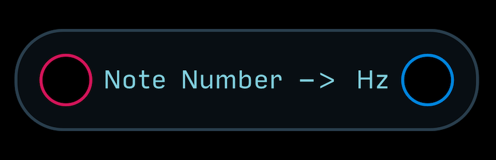

Translates a note number into a Hz signal.

---
**Note Number to Octave**  

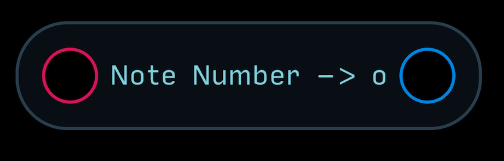

Translates a note number into the octave signal.

#### Octave

These modules translate the octave signal to other signal types. The octave signal in Audulus is a linearized pitch scale. Unlike 1 volt per octave modular synth pitch scales, the octave signal has no upper or lower limit. Instead, it is centered around 0, where 0 = A4 = 440Hz. An octave signal of 1 would be 1 octave higher than A4, or A5 = 880Hz. An octave signal of -1 would be 1 octave lower than A4, or A3 = 220Hz. The reference pitch of A4 = 440Hz can be changed inside these modules.

---
**Octave to Hz**  

Translates the octave signal into a Hz signal.

---
**Octave to Note Number**  

Translates the octave signal into a note number signal.

#### Radians

These modules translate radians into other signal types. The Phasor node outputs in radians.

---
**Radians to Audio**  

Translates radians into a -1 to 1 audio signal.

---
**Radians to Degrees**  

Translates radians into a 0 to 360 degrees signal.

---
**Radians to Modulation**  

Translates radians into a 0 to 1 modulation signal.

#### Round

These modules round incoming signals to the closest digit specified.

---
**Round to Hundredths**  

Rounds incoming signal to the nearest hundredths place.

---
**Round to Integer**  

Rounds incoming signal to the nearest integer.

---
**Round to Tenths**  

Rounds incoming signal to the nearest tenths place.

---
**Round to Thousandths**  

Rounds incoming signal to the nearest thousandths place.

#### Samples

These modules translate the time period of a sample into other signal types.

---
**Samples to seconds**  

Translates x number of samples into seconds. Smallest value is 1. For best results, use integers.

#### Seconds
These modules translate seconds into other signal types.

---
**Seconds to samples**  

Translates x number of seconds into a number of samples.

#### Truncate

These modules clip off trailing digits after the given decimal place.

---
**Truncate to Hundredths**  

Clips off any digits after the hundredths place.

---
**Truncate to Tenths**  

Clips off any digits after the tenths place.

---
**Truncate to Thousandths**  

Clips off any digits after the thousandths place.

### Vias

Vias are special pass-through tabs that help arrange wires in Audulus. They are very useful for keeping the internals of modules neat and easy to read. They also serve an important function while building. You may, for example, have a single output going to multiple inputs. You want to attach a knob to test that function, but then later wish to replace it with an input or maybe even a button. If you simply attached the output of the knob to all of those inputs, you would have to delete the knob and rewire everything from scratch. However, if you wire the via first and then attach the knob to the via, you can easily clip out the knob while retaining your connections. Also, because signal flow in Audulus is by default left to right, the cable animation will not look very neat if you want to run a signal backwards in a feedback configuration. Reverse vias allow you to change the direction of a signal in Audulus while maintaining a clean look.

## Chaos

Chaos modules are a special class of random modules used primarily for modulation. They are not purely random like white noise (where all values have an equal possibility of being chosen), and not “filtered” random like pink noise (where lower values have a greater chance of being chosen than higher values). Instead, chaos describes a system that is highly dependent on an initial state, and often contain feedback loops, where the previous state affects the next state. For example: in choosing random numbers, the previous number does not affect the probability of the value of the next number being chosen. A filtered random system can bias the set of numbers being chosen so that more low-value numbers are chosen (like with pink noise), but the previous number chosen still does not affect what number will be chosen next. Chaos on the other hand allows for previous values to influence future values that are chosen. Chaos modules make for interesting modulation sources as they tend to have a more organic or natural feel - almost as if a human hand or the wind were turning the knob.

---
**1D Chaos Decay**  

Creates a one-dimensional chaos modulation and envelope decay source. The module begins with a modulation output of 0.5. Each time the module is clocked, a new value is chosen. The new value will be go halfway from its current position to 1 (0.75) or 0 (0.25). 

Each successive clock pulse will again choose halfway to 0 or halfway to 1. So if the current position after one clock pulse is 0.75, the next position could be halfway to 1 (0.875) or halfway to 0 (0.375). The bias knob tips the balance from a 50-50 chance to go up or down to 100% chance to go down (0) or 100% chance to go up (1). 

The slew knob eases transitions between each new value. The range knob offers 7 discrete ranges of slew limiting. Range value of 1 is the least amount of slew limiting, good for just barely taking the edge off of transitions, and a range value of 7 offers really long and slow transitions between each new value for when you want changes to happen over the course of several minutes. 

The range must be used in conjunction with the speed of the incoming clock. If the range is set to 7 with a fast incoming clock speed, the module will hover very closely to 0.5 without changing much ever. 

So as a general rule use slow clock speeds for higher slew range values. The decay control adjusts the speed of the decay of the 8 envelope outputs from 0.01 seconds to 30 seconds. The decay cycle is triggered whenever the value of the modulation output crosses each input.

---
**1D Chaos Gate**  

Creates a one-dimensional chaos modulation and gate source. The module begins with a modulation output of 0.5. Each time the module is clocked, a new value is chosen. The new value will be go halfway from its current position to 1 (0.75) or 0 (0.25). 

Each successive clock pulse will again choose halfway to 0 or halfway to 1. So if the current position after one clock pulse is 0.75, the next position could be halfway to 1 (0.875) or halfway to 0 (0.375). The bias knob tips the balance from a 50-50 chance to go up or down to 100% chance to go down (0) or 100% chance to go up (1). 

The slew knob eases transitions between each new value. The range knob offers 7 discrete ranges of slew limiting. Range value of 1 is the least amount of slew limiting, good for just barely taking the edge off of transitions, and a range value of 7 offers really long and slow transitions between each new value for when you want changes to happen over the course of several minutes. 

The range must be used in conjunction with the speed of the incoming clock. If the range is set to 7 with a fast incoming clock speed, the module will hover very closely to 0.5 without changing much ever. 

So as a general rule use slow clock speeds for higher slew range values. The -/+ control is a positive domain attenuverter for the modulation output. The 8 gate outputs serve as both a meter and set of triggers for other modules.

---
**2D Chaos Decay**  

Essentially the same as two 1D Chaos Decay modules, but with a 2D output matrix. Map the x and y outputs to dual parameters like delay time and feedback, left and right channel volume, or filter cutoff and resonance. Use the output gates to trigger chaotic events or step sequencers.

---
**2D Chaos Gate**  

Essentially the same as two 1D Chaos Gate modules, but with a 2D output matrix. Map the x and y outputs to dual parameters like delay time and feedback, left and right channel volume, or filter cutoff and resonance. Use the output gates to trigger chaotic events or step sequencers.

## Clock

These modules are the beating heart of any modular system. Clock modules are primarily used to advance step sequencers from one note to the next. In many hardware clock modules, clocks output a very short pulse or 10 milliseconds or less. In Audulus, however, clock modules output either a 50% pulse-width gate (equal time on and off), or have a variable control. 

This allows clocks to be used as gates for envelope modules or as on/off switches as well. This collection also contains clock modifiers like clock speed dividers and multipliers. Clocks output 0 or 1 gate signals.

---
**BPM Clock**  

Creates a clock pulse based on a beats per minute (BPM) value. The top knob controls the BPM value, which is displayed at the bottom of the module. The BPM values are fixed at integers from 60 to 220 BPM. 

The pulse width control adjusts the amount of on time relative to off time. The decimal value represents the pulse width percent - so 0.5 is 50% duty cycle, 0.1 is 10% duty cycle, and 0.9 is 90% duty cycle. At 0 or 1 the clock output will effectively turn off (remain low or high all the time), though internally it will still pulse. 

The button will turn the clock on (red) or off (blue). The input just below the button is a remote on/off gate that will work only if the button is in the off state. The gate input of the clock is a sync input which restarts the clock. 

Use a slower clock to reset a faster clock for some interesting rhythmic variations, or simply to sync multiple clocks to one master clock.

---
**Burst Generator**  

Creates a stream of 1 to 32 clock pulses at a given speed whenever the input is clocked. The top knob adjusts how many clock pulses the burst generator creates. The bottom knob adjusts how fast the pulses are generated. Very useful for creating organic-sounding snare rolls.

---
**Clock Divider**  

Accepts an incoming clock pulse and outputs a division of the incoming clock speed from 1/1 (pass-through) to 1/64 (one clock pulse per 64 incoming clock pulses). If you have a patch with multiple clock dividers, you may find that you have to close and reopen a patch to sync them up. You only need to do this once after you have finished adding the clock dividers. This is not a bug: closing and reopening a patch resets the counters inside the clock dividers so they all start from the beginning. A unique feature to Audulus is that clock dividers modules preserve the throughput clock’s pulse width.

---
**Clock Fractional Multiplier**  

Accepts an incoming clock pulse at the top gate input and outputs a fractional multiplication of the incoming clock speed from 1/1 (pass through) to 8/9 (8 clock pulses per 9 incoming clock pulses). The top knob controls the numerator from 1 to 9 and the bottom number controls the denominator from 1 to 9. The momentary button resets the counter from start. The rs (reset) input will do the same, but with a remote gate control. This module can create all sorts of complex rhythmic pulses based on an incoming clock pulse. Clock multipliers in Audulus work by using a Zero Cross node to analyze the incoming speed of a clock signal. Thus, they will always need 2 initial clock pulses to begin working. If you want everything in your patches to stay totally lock step in a perfect way, it is much better to set your master clock to the fastest pulse you will use and use clock dividers to divide the master clock.

---
**Clock Multiplier**  

Accepts an incoming clock pulse and outputs a division of the incoming clock speed from `1*1` (pass-through) to `1*64` (64 clock pulses per 1 incoming clock pulse). If you have a patch with many clock multipliers, you may find that you have to close and reopen a patch to sync them up. You only need to do this once after you have finished adding the clock multipliers. This is not a bug: closing and reopening a patch resets the counters inside the clock dividers so they all start from the beginning. Clock multipliers in Audulus work by using a Zero Cross node to analyze the speed of the incoming clock signal. Thus, they will always need 2 initial clock pulses to begin working. If you want everything in your patches to stay totally lock step in a perfect way, it is much better to set your master clock to the fastest pulse you will use and use clock dividers to divide the master clock.

---
**Clock**  

Creates a clock pulse based on a Hz value from 0 to 20Hz. The top knob controls the speed of the clock. The pulse width control adjusts the amount of on time relative to off time. The decimal value represents the pulse width percent - so 0.5 is 50% duty cycle, 0.1 is 10% duty cycle, and 0.9 is 90% duty cycle. At 0 or 1 the clock output will effectively turn off (remain low or high all the time), though internally it will still pulse. The button will turn the clock on (red) or off (blue). The input just below the button is a remote on/off gate that will work only if the button is in the off state. The gate input of the clock is a sync input which restarts the clock. Use a slower clock to reset a faster clock for some interesting rhythmic variations, or simply to sync multiple clocks to one master clock.

---
**Flip Flop 2^16**  

Flip flops in Audulus are a great, low-CPU way to create a clock divider. A single flip flop will divide an incoming clock pulse by 2. Chain the flip flops together and you get more and more divisions. This chain of flip flops is also known as a SISO (serial in serial out) shift register. This module outputs the clock divisions by powers of two, from top to bottom: 1/2, 1/4, 1/8, 1/16, 1/32, 1/64, 1/128, 1/256, 1/512, 1/1024, 1/2048, 1/4096, 1/8192, 1/16384, 1/32768, and 1/65,536 (or 2^16). This is a very useful module for queuing events, especially in 4/4 time. If the master clock pulse is set to 1/64th notes, then the 1/64 divided output will become the whole note output, and the 1/512 output will become the 8 bar output. These flip flop clock dividers are fixed at a 50% pulse width by design.

---
**Flip Flop 256 Inverter**  

Flip flops in Audulus are a great, low-CPU way to create a clock divider. A single flip flop will divide an incoming clock pulse by 2. Chain the flip flops together and you get more and more divisions. This chain of flip flops is also known as a SISO (serial in serial out) shift register. This module outputs the clock divisions by powers of two and their inverted counterparts, from top to bottom: 1/2, -(1/2), 1/4, -(1/4), 1/8, -(1/8), 1/16, -(1/16), 1/32, -(1/32), 1/64, -(1/64), 1/128, -(1/128), 1/256, -(1/256). This is a very useful module for queuing events, especially in 4/4 time. If the master clock pulse is set to 1/64th notes, then the 1/64 divided output will become the whole note output, and the 1/256 output will become the 4 bar output. The inverted outputs offer a way to make events happen in between clock divisions. These flip flop clock dividers are fixed at a 50% pulse width by design.

---
**Flip Flop**  

Flip flops in Audulus are a great, low-CPU way to create a clock divider. A single flip flop will divide an incoming clock pulse by 2. This is a very useful module for as a kind of remote on/off switch. These flip flop clock dividers are fixed at a 50% pulse width by design.

---
**Probability Clock**  

A combination of a basic clock module and a chance gate passthrough module, this patch allows you to adjust the percent chance that the clock’s gate output will pass from 0% to 100% chance. A perfectly simple way to add a little variation to your sequencers or envelopes. The pulse width of the clock is preserved through the chance gate passthrough module.

---
**Pulse Looper**  

Tap the button to store 8 gate pulses over a maximum of ~5 seconds. The knob controls how long the recorded loop will be from 0 to ~5 seconds. This module can be chained with multiple instances through the outputs marked “v.” The Master module should have no input at the top v input. Slaved modules should have the master’s v output attached to their v input. This module will not store patterns between opening and closing your patch.

---
**Random Clock Divider**  

This module is the same as the clock divider module with an R or randomize gate input for selecting a random gate division from 1/1 to 1/64. A unique feature to Audulus is that clock dividers modules preserve the throughput clock’s pulse width.

---
**Random Clock Fractional Multiplier**  

This module is the same as the clock fractional multiplier module with an R or randomize gate input for generating a random gate fractional multiplication where the numerator and denominator can be any integer 1 to 9.

---
**Random Clock Multiplier**  

This module is the same as the clock multiplier module with an R or randomize gate input for selecting a random gate multiplication from `1*1` to `1*64`.

---
**Random Clock**  

This module is the same as the clock module with an R or randomize gate input for selecting clock speed from 0 to 20Hz.

---
**Shift Register Clock**  

This patch is a combination of the Clock module and the Flip Flop 256 Inverter module.

---
**Smeared Clock**  

This patch is a combination of the Clock module, Chance Gate Passthrough (CGP) module, and the Gate Smear module. The CGP module passes a random number of clock gates through to the Gate Smear module which keeps the gate high if the time between the gates is lower than its threshold. Useful for creating gates to send to envelopes that stay in sync with the master clock but have random varying lengths.

---
**Tap Tempo Clock**  

Outputs a clock pulse based on a tap input and displays the clock speed in both Hz and approximate BPM. Tap Tempo speed will not be stored when closing a patch.

---
**Touch Clock**  

Uses a delay node to record tapped clock pulses. Great for inputting rhythms for live performance. Tap a rhythm then wiggle the loop time knob to get distorted semi-random gates.

##Collection

These patches collect all or some of the modules in each subfolder by different types. Useful for when you want to explore everything Audulus has to offer in a particular category.

---
**Clocks**  

A collection of all of the clock modules.

---
**Gates**  

A collection of all of the gate modules.

## Controller

These modules are performance controllers meant to provide interfaces beyond simple knobs and buttons.

---
**xy Pad 8x8**  

Creates a quantized 64-point input grid that acts as an xy controller. Simply draw out a cable from the module’s output below the grid and wave it around the field of inputs. Do not let go of the cable over the field of inputs. When you are done using the xy pad, make sure you move the cable away from any of the field of inputs and disconnect there. Otherwise the cable will become statically connected to the pad. The module outputs an x and y 0 to 1 modulation signal in discrete steps of 1/7. The module also outputs a gate signal when a new value is detected at each coordinate. The length of the gate can be adjusted internally.

## Drum

These modules are synthesized drum sounds categorized by general types. Some are collected into drum kits that offer a convenient package to create a beat. All work well with a combination of clock modules and clock dividers and multipliers, as well as chance modules that add variation to their beats. A great starter companion patch is to create a Shift Register clock and use probability modules to add variations to the different tempos of clock signals going to each module. You can also use the Pattern Bank Sequencer to instantly create groovy patterns and use modulation to switch between different patterns.

### Cymbal

These modules are different cymbal-like synthesized drum modules.

---
**Sizzle Cymbal**  

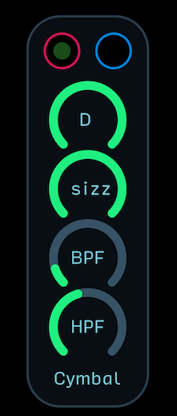

Creates a trashy lo-fi cymbal sound that is nice for bell rides at the right settings. D or decay controls the length of the cymbal crash, sizz or sizzle controls a filter that gives the cymbal its characteristic sound, and the BPF (band pass filter) and HPF (high pass filter) offer other tonal controls. Play around with different settings and modulate the decay to make the cymbal sound really varied.

### Kick

These modules are different kick-like synthesized drum modules.

---
**Sine Kick**  

A simple no-frills sine kick sound with a few controls. The pitch knob sets the pitch of the kick and the shape controls how exponential the decay of the envelope is.

### Kit

These modules are collections of drum modules, sometimes with some added functionality like probability or mixing controls.

---
**ITS A TRAP!!**  

A collection of the Sizzle Cymbal, Sine Kick, and Basic Snare in one neat package with volume controls for each sound. Has individual outputs for each sound as well as a mix output.

---
**Weather Patterns**  

Similar to ITS A TRAP!!, this module collects two versions of the Sizzle Cymbal, Sine Kick, and Basic Snare modules with options to randomly choose one sound or another. Each drum sound can accept a unique gate and the gA/B controls which sound is more likely to hit.

### Percussion

These modules are synthesized percussion sounds of various types that don’t fall into traditional kick/snare/tom/cymbal categories.

---
**KarPlus**  

A Karplus-Strong percussion oscillator that can create all kinds of zinging hits. The A or attack control adjusts the onset of the sound, and the D or decay control adjusts the length of the sound. The grain knob adjusts the graininess of the sound, and the FB control also contributes to the length of the decay. The level knob adjusts the output level, and the drive control adds distortion to the output.

---
**Res Drum**  

A self-oscillating filter-based resonant drum that mimic the natural sound of tight head drums like bongos and congas. The two filter cutoff points can be dragged around to create different sounds. One controls the tone of the instrument and the other controls the noise filtering. The noise knob adjusts the level of noise, the Q control adjusts the Q of the tone of the module, and the drive knob adds distortion to the output. Under the Q control is an internal envelope output that, when connected to the Q control, can add a more nonlinear sound to the drum.

---
**Resonant Hand Drum**  

Similar to the Res drum, this module uses BPFs to create a very realistic sounding hand drum. The noise control adjusts the level of noise, and the decay control adjusts how long the sound lasts. The two filter cutoff controls adjusts the cutoff points for the internal bandpass filters and the Q control adjusts the sharpness of their peaks. The mix control adjusts the balance between the left and right filter, and the drive control adds distortion to the output.

---
**uDing V1**  

Bell simulator which generates multiple decaying harmonics by exciting a resonant filter. Harmonic ratios were taken from the Wikipedia article on strike tone. The pitch knob sets the pitch of the bell. The decay controls how fast the bell sound fades. The detune detunes the various harmonics for a more dissonant sound (0.5 is no detune). The tone knob controls the tone of the bell.

### Snare

These modules are different snare-like synthesized drum modules.

---
**Basic Snare**  

A basic synthesized snare based on the architecture of the 909 snare. The D or decay control adjusts the length of the snare and the shape control adjusts how exponential the decay is. The snare knob adjusts the loudness of the noise component of the snare sound (similar to the metal snares underneath the snare drum), and the ring adjusts the loudness of the tone of the snare.

---
**Noise Snare**  

A purely noise-based snare with no tone oscillator, this snare is perfect for creating really trashy sounding snares. The cutoff controls the base frequency that the envelope will settle to once pinged, and the knob below it adjusts the speed of the sampling of the noise. At higher sample rates, the noise is more pure white, white at lower sample rates it starts to sound very crushed and digital and has fewer high frequencies. The top decay knob controls the time the filter takes to settle and the bottom decay knob controls the overall length of the sound. The overdrive knob at the bottom controls the total output distortion.

## Effect

These modules alter audio signals in a variety of ways. Adding a sense of space with reverb, pumping your drums with compression, or overdriving your synth for a harder-hitting sound are all ways to polish off a mix.

### Autopan

These modules are like a stereo tremolo effect. They pan audio back and forth between the left and right channels. Great for adding some subtle stereo depth to your music, or creating rythmic back and forth ping-ponging.

---
**Skew Sine Autopan**  

Uses a Sine Skew LFO module to create a variable autopan shape from reverse ramp-like to sine to saw-like. This autopan has a softer sound than a saw or triangle based autopan would, but still gives the feeling of percussiveness and reverse autopan. The mix control balances the dry and wet signal. The LFO speed knob goes from 0.032Hz to 20Hz, and the skew control adjusts the tilt of the sine wave from reverse ramp to sine to saw.

### Delay

Delay is an effect that grabs a portion of your sound and repeats it - like an echo in a canyon. There are many types and flavors of delay which can add a sense of space or a rhythmic element to your instruments. Delays especially love arpeggiated lines and drums, especially cymbals and snares.

---
**Analog Delay**  

Uses an LPF inside a delay loop to create a dark-sounding delay effect. Delay controls the delay time from 0 to 2 seconds. Feedback controls the number of delay repeats. Mix balances the dry and wet signal.

---
**Art D’Echo Dub Delay**  

Combines a delay effect with a spring reverb effect to recreate the vibe of famous tape echo dub effects. Time, regen, and amount are the delay time, feedback, and mix for the delay effect. The tape knob controls the amount of warbly modulation to the delay line. Drive controls the amount of drive within the delay loop. Cut is the filter cutoff for the filter within the delay loop. Tens or tension is the control for the virtual tension of the springs in the the spring reverb effect. Mix is the balance of delay/reverb, color changes the tone of the springs, and dwell is the length of the spring reverb.

---
**Chorus Delay**  

Combines a delay effect with a chorus effect. Delay controls the delay time from 0 to 2 seconds. Feedback controls the number of delay repeats. Mix balances the dry and wet signal. Speed controls the modulation speed of the chorus effect. Depth controls the amount of chorus modulation. Color adjusts the cutoff of the filters within the delay and chorus effect.

---
**Clockable Tuned Delay Line**  

A wild delay effect that can be used for much more than just rhythmic delays, the Clockable Tuned Delay Line can even work as an oscillator and audio chopper. 

Delay controls the delay time from 0 to 2 seconds. Regen controls the number of delay repeats. Mix balances the dry and wet signal. The sync button locks the delay time to musical intervals from 1/64th notes to 3/1 measures with all the dotted (D) and triplet (T) variations in between. 

Sync can be turned on and off remotely with a gate at the sync input. The mod knob adjusts the amount of delay time modulation - requires an external LFO at the mod input. The color knob adjusts the filter cutoff for the LPF/HPF filter. 

The HPF button switches the LPF/HPF filter within the delay loop into HPF mode. This mode can be remotely turned on and off at the HPF gate input. The tap button allows you to enter a tap tempo for the delay, and the clock input allows you to “tap” remotely with a clock in Audulus. 

The tune button turns the delay into a Karplus-Strong-like oscillator with the pitch (delay time) determined by the octave signal present at the octave input. The tune mode can also be gated at the tune input. 

This is a sound sample of what this module can do when rhythmically switching in and out of all of its modes - free, synced, and tuned: https://soundcloud.com/audulus/bimini-road-clockwork-groove-electrofunk

---
**Digital Delay**  

A pure, high-fidelity digital delay. Delay controls the delay time from 0 to 2 seconds. Feedback controls the number of delay repeats. Mix balances the dry and wet signal.

---
**Icebox Audio Freezer**  

A granular automatic audio looper that uses threshold detection to grab bits of audio and loop them infinitely until the next note overrides it. 

Thrsh or threshold sets the threshold that must be exceeded before a new grain is grabbed and looped. The light below thrsh illuminates when the threshold has been exceeded. Dialing in this control is essential for making it work. 

For guitar, you want it to be just low enough to grab notes as you play them, but high enough that fret talk does not cause the grain to be erased and replaced. 

Emph or emphasis controls the aggressiveness of the grain from completely choppy to a little smooth on the uptake. Grain adjusts the amount of time to be looped from 0.05 seconds to 0.55 seconds. 

Mix controls the balance of dry audio and frozen audio. When the env or envelope button is engaged (red), the A (attack) and D (decay) controls will fade up and out the grain as you play. 

An excellent and very musical guitar effect - watch a demo of it here: https://www.instagram.com/p/BV_Cca1Amv2/?taken-by=audulus

---
**Multi-Tap Filter Delay**  

A stereo triple delay with controls to adjust the level, pan, delay time, feedback, cutoff, Q, and filter type for each delay (from top to bottom). The dry knob at the top adjusts the level of the dry signal - not the overall mix.

---
**Stereo Digital Delay**  

A stereo delay that can accept both mono and stereo signals. For a mono to stereo effect, use the top L or left input and make sure the mono button is engaged (red). For a stereo to stereo delay effect, disengage the mono button (blue) and attach the input signals to L and R. Mix adjusts the balance of wet and dry, L and R are the delay times for the left and right channels, and the fb knob controls the amount of feedback for each delay line.

---
**Tape Delay**  

A model of a hissy broken tape delay, perfect for that lofi sound. Delay controls the delay time from 0 to 2 seconds. Feedback controls the number of delay repeats. Mix balances the dry and wet signal.

### Distortion

Distortion effects change audio signals by distorting or warping the signal as it passes through. Distortion adds harmonics most often by overdriving or squaring-off a wave. All distortions have different flavors and are better for one sound or another. Make sure you try them all on each instrument you use to see which ones you like the most!

---
**Araya-Suyama Tube Overdrive**  

Cribbed from a research paper describing a low-CPU way to model a tube amplifier in software, this simple distortion uses a waveshaping expression to overdrive your signal in a manner similar to how an overdriven tube amplifier would sound.

---
**Bitcrush**  

Bitcrushing is a type of distortion that limits the available definition of any given sample. The less definition the wave has, the more distorted it becomes. Heavy bitcrushing can make a smooth sine wave look like an undulating staircase. Bitcrushing is similar to sample rate reduction, but they sound a little different. Perfect distortion for really aggressive drum sounds or buzzy bass lines.

---
**Cubed Overdrive**  

Uses a simple x^3 expression to waveshape the audio going through it. Very CPU efficient.

---
**Distortion**  

Uses the Distortion node in series with an overdrive module to limit the output of the module.

---
**Doidic Asymmetrical Tube Overdrive**  

Another distortion module taken from an audio DSP research paper, this tube overdrive simulator attempts to mimic the asymmetrical transfer function of guitar tube amplifiers. Asymmetric means that the negative and positive portions of the wave are not shaped identically. A transfer function is the shape that the sound wave is forced to follow as it moves up and down from positive to negative.

---
**Down Sample**  

Reduces the number of samples for the audio as it comes through from the sample rate of 44.1kHz to much, much lower sample rates. The main difference between downsampling distortion and bitcrushing (which both produce staircase-like wave shapes) is that downsampling effectively limits the upper frequency range of the sound coming through it, where bitcrushing does not. This can sound awful or awfully amazing, depending on how you use it. Great for mangling drums or creating digital chaos.

---
**Hypertangent Overdrive**  

Uses a simple hypertangent (tanh(x)) expression to emulate transistor saturation.

---
**Sigmoid Overdrive A**  

Uses a sigmoid transfer function that is similar to the Distortion node to distort audio. Also taken from an academic research paper.

### Dynamics

These modules affect the dynamics, or amplitude, of the audio as they pass through. Dynamic processors include compressors, expanders, limiters, audio gates, de-essers, and so on.

#### Compressor

These modules compress an audio signal’s overall dynamic range. This is done for many reasons, but the most common is to make a sound more “punchy.” It takes a while to learn how to balance the parameters of a compressor correctly, but it’s an essential ingredient for well-balanced music.

---
**miniPress**  

Compresses incoming audio based on the curve drawn by the mapper node. The lookahead function allows the compressor to respond more intelligently by delaying the signal.

---
**RMS Compressor**  

RMS or root mean square compression takes the average of an incoming audio signal and compresses based on a ratio derived from that average. The threshold controls the point at which the compressor is triggered, the ratio determines how hard the sound is compressed, and the drive knob applies output distortion. 

The ZC/o or zero-cross/octave signal knob switch determines the method of sampling the audio signal. The ZC mode attempts to determine the pitch of the incoming signal and samples appropriately from there. The octave mode uses the oscillator’s octave signal to create a more precise sampling of the oscillator. 

In general, use the ZC mode for drum modules and other non-pitched instruments, and use the octave mode when you have an octave signal available. 

This module also works for stereo signals. The compression it creates can be rather extreme. Think of it less as a final mastering compressor and more as an effect for mangling things like drums and bass lines.

---
**Super Simple Compressor**  

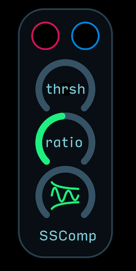

This compressor is one of the simplest types of compressors you can make in Audulus. It has a threshold control for determining when compression kicks in, a ratio knob for setting the amount of compression, and a release knob for setting how long it takes for the compressor to let go.

#### Ducker

Duckers are a type of compressor that use a technique called side-chaining. Side-chaining is really popular at the moment, especially in dance music. The effect you hear when the kick drum sucks the rest of the music away for a moment every time it hits is ducking. Ducking allows low frequency content to burst through a mix in a dynamic way.

---
**Ducker**  

A basic ducking module that has a separate audio input for whatever instrument you want to trigger the ducking effect (usually a kick drum). The audio to compress goes through the left and right inputs, and the kick drum or other instrument triggering the compression goes into the audio input below. 

Threshold sets the point at which the compression begins, and release sets how long it takes for the compressor to let go. A gain reduction meter is present below the outputs. The more this meter is pushed downwards, the more compression is happening. 

The mix knob is essential for getting this module to sound good. First dial the mix all the way up to wet compression and set the compression to a pleasing and heavy sound, but more extreme than you would like. Then, dial back the mix knob until you can just hear the subtle pumping effect.

#### Limiter
These modules are another type of specialized compressor. While most compressors have variable ratios from 1:1 to 1:10, a limiter is a compressor with a virtually infinite ratio. This means that the limit set by the limiter will not be exceeded at all.

---
**Tube Limiter**  

Uses a hypertangent (tanh(x)) function to emulate the sound of a tube limiter. Threshold sets the point at which compression kicks in.

### Flanger

Flangers are delay-based effects that use a delayed copy of a signal to create comb-filtering effects. They are well-known as the effect that creates the jet-engine sound on 70s-era drums.

---
**Stereo Analog Flanger**  

A mono to stereo flanger effect that uses an LPF in the feedback loop of its delay lines to simulate a real bucket brigade-style analog flanger. The LFO speed controls how quickly the sine wave modulation moves, and the time adjusts the total amount of flanging time. 

The skew control morphs the sine into a more saw-like sine wave, and the feedback control adjusts the amount of feedback within the delay line. The width control adjusts the phase relationship of the LFO for the left and right signals. 

For subtle back-and-forth stereo flanging, add just a little width. For extreme ping-pong back and forth zinging, crank it all the way up. The mix control adjusts the overall output mix. 

Sometimes it is best to turn the mix all the way wet, create a really heavy flanging sound, then dial it back until it is just noticeable. The lights near the outputs indicate the separation of the LFO driving the flanging effect.

### Phaser

Phasers use chained all-pass filters to change the phase relationship of frequencies as they pass through. When recombined with the original audio, the difference in phase causes cancellations and boosting of frequencies. When the cutoff of the allpass filters are modulated, the boosted and canceled frequencies create a swirling sound. Phasers are not flangers, but they can sound similar.

---
**Phase12**  

A 12 stage phaser that has no internal LFO. You can attach your own LFO, or you can also use an envelope to modulate the phaser effect. The top knob is mix to balance dry and wet signal. The feedback control adjusts how much of the signal is fed back through the allpass loop (which makes for a deeper phasing sound). The attenuate-offset controls adjust how much and in what range the incoming modulation tweaks the filter cutoff.

---
**Stereo 1-6 Stage Pseudo Phaser**  

This module is technically not a phaser, but it sounds more like a phaser than a flanger. The top two knobs control the speed of the LFO and how wide the modulation sweeps (which amounts to a kind of cutoff). 

The skew control morphs the sine wave into a sine-like saw wave and the feedback knob adjusts how much feedback there is within the delay lines (creating a deeper richer effect). 

The stage control adjusts how many delay stages the audio runs through from 1 stage to 6 stages. The more stages the audio runs through the deeper the sound, but each has its own kind of unique sound to it. The tone control is an HPF on the output of the module that can tame some of the low frequency build-up that can happen at high settings. 

The width control adjusts the phase relationship of the left and right output LFOs to create stereo separation, and the mix control adjusts the overall balance of the dry and wet signal. 

Like with the flanger, it can be beneficial to dial in a really deep sounding effect with 100% wet signal and then dial back the mix until there is just barely a little bit of the phasing sound.

### Pitch

Pitch shifters take an input audio signal and shift the pitch up or down, or create unison effects by copying and detuning the signal slightly.

---
**Octave Unison**  

Not an audio effect, but instead, takes an octave signal and splits it into a quad polyphonic signal for creating a unison detune effect on oscillators. Remember to use the PolyToMono node after the oscillator to collapse the poly signal into a mono signal to save on CPU processing.

---
**Pitch Shift**  

Uses the Pitch Shift node to create a pitch shifter that can shift incoming signals up and down to a maximum of one octave down and two octaves up.

### Reverb

Reverb uses delay lines and allpass filters to create a sense of space, or of the instrument being played in a particular type of room.

---
**Spring Reverb**  

Uses short delay line and a BPF to emulate the sound of a guitar amp spring reverb. The dwell control adjusts how long the decay of the reverb is, and the mix adjusts the overall balance of dry and wet signal. The color knob adjusts the tone of the reverb and the tens or tension control adjusts the virtual tension of the spring.

---
**Stereo Reverb**  

Uses the Reverb node to create a stereo digital-sounding reverb. To make a mono signal into a stereo signal, make sure the mono button is engaged (red). To pass a stereo signal through, make sure the mono button is disengaged (blue). The decay control adjusts how long the reverb lasts and the mix adjusts the overall dry and wet balance.

### Tremolo
Tremolo is uses amplitude modulation to give a swelling or stuttering sound to the audio. Not to be confused with vibrato, which is frequency modulation.

---
**Skew Sine Tremolo**  

Uses a Skew Sine LFO module to create a variable tremolo shape from reverse ramp-like to sine to saw-like. This tremolo has a softer sound than a saw or triangle based tremolo would, but still gives the feeling of percussiveness and reverse tremolo. The mix control balances the dry and wet signal. The LFO speed knob goes from 1.25Hz to 20Hz, and the skew control adjusts the tilt of the sine wave from reverse ramp to sine to saw.

---
**Waveshape Tremolo**  

Uses a Waveshape LFO module to create a variable shape tremolo from sine to triangle to square to saw. The mix control balances the dry and wet signal. The LFO speed knob goes from 1.25Hz to 20Hz, and the skew control adjusts the shape of the tremolo modulation from sine to triangle to square to saw.

### Wavefolder
These modules distort waves by folding them over themselves. Wavefolding adds lots of harmonics and has a very distinct aggressive sound to it.

---
**RSWF-1 Wavefolder**  

Accepts one or two modulation inputs simultaneously, and will create both an audio (top) and modulation (bottom) output. The fold knobs adjusts how much the waves are folded, and the -/+ knob is an attenuverter knob that adjusts the wave size and inversion as it enters the wavefolding expressions. The color adjusts the balance between two wavefolding algorithms.

---
**SineFold**  

Folds an incoming wave using a sine expression. The input wave is multiplied by a factor of 1 to 500 and fed through a sin(x) expression. Sine folding can sound a bit like frequency shifting. This module can accept modulation inputs, but it will output an audio signal as a result.

## Envelope

These modules are a critical part of making a synth sound like a synth. Typically envelope modules are used to modulate the filter cutoff and amplitude of a synthesizer. Envelopes can be shaped to give a violin-like sound with a long slow attack, or a percussive sound with a quick attack and fast decay. 

Attack is the time it takes to rise from 0 to 1 (or gate height); decay is the time it takes to fall to the sustain point; sustain is the level to which the envelope will settle while the incoming gate signal is still high; and release is the amount of time it takes for the envelope to return to 0 once the gate has been released. 

Some envelopes have more parameters like delay and hold, and others have just attack and release. Envelopes can be used to modulate anything you want - even sequencer step values. 

The naming conventions for these modules give you an idea of what knobs are made available. A-R is an attack release envelope with two knobs - one for attack and one for release. The AR envelope however is a one knob envelope with a single knob that controls both parameters.

---
**1-Shot**  

Creates both a rising and falling envelope when tapped or clocked at its input. The knob controls the amount of time it takes for the envelope to complete its cycle, from 1 to 60 seconds.

---
**A-D-S-R Natural Decay**  

A typical A-D-S-R envelope but with a twist: an octave signal input that shortens the ADR periods the higher the pitch goes. This simulates the way that actual instruments decay, with higher pitch notes decaying faster.

---
**A-D-S-R**  

A basic envelope with all four normal envelope controls: attack, decay, sustain and release.

---
**A-R**  

A minimalist envelope with controls for only attack and release. Sustain is set to full.

---
**ADR-S**  

A minimalist two knob envelope that uses one knob to control the attack, decay, and release periods and another knob to control sustain level.

---
**AR**  

A minimalist one knob envelope that uses one knob to control the attack and release periods. Does not have a sustain period.

---
**ASR**  

A minimalist one knob envelope that uses one knob to control the attack and release periods with a sustain period.

---
**BEOC Max A-D-S-R**  

An advanced envelope with gate outputs for the beginning and end of cycle (BEOC) for each stage and max time control that changes the maximum periods for the ADR controls simultaneously. By taking a gate output from the sustain beginning cycle, you can trigger an extra envelope or event that happens when the decay period is over. The beginning cycle will stay lit for the length of the parameter’s period, but the end of cycle gate will only last 0.1 seconds.

---
**d-A-D-S-R**  

Same as a normal A-D-S-R envelope, but with an extra parameter for delaying the initial attack rise. Great to pair with another envelope to be able to trigger the envelopes simultaneously, but have one rise later than the other.

---
**d-A-H-D-S-R**  

Same as a normal A-D-S-R envelope, but with two extra controls - one for delaying the initial attack period, and one for holding the attack period for a certain time before falling into decay and sustain. Another great complex envelope that works wonders for FM synthesis.

---
**Looping A-R**  

Same as the A-R envelope, but with a button to engage looping. A looping envelope will retrigger itself once its cycle is finished - turning it into a kind of LFO-like modulator. When looping it turned on (red) the input gate will light up to indicate that no incoming gates will be used.

---
**Looping AR**  

Same as the AR envelope, but with a button to engage looping. A looping envelope will retrigger itself once its cycle is finished - turning it into a kind of LFO-like modulator. When looping it turned on (red) the input gate will light up to indicate that no incoming gates will be used.

---
**Looping Skew AR**  

Unlike a typical envelope, this envelope is looping-only. As long as a high gate is present at the input, or the looping button is on (red), the envelope will loop. The AR controls the amount of total time the envelope has to cycle, and the skew controls the tilt from faster attack slow release to equal attack and release time, to slower attack faster release.

---
**Max A-D-S-R**  

Same as the A-D-S-R envelope, but with a control for the maximum time period for the ADR controls. A very dynamic envelope that loves rhythmic modulation on the max time period.

---
**Shaped Envelope**  

This envelope outputs both a linear, unshaped envelope, and a shaped, non-linear envelope. It is a great module to use the linear output to modulate a VCA and shaped output to modulate a VCF. 

The envelope outputs both the inverted and non-inverted modulation signals. The top set of modulation outputs are the linear envelopes and the next two are the shaped modulation outputs. 

Both envelopes share the A-D-S-R knobs, but the shaped envelope only uses the attenuate-offset combination, as well as the shape and drive knobs. The bottom knob adjusts the multiplication factor for the ADR periods. 

When the mode button is engaged (red), the envelope will not accept a new incoming gate pulse until the output has fallen all the way to 0. During this cycle, the octave signal present at the octave input will be sampled and held at the octave output.

## EQ

Short for equalizer, these modules are used for shaping your sounds, usually after filters and effects, but before the master mixer.

---
**1073 EQ**  

A biquad-based EQ that uses the same frequency ranges as the famed Neve 1073 EQ. Not in any way intended to be a clone of the 1073, but a lot of the musicality of that EQ comes from intelligently chosen frequency points.

---
**Bass Boost**  

Boosts low frequencies by a few dBs. Mix control goes from no boost to boosted.

---
**High Shelf EQ**  

An HPF meant to be used as a finishing EQ that will attenuate bass frequencies below the cutoff set by the Hz knob. 

---
**Low Shelf EQ**  

An LPF meant to be used as a finishing EQ that will attenuate treble frequencies below the cutoff set by the Hz knob.

---
**Peak EQ**  

A BPF meant to be used as a finishing EQ that will attenuate or boost a specific frequency band at the cutoff set by the Hz knob.

---
**Treble Boost**  

Boosts high frequencies by a few dBs. Mix control goes from no boost to boosted.

## ES-8

The Expert Sleepers ES-8 is the officially recognized and recommended DC-coupled audio interface for interfacing Audulus with your hardware synthesizers with audio and control voltage (CV) signals. Use these modules to connect to and from your hardware synths.

---
**ES-8 Audio Outputs**  

A set of 8 outputs with attenuators that are scaled for fading audio in and out.

---
**ES-8 Linear Outputs**  

A set of 8 outputs with attenuators that are scaled for fading control signals in and out.

---
**ES-8 Outputs 1-8**  

A set of 8 outputs for use with your ES-8. 

## Gate

These modules create or modify gates. A gate is an on/off, yes/no, signal. Gates in Audulus are typically 0 or 1 signals, but an exception is made as gates enter envelope modules, in which case, the gate height from 0 to 1 allows for dynamic playing, as the attack portion will only rise to the height or value of the incoming gate. They play well with clock modules, but can also be used to either generate gates themselves, or modify gates coming from the MIDI input module.

---
**3D 8 Output Gate Generator**  

Uses an xyz coordinate system to generate gates at each of a 3D cube’s vertices. The x-y-z knobs set the coordinates of an imaginary point within the cube and the thrsh or threshold knob adjusts how close that point must be to the vertices to make the gate go high. Responds well to having multiple different LFOs or envelopes modulating the coordinate knobs, or using 3 outputs of a quadrature LFO to get the point to move in a pattern around the space.

---
**Chance Gate Over-Under**  

Creates a gate on or off message based on a random chance set by the % knob. Each time the module is gated, a random value is sampled. If that sampled value is less than the 0 to 1 value present on the knob, then the gate will go high. Otherwise, the gate will go low. At 0.5, the gate will have a 50-50 chance of being on or off whenever it is pulsed. At 0.1, it has a 10% chance of being on. At 0.9 it has a 90% chance of being on. A nice module to add some randomness to envelopes where length of sustain is and important factor.

---
**Chance Gate Passthrough**  

Will either pass or not pass an incoming gate (or clock) signal based on the % chance set by the knob. At 0.5, the gate will have a 50-50 chance of passing through or not. At 0.1, it has a 10% chance of passing through. At 0.9 it has a 90% chance of passing through. A nice module to add some randomness to drum machines and other clock-based patterns.

---
**Gate Delay**  

Delays a gate signal by a given amount of time, from 0 to 2 seconds. Good for offsetting a master clock pulse slightly to achieve flamming in drums.

---
**Gate Smear**  

Keeps a gate high for a certain number of seconds so that erratic or fast gates are combined or smeared together. Smear time from 0.001 to 1.5 seconds.

---
**Gate Swing**  

Takes an incoming gate pulse and delays every other pulse to create a swinging effect. Essential for creating really groovy music.

---
**Logic Gates**  

A collection of basic Boolean logic gates, from top to bottom: and, nand, or, nor, xor, xnor. The output goes high (is true) when the inputs satisfy the particular logic gate’s truth table. For example: an and gate must have both inputs high to be true. So if one or the other or neither outputs are high (1), the and output will remain low (0). A very good module for pitting two clock signals against one another to create complex rhythms.

---
**Random Chance Gate Passthrough**  

Same as the Chance Gate Passthrough module but with a R or randomize input that selects a random passthrough chance whenever the input is gated.

---
**Random Gate Delay**  

Same as the Gate Delay module but with a R or randomize input that selects a random amount of time to delay the incoming gate by whenever the input is gated.

---
**Random Gate Smear**  

Same as the Gate Smear module but with a R or randomize input that selects a random amount of time over which to smear gates whenever the input is gated.

---
**Random Logic Gates**  

Same as the Selectable Logic Gates module but with a R or randomize input that selects which logic gate is being referenced.

---
**Selectable Logic Gates**  
A collection of basic Boolean logic gates, and, nand, or, nor, xor, xnor, selectable by a knob. The output goes high (is true) when the inputs satisfy the particular logic gate’s truth table. For example: an and gate must have both inputs high to be true. So if one or the other or neither outputs are high (1), the and output will remain low (0). A very good module for pitting two clock signals against one another to create complex rhythms.

## Input-Output

These modules allow you to pass audio and control signals and into and out of Audulus. Some modules have helpful add-ons like level controls and mutes.

---
**Audio Input**  

A simple rehousing of the Mic node with level control for audio input. Top knob is channel 1 and bottom knob is channel 2. Contains a pre-volume knob audio peak detector to indicate when you are clipping the input with a signal that is too loud.

---
**Audio Output Mono**  

A simple rehousing of the Speaker node with level control for audio output. This module has a mono input that distributes the signal equally to both speakers (good for when you have a mono synth and don’t want to have to attach two wires to the left and right inputs). Contains a post-volume knob audio peak detector to indicate when you are clipping the output with a signal that is too loud. Also contains a DC-blocker node for removing any DC offset. 

---
**Audio Output Stereo**  

A simple rehousing of the Speaker node with level control for audio output. This module has an input for left (top) and right (bottom) channels with a single volume control. Contains a post-volume knob audio peak detector to indicate when you are clipping the output with a signal that is too loud. Also contains a DC-blocker node for removing any DC offset. 

## Meter

These modules give visual feedback for the signals flowing through them. Oscilloscopes for observing wave motion, volume meters for audio, and so on.

### Oscilloscope

Oscilloscopes are good meters for observing change over time. They are usually used as a kind of audio or modulation microscope.

---
**Modulation x4 Scope**  

Four Waveform nodes in one package scaled to meter modulation signals.

---
**Octave Keyboard and Tune Meter**  

Displays the current note being played by an octave signal with a sharp, in-tune, and flat indicator.

---
**Octave Keyboard Meter Horizontal**  

Displays the current note being played by an octave signal, oriented horizontally.

---
**Octave Keyboard Meter Vertical**  

Displays the current note being played by an octave signal, oriented vertically.

## MIDI

These modules allow you to pass MIDI signals into Audulus. Some modules have helpful add-ons like slew limiting and key priority. To adjust channel and polyphony, open the modules and find the Keyboard node in the upper left corner and adjust from there.

---
**Keyboard Input Bend Slew Velocity Slur**  

A deluxe MIDI input that includes controls for bend range, slew amount and type, velocity on (red) or off (blue), and slur on (red) or off (blue). When slur is applied, new notes will not trigger a new output gate as long as another note is being held down. If slur is off, every time a new note is pressed, a new gate will be triggered.

---
**Keyboard Input Velocity Slur**  

A paired back keyboard input module with just velocity on/off and slur on/off buttons.

---
**MIDI Input**  

A bare bones MIDI input with octave signal output and gate only. To change polyphony and channel settings, enter the module and adjust from the keyboard node.

## Mixer

These modules combine signals by adding them together. The most common mixer is the audio mixer, which allows you to combine several instruments together into one stereo mix.

---
**3D 8 Input Mixer**  

Combines 8 signals in a 3D mixing matrix. The xyz knobs control the coordinate of an imaginary point within the cube. The closer this point is to any given input, the more that input is fed to the output. The ex/lg control fades between exponential, linear, and logarithmic response. You can imagine a linear response as a kind of diamond centered around the floating coordinate, whereas logarithmic makes this diamond more ball like. The exponential response makes it so that the coordinate must be really close to an input to send it to the output. The main output attenuator adjusts the overall output.

---
**4x2 Stereo Output Mixer**  

Accepts 4 channels of stereo or mono signals. If the input is mono, use the top input and press the mono button. The pan control sends the audio to the left or right channels, and the output attenuator adjusts the overall output loudness. To mute the output, press the red button underneath the master volume control. The left and right channels also pass through the two outputs.

---
**8x2 Mixer**  

Accepts 8 mono signals. Has level and pan controls for each channel, as well as an A and B send and return channel.

---
**8x2 Stereo Output Mixer**  

Accepts 8 channels of stereo or mono signals. If the input is mono, use the top input and press the mono button. The pan control sends the audio to the left or right channels, and the output attenuator adjusts the overall output loudness. To mute the output, press the red button underneath the master volume control. The left and right channels also pass through the two outputs.

---
**Audio 5x1 Mixer**  

Accepts 5 input signals and mixes them together to one output. A master volume control is at the bottom of the module.

---
**Infinite XFade**  

A module for crossfading between any number of inputs. Instructions for how to use it are contained in the patch.

---
**Pan**  

A module for panning audio to left or right outputs.

---
**VCO Mixer 3x1**  

An automatically levelling mixer that allows you to attach up to 3 VCOs and always have a consistent output (as long as the VCOs each have an amplitude of no more than 1).

---
**VCO Mixer 6x1**  

An automatically levelling mixer that allows you to attach up to 6 VCOs and always have a consistent output (as long as the VCOs each have an amplitude of no more than 1).

## Octave

These modules generate or modify octave signals, the linearized pitch scale that Audulus uses for oscillators. The octave signal is the equivalent to the 1 volt per octave linearized pitch scale standard in modular synthesizers but with a twist. 

Instead of 0 volts = lowest note and 10 volts = highest note, the octave signal in Audulus is centered at 0, where 0 = A4 = 440Hz. Going up or down by integers changes the octave, so 1 = A5 = 880Hz and -1 = A3 = 220Hz. 

The advantage of this system is that you can create synced oscillators that go far into the LFO range while still staying in tune with the master oscillator - very useful for FM synthesis. For practical purposes, VCOs are ranged from -5 to 5 to cover a standard 10 octave range.

---
**Octave Shift**  

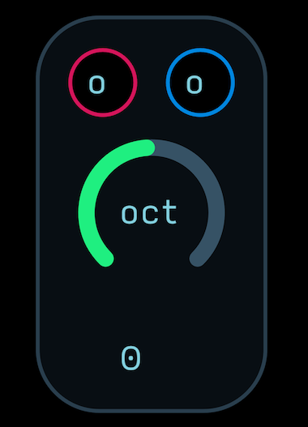

Shifts an incoming octave signal up or down by octaves. Maximum translation is -10 (ten octaves down) to 10 (ten octaves up).

## Patches

Patches are collections of multiple modules strung together in common configurations. This is a great go-to category for finding new inspiring ideas to combine modules together, or for a quick and easy way to set up a common synthesizer so you don’t have to add modules one at a time. Patches may or may not be totally complete. Some are just as simple as a clock with some clock modifiers attached - others are larger and more complex.

### Clock

These modules focus on different ways to use clock modules.

---
**Dueling Phase Clock Logic A-R Envelopes**  

This patch uses two clocks at slightly different speeds feeding a Logic Gates module to trigger 6 different A-R Envelope modules. The envelopes can then be used to modulate VCAs and VCFs or 3 to 6 synth voices.

---
**Flip Flop Divider Random Logic**  

This patch is a collection of different clock and gate signals that can be used to create all kinds of rhythms. First, the master clock is connected to a Flip Flop 256 Inverter module, providing many divided clock pulses in powers of 2 and their inverted counterparts. Then, the master clock is multiplied by 2/3, creating a triplet version of the master clock. The master clock and this fractionally divided clock pulse are then fed into a Logic Gates module, providing 6 more gate outputs. The nand and xnor outputs of this module become the two inputs of a Random Selectable Logic Gates module, which is randomized by the triplet pulse fed through a Chance Over Under module. Finally, the master clock pulse is fed through a Chance Passthrough module and used to trigger a burst generator.

## Self-Playing

These patches are songs-within-Audulus that run and play all by themselves. They can be anything from a small sample and hold generated random melody to a complex fully automated tune with every note and event perfectly planned and executed. They are meant to show you how to create music in what might be a novel way for you - outside the box, without a DAW, and with experimental modular synthesizer-based composition techniques. They are also meant to show that you don’t necessarily need a degree in music theory to make a self-playing patch that sounds great and really groovy. All that is required is a little understanding and a lot of patience to turn knobs and experiment until something great comes out!

---
**Self Playing Subtractive Synth Template**  

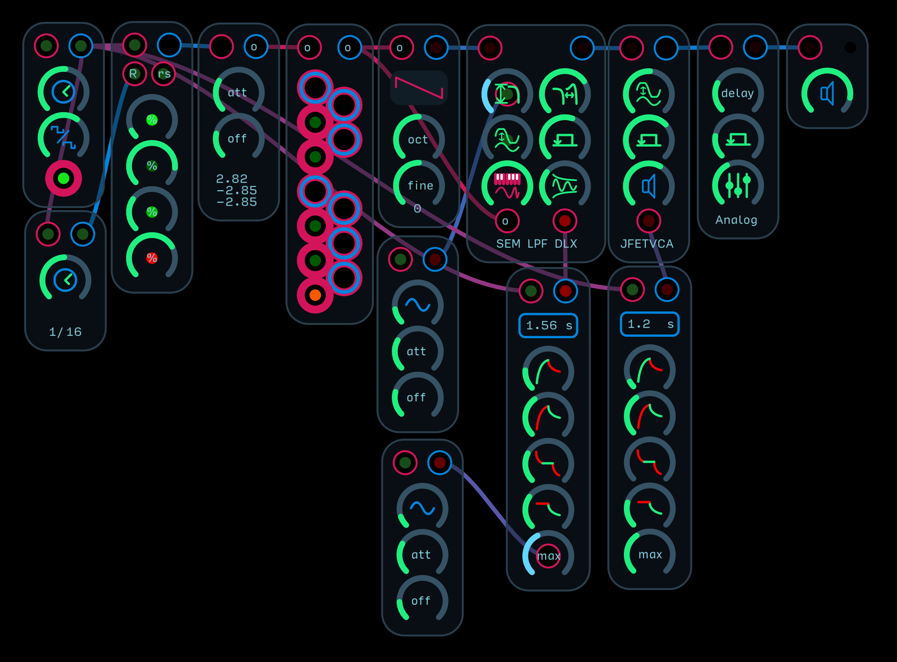

A beginner’s look into how to create a self-playing Audulus patch. Beings with a master clock that is stepping a Random Chance 4 Step Sequencer. The master clock pulse is being divided by 16 so that every 4 cycles of the sequencer, it has a chance to reset step values. This gives patterns a chance to develop without being totally random, and thus have nothing for your mind to latch on to and groove with. The output of the sequencer is translated from a modulation signal to an octave signal and quantized into a pentatonic scale. 

The pitch is sent to a basic oscillator which is being filtered by an SEM-style filter. The filter’s cutoff point is slowly modulated by a sine LFO to give the filter a little animation. The output of the quantizer is also fed into the filter to give the filter octave tracking. The master clock pulse is also used as a gate for the filter envelope. The filter’s envelope is having its max time parameter modulated by a slow LFO to give the filter some further animation. The master clock is also gating the envelope that is modulating the VCA, and finally the synth is fed through an analog delay and sent to the audio output.

## Quantizer

These modules take an incoming octave signal and snap them to a user-defined scale. They are one of the most important modules for creating sequencer-based music. Without a quantizer, you would have to tune individual notes by ear with each sequencer step. Quantizers allow you to dial the knob close enough and get a perfectly tuned note. Some special quantizers are also included in this collection that create chords or quantize knob and modulation outputs to specific levels.

### Chord

These quantizers take an input octave signal and translate it into a chord. Requires multiple oscillators or at least collapsing the chord signal into a polyphonic chain.

---
**Neo-Reimannian Triad Transformer**  

Transforms an input octave signal into Neo-Reimannian Triads.

---
**Chromatic Quantizer**  

The smallest, most CPU-lightweight quantizer module. Uses a simple expression to snap inputs into discrete steps of 1/12.

---
**Drifting Gateable Quantizer**  

Same as the Gateable Quantizer but adds a drift control at the bottom that applies a randomly chosen sharp or flat offset to each new note. The maximum drift is 1 semitone flat or sharp. The knob is scaled exponentially to allow you to add just a little detune. Detune is important for creating more organic-sounding synthesizers. Adding just a little can go a long way to making your music sound more harmonically interesting.

---
**Gateable Quantizer with Gate Output**  

Same as the Gateable Quantizer but with a gate output that goes high for every new note chosen. The knob at the bottom of the quantizer adjusts how long the output gate pulse stays high. A useful tool if you are not using a master clock to step a sequencer, but instead using an LFO or other modulation source translated into the octave range, but still need a gate for new notes to ping a VCA or VCF envelope.

---
**Gateable Quantizer**  

A 12 note quantizer that allows you to turn individual notes on (red) and off (blue) with buttons, or to turn the notes on and off remotely with gates. This is one of the most useful modules for creating self-playing patches. You can use gates created by logic modules or sequencers to turn notes on and off remotely to effectively change the tune being played. You can sequence chord changes while a randomly fluctuating octave signal flows through the quantizer to create a moving arpeggiator that follows a general pattern but does not really repeat itself. If no notes are engaged the quantizer becomes a chromatic quantizer by default. The current note being played is highlighted in orange-red, while the active notes are highlighted in green. Inactive notes are black.

---
**Modulation Quantizer**  

Quantizes a modulation signal into 2 to 64 steps. Will create a staircase, bitcrushing-like effect for modulation signals.

---
**Scales Maj-Min Quantizer**   

A very compact and useful quantizer that allows you to dial in which base note you want for a scale and whether you want the major (red) or minor (blue) version. The maj/min selector is gateable to allow you to modulate into one or the other scale. 

## Sample + Hold

These modules use sample and hold techniques to create random modulations. The sample and hold node will sample an input signal whenever its input is gated.

---
**Att-Off Sample + Hold**  

A white-noise sampling random generator with attenuate offset controls to adjust the range of modulation and a speed control from 0 to 20Hz sampling rate.

---
**Basic Sample + Hold**  

A gateable sample and hold that accepts an input signal. Perfect for grabbing samples from LFOs and other modulation sources.

---
**Gateable Sample + Hold**  

A white-noise sampling random generator that samples a new random 0 to 1 modulation value every time it is gated.

---
**Modulation Threshold Random Generator**  

Takes a modulation input and outputs a new random sample every time the threshold, set by the knob at the bottom, is crossed. Perfect for turning modulation and envelope waves into sample and hold triggers.

## Sequencer

These modules are the one of the core modules of a modular synthesizer ecosystem. Although they are primarily used to generate musical notes for oscillators, they can be used to modulate any parameter you want. Most sequencers are clocked, meaning they step forward every time a clock pulse enters their gate input. 

Although some sequencers in Audulus have octave signal outputs, in general, they only output 0 to 1 modulation signal. To translate the modulation signal output into an octave signal, use the module found under Attenuator/Modulation/Modulation to Octave Attenuate-Offset. This module will translate the 0 to 1 modulation signal into whatever range you want it to be for your instrument. It is also helpful to use a quantizer after this translation module to easily dial in notes. Sequencers can also be used to add dynamics to gates as they enter envelopes. Simply use a Mult node or one of the Digital VCA modules to multiply the gate by the sequencer’s 0 to 1 output.

### 3D

These modules use an imaginary 3-dimensional space to create sequences. They are esoteric but still very musical and interesting sequencers to play with.

---
**3D Cube 8 Step Sequencer**  

This is an 8 step sequencer that uses a cube metaphor to create non-linear sequences. The sequencer is advanced at the top left gate input. The two rows of four knobs along the bottom of the sequencer are the sequencer steps. These knobs control which vertex (point) of the cube that the sequencer references during the sequence. As you turn the knob, a blue dot will appear on the small display cube to the lower right of the sequence cube illustrating which vertex is selected. After a moment of not turning the knob, the blue dot will disappear. 

The min and max knobs control the minimum (green) and maximum (blue) steps of the sequencer. The current step is highlighted in red. The knobs around the sequence cube are the actual 0 to 1 modulation values that will be outputted in the upper right of the module. 

Under each knob is a gate output that will flash when that vertex is selected. The rs or reset input in the upper left will restart the sequencer from the minimum step when gated. The xyz knob controls adjust the coordinates for an imaginary point floating within the cube. The closer this point comes to the vertices, the steps will turn on. 

The thrsh or threshold control adjusts how close this point must be to the vertices to turn them on or off. If they are turned off, they count as a skip. The skip will only work if you are also using the gate output of the sequencer at the top right of the module. 

As you can tell, this sequencer might take a while to wrap your head around. However, it is well worth the time invested, as it can create some really amazing sequences not otherwise possible with linear 8 step sequencers. Watch a video of it in action here: https://www.instagram.com/p/BbUYm0HAujC/?taken-by=audulus 

### Algorithmic

Algorithmic sequencers output sequences based on mathematical formulae or processes. They are the ultimate happy accident sequencer modules that generate all kinds of complex melodies and rhythms with from a limited number of knobs and buttons.

---
**Euclidean Gate Sequencer**  

Creates output gates using a Euclidean algorithm. Great for setting up quick dance beats or polyrhythmic hits.

---
**Random Melody**  

Generates random melodies based on probability curves applied by filtering white noise.

---
**uTuring**  

An unaffiliated functionality clone of the original Music Thing Modular Turing Machine.

### Basic

These modules are your bread-and-butter sequencers. They are very simple and easy to use and yet still have very musical uses and limitless potential. Take advantage of the fact that Audulus allows you to modulate any knob by applying LFOs and gates to sequencer knobs to expand their potential.

---
**4 Step Max Sequencer**  

Same as the 4 Step Sequencer but with a control for the maximum step. Modulate this maximum control with another synced sequencer for some really awesome moving sequences.

---
**4 Step Sequencer**  

The most elemental sequencer. Advance from one step to another with a gate. Once the last step has been reached, it will reset back to the first step and continue on.

---
**8 Step Min Max Sequencer**  

Same as the 8 Step Sequencer but with both a minimum and maximum step control. Modulate these controls with other synced sequencers for some really awesome moving sequences.

---
**8 Step Sequencer**  

Same as the 4 Step Sequencer but expanded to 8 steps total.

---
**Random 4 Step Sequencer**  

Same as the 4 step sequencer but instead of knobs, the sequence is randomly generated whenever the R or randomize input is gated. Try clocking the sequencer with a master clock and ping the reset input with a division of the master clock to allow patterns to develop, but keep sequences moving and growing all the time.

---
**Random Chance 4 Step Sequencer**  

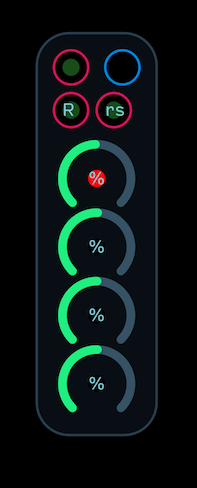

Same as the Random 4 Step Sequencer, except instead of being totally randomized every time the R or random input is gated, you have knobs that set the percent chance that each step will be randomized. This allows you, for example, to anchor a sequence to the first note by setting it to 0% chance of changing, while adjusting the other notes to change more frequently.

### Gate

These modules generate sequences of 0 or 1 gate signals instead of 0 to 1 modulation signals. They are perfect for generating rhythms sent to envelopes or drum modules.

---
**Pattern Bank Gate Sequencer**  

Uses 4 banks of preset beats to generate output gates for drums and instruments.

---
**Strip Sequencer**  

Uses a series of buttons to turn steps on and off to convert a clock signal into a sequenced gate.

## Graphic

These modules use one Spline and Mapper nodes to create unusual types of sequencers that, instead of following knobs, follow curves or shapes you draw. A very fast way to generate sequences without having to turn multiple knobs.

---
**4 Step Mapper Sequencer**  

Uses a mapper node to create a 0 to 1 modulation sequence. The sequencer follows the curve and outputs the area roughly above each red light. A great way to quickly create a gestural sequence. Tap or click and drag the green break points to adjust the shape.

---
**8 Step Spline Sequencer**  

Uses a spline node to allow you to draw a shape for a sequencer to follow. To add spline points, double tap or click on the spline area. To delete points, double tap or click on the point.

---
**Arranger**  

The arranger is a specialized Spline sequencer that allows you to control how many clock steps per length of spline (called Events). Gate outputs at 4, 8, 16, 32, and 64 outputs help cue events. A built in modulatable quantizer quantizes the translated modulation signal into pitches.

### Matrix

These modules are essentially 2 dimensional sequencers. If you consider normal sequencers to be 1 dimensional sequencers (they can go forward, backwards, but not across), then matrix sequencers allow the sequence to move in a more dimensional way around a sequence field. They are a great sequencers to use when you tire of using normal linear sequencers and want to explore the more experimental dimension of music making that modular synthesis has to offer.

The naming convention for some of these matrix sequencers follows this:(Signal Type) (length)x(width)x(outputs) Matrix Sequencer. So a Modulation 2x2x4 Matrix Sequencer has 2 rows, 2 columns, and 4 modulation outputs.

---
**Chladni Sequencer**   

Using two modulation signals at the top left modulation inputs, the sequencer will fluidly move through from left to right, top to bottom, and top to bottom left to right. When the two sequences collide they create a third sequence that is sampled and held at the output. The x and y controls the maximum steps for each axes. The blank knob controls which outputs are selected or muted.

Try feeding back the output of the sequencer onto the field of knobs for some real chaotic modulations!

---
**Gate 4x4x2 Matrix Sequencer**   

Either passes (red) or does not pass (blue) a gate as it moves over the sequence field. The sequencer can be clocked at both the x and y inputs. The x input moves the sequencer from left to right, and the y input moves the sequencer from top to bottom. Preserves the pulse width of the clock as it moves through the module.

---
**Gate Cross 4x4x10 Matrix Sequencer**   

This gate sequencer uses a 4x4 grid of buttons to create a total of 10 sequences.

Each row and column is its own individual 4 step sequencer. There are 4 x-axis sequencers and 4 y-axis sequencers.

The x sequencers are stepped at the x gate input. Their current steps are highlighted with a red light. When the current step is on (button = red), the x clock passes to the row’s output. When the current step is off (button = blue), the clock does not pass, acting like a step skip. The pulse width of the clock is preserved as it goes through the sequencer.

The y sequencers are stepped at the y gate input. Their current steps are highlighted with a blue light. When the current step is on (button = red), the y clock passes to the row’s output. When the current step is off (button = blue), the clock does not pass, acting like a step skip. The pulse width of the clock is preserved as it goes through the sequencer.

At the x and y output, the gate will go high only when three conditions are met: the x input gate is high AND the y input gate is high; and the (x,y) coordinate point is located on a step that is on (button = red).

At the x or y output, the gate will go high when some conditions are met: the x input gate is high OR the y input gate is high; and the (x,y) coordinate point is located on a step that is on (button = red).

---
**Modulation 2x2x4 Matrix Sequencer**   

This sequencer has four simultaneous outputs that read the sequence left to right, top to bottom; right to left bottom to top; right to left, top to bottom; and bottom to top, right to left. Each sequence and output is color coded. It is essentially an 4 step sequencer being read in 4 different ways.

---
**Modulation 2x2x5 Max Matrix Sequencer**   

This sequencer has five simultaneous outputs that read the sequence left to right, top to bottom; right to left bottom to top; right to left, top to bottom; and bottom to top, right to left. An extra sequence in the middle is a selectable sequence, noted by the light outside each output. This control is normalled to an output of the sequencer to show how you can feedback modulate the sequence selection. Each sequence and output is color coded. Also has a max step feature.

---
**Modulation 2x4x4 Matrix Sequencer**   

This sequencer has four simultaneous outputs that read the sequence left to right, top to bottom; right to left bottom to top; right to left, top to bottom; and bottom to top, right to left. Each sequence and output is color coded. It is essentially an 8 step sequencer being read in 4 different ways.

---
**Modulation Cross 4x4x9 Matrix Sequencer**   

This modulation sequencer uses a 4x4 grid of knobs to create a total of 9 sequences.

Each row and column is its own individual 4 step sequencer. There are 4 x-axis sequencers and 4 y-axis sequencers.

The x sequencers are stepped at the x gate input. Their current steps are highlighted in red. Their 0 to 1 modulation signal outputs are also red.

The y sequencers are stepped at the y gate input. Their current steps are highlighted in blue. Their 0 to 1 modulation signal outputs are also blue.

At the (x,y) output, where the x sequencer and y sequencer overlap is outputted as a 0 to 1 modulation signal, colored in purple.

---
**Octave-Modulation 4x4x1 Matrix Sequencer**   

Uses two input gates to scan across a field of sequence values. Outputs both an octave and modulation signal. The sequencer can be clocked at both the x and y inputs. The x input moves the sequencer from left to right, and the y input moves the sequencer from top to bottom.

---
**Random Chance Modulation 2x2x4 Matrix Sequencer**   

This sequencer has four simultaneous outputs that read the sequence left to right, top to bottom; right to left bottom to top; right to left, top to bottom; and bottom to top, right to left. Each sequence and output is color coded. It is essentially an 4 step sequencer being read in 4 different ways. The knobs control the chance of changing whenever the R or randomize input is clocked.

---
**Random Modulation 2x2x4 Matrix Sequencer**   

This sequencer has four simultaneous outputs that read the sequence left to right, top to bottom; right to left bottom to top; right to left, top to bottom; and bottom to top, right to left. Each sequence and output is color coded. It is essentially an 4 step sequencer being read in 4 different ways. The sequence is randomized whenever the R or random input is gated.

### Random Non-Repeating

These modules create random sequences that are also non-repeating. Although it is statistically astronomically unlikely that a sequence generated from white noise 32-bit numbers will have two or more step values that are exactly alike, they do tend to create values that are close enough that, once put through a quantizer, they end up playing the same note. This class of sequencer solves this problem by creating equally spaced values that are less likely to result in the same note being played twice within one round of the sequence.

---
**Random Non-Repeating 4 Step Sequencer**  

 

Outputs a random arrangement of 4 values every time the R or randomize input is clocked. Can be reset at the rs input.

### Shape

These modules use shape metaphors to create sequences that are a mix of linear and non-linear. They are not quite matrix sequencers but also not just a normal linear sequencer wrapped into a shape either.

---
**5 Step Shape Gate-Trigger Sequencer**   

Outputs a gate based on a shape drawn by the buttons on the module. The shape rotate knob rotates the shape you create, and the max step knob adjusts the maximum step. Also has individual step gate outputs for triggering events.

## Slew

These modules ease sharp transitions in modulation and pitch. When using them for pitch, they amount to a glide or slur between notes, so instead of sharply transitioning from one note to another, the pitch will glide up or sink down to the next note. Most slew limiters are essentially an LPF with a very low cutoff point.

---
**Slew Limiter Dual Mode**   

A slew limiter module with two modes. Equal time mode (red) will take an equal amount of time to glide between notes no matter how far apart they are. Note distance mode (blue) will take longer to glide up to higher notes, emulating the way analog slew limiters work. Slew knob adjusts the total amount of time between notes to glide.

## SVG
These graphics are collection of SVGs (scaleable vector graphics) for use in Audulus. This category will be expanding greatly over time as more icons are created.

---
**Cube**   

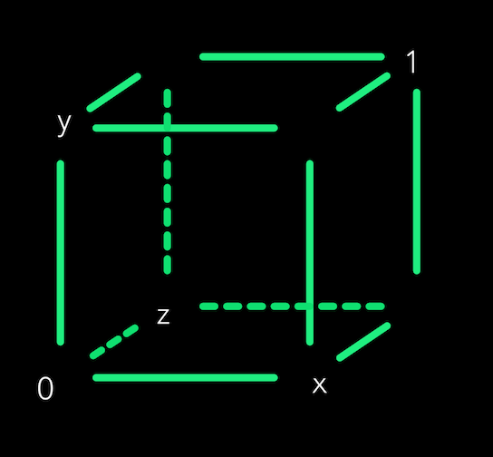

A cube SVG with labels.

## Switch

These modules route signals to and from other modules, or turn signals on and off. 

---
**Chance Switch AB**  

When gated, the module will choose between the first and second modulation input (marked by a blue light) to the top output. Simultaneously, the top output will be sent to the second or third output. Knob sets the likely hood of A or B being chosen.

So you can choose between a signal A or B going to a C destination, or signal A going to a D or E destination.

---
**Random Chance Switch AB**  

Same as the Chance Switch AB, but with a R or randomize input gate for the A/B chance.

## Synth Voice

These modules are complete synthesizers unto themselves. They have oscillators, envelope generators, filters, VCAs, and sometimes more wrapped up into a convenient package. Perfect for when you just want to quickly get a synth sound going.

---
**Curvature Micro**  

The Curvature Micro is a great all-in-one synthesizer with many controls. Watch this video for more information about it.

https://www.youtube.com/watch?v=Rm2cJ3QkQRI

---
**K35 Curved Synth**  

A very basic subtractive synthesizer based around the K35 analog modelling filter. Needs an octave input signal for pitch and a gate to trigger the internal envelopes.

The top four controls are for filter cutoff, Q, envelope amount, and overdrive. The envelope on the left side is the A-R cycle for the VCF, and the right is for the VCA.

Controls under the envelopes shape the envelopes' response.

A built in delay controls the time, mix and feedback. 

The last control is an output volume. If this control is turned all the way down, the sound will output at the top right output. If it is turned up at all, it will output to the speaker.

---
**Smol Synth**  

An experiment to create one of the smallest, yet still functional and musically variable synthesizers, the Smol Synth is a VCO-VCF-VCA subtractive synthesizer. The waveform knob fades between sine, triangle, square and saw waves. The A-R envelope adjusts the attack and release of both the filter and the VCA simultaneously. The Q of the filter is fixed internally, but you can of course open it up and change it if you like.

## VCA

These modules are the Audulus equivalent of VCAs, or voltage controlled amplifiers. They are typically placed after a VCF (voltage controlled filter) when building a synthesizer patch, though they can also be used to combine modulation signals. Though there is no “voltage” in Audulus per se, they perform the same functions. A typical subtractive synth is made up of a VCO-VCF-VCA configuration. The reason the VCA goes after the VCF is that the filter may be self oscillating, and using an envelope to close the VCA all the way will prevent the VCF from ringing indefinitely. All of the VCAs in this collection will hard clip if their outputs exceed the -1 to 1 maximum range for audio signals. Clipping will be indicated by a white flashing light at the output.

---
**Digital Exponential VCA**  

A clean digital VCA that accepts an envelope or modulation signal and applies an exponential response to the input. Perfect for quick plucked sounds. The shape controls the degree of exponential curve from `x*x` (slightly exponential) to `x*x*x*x` (very exponential). The volume attenuator adjusts how loud the VCA will peak from an input envelope or modulation.

---
**Digital Linear VCA**  

A clean digital VCA that accepts an envelope or modulation signal and applies no curve to its response. An all around good VCA, especially when you want to control the shape of the envelope elsewhere, or simply want a linear response. The volume attenuator adjusts how loud the VCA will peak from an input envelope or modulation.

---
**Digital Logarithmic VCA**  

A clean digital VCA that accepts an envelope or modulation signal and applies a logarithmic response to the input. Perfect for punchy sounds. The shape controls the degree of logarithmic curve from sqrt(x) (slightly logarithmic) to sqrt(sqrt(sqrt(x))) (very logarithmic). The volume attenuator adjusts how loud the VCA will peak from an input envelope or modulation.

---
**Diode VCA**  

An analog-modelling module that recreates the sound of a diode-based VCA. The overdrive control adjusts the amount of distortion, and the feedback control adjusts the amount of positive feedback that runs from the output of the module back to the input. These two controls in combination can create a variety of distorted sounds. 

---
**JFET VCA**  

An analog-modelling module that recreates the sound of a JFET (junction field effect transistor) VCA. JFETs are silicon transistors, but they have a similar sound to tubes that can be summed up as warm. The overdrive control adjusts the amount of distortion, and the feedback control adjusts the amount of positive feedback that runs from the output of the module back to the input. These two controls in combination can create a variety of distorted sounds.

---
**Tube VCA**  

An analog-modelling module that recreates the sound of a tube-based VCA. Tubes were the predecessors to transistors in electronics and are renown for their warm sound. The overdrive control adjusts the amount of distortion, and the feedback control adjusts the amount of negative or positive feedback that runs from the output of the module back to the input. If the feedback control is at 0.5, there is no feedback. At 0 it is total negative feedback and at 1, total positive. Negative feedback has a really harsh brittle tone to it, and positive feedback is warmer. Both are great and are highly interactive with the overdrive control.

## VCF

These modules are called VCFs, or voltage controlled filters. They are a huge part of any synthesizer’s sound. The most commonly used filter type is a LPF or low pass filter. If you’re new to synthesis, use them as a starting point. Most filters in Audulus have an input attenuator and a cutoff knob that together act like an attenuate-offset module for the purposes of shaping your incoming modulation. Getting your envelope to modulate in the right frequency range is critical to it sounding musical. Combine your envelopes with LFOs by attaching an LFO to your cutoff knob for an even more dynamic sound. 

### Biquad

These VCFs are created using the BiQuad node. Biquad filters are very low-CPU digital filters. They might not sound as creamy or warm as the analog-modelling filters, but that doesn’t mean they’re not useful in their own right. They excel when their cutoff points are not modulated and are used internally in modules like phasers or analog-modelling delays. They are also great for when you want to have a high-polyphony synthesizer patch when you are working on a device that has limited CPU overhead. Although the analog modelling filters in Audulus take up as little CPU as possible, running 16 of them in one patch, plus oscillators, plus effects, plus modulators can strain a system. In general, it is up to your taste to find which ones you like the most. Biquad filters are also much simpler to build and understand than filters made with the z-1 node.

---
**APF**  

APF or allpass filters change the phase relationship of frequencies without attenuating them. A key ingredient in phase shifters.

---
**BPF**  

BPF or bandpass filters attenuate frequencies lower and higher than the cutoff point.

---
**HPF**  

HPF or highpass filters attenuate frequencies lower than the cutoff point.

---
**LP-HP**  

Morphs between a lowpass filter and highpass filter.

---
**LPF**  

LPF or lowpass filters attenuate frequencies higher than the cutoff point.

---
**Multimode Filter**  

A filter with selectable modes. When the Hz knob is turned all the way down, the input below it turns into an octave tracking input. Width controls the bandwidth of the BPF.

---
**Notch**  

Attenuates frequencies at the cutoff point while passing all others. Useful for creating cascaded comb filters.

### DLX

These modules are deluxe versions of other analog modelling filters in Audulus. They have more features like octave tracking, internal modulators, or audio feedback for extra distortion.

---
**SEM LPF DLX**  

Same as the SEM LPF but with extra controls for octave pitch tracking and an attenuator that feeds back audio from the output to the cutoff.

### LPF

These modules are a collection of analog modelling lowpass filters (LPFs). LPFs are the most common and musically useful class of filters. Low pass means the filter passes low frequencies below its cutoff point relatively unaffected, while attenuating (making quieter) frequencies above the cutoff point. 

The Q or resonance control adjusts the amount of frequency boost that happens around the cutoff point. Some filters self-resonate with a high enough Q value, meaning they generate a tone, usually in the form of a sine wave, at the cutoff point. This can be used to your advantage by giving the sense of duophony in a monophonic patch. 

These filters are often based around the architecture of known famous filters (though none should be construed as officially sanctioned digital reproductions, and all trademarks are the property of their respective owners). 

They are also not meant to be exact 1:1 clones that do everything possible to remain faithful to the original. They sound great in their own right and have their own quirks and musicality.

---
**1 Pole LPF**  

The smallest most lightweight available filter with no Q or resonance control, the 1 Pole filter is a soft 6dB/oct cutoff slope. A great filter for smooth sounding soft pads.

---
**303 LPF**  

Based around the architecture of the diode filter in the Roland TB-303 bass synthesizer, this resonant LPF is perfect for squelchy bass lines and screaming leads.

---
**K35 LPF**  

Based around the architecture of the Korg 35 filter found in the famous MS-20 synthesizer, this resonant LPF is a great all around dirty sounding filter that overdrives nicely.

---
**Mg LPF**  

Based around the architecture of the Moog Transistor Ladder filter found in the Minimoog synthesizer, this filter is a great all-rounder that sings on any kind of sound. Characteristically, the bass frequencies will be attenuated extremely as the Q value is increased.

---
**SEM LPF**  

Based around the architecture of the Oberheim SEM IC (integrated circuit) filter, this non-resonant filter just sings on polyphonic pads and is one of the most musical filters ever made.

### LPG

These modules were made famous in Buchla synthesizer systems. They are essentially a combination of a VCF and VCA. They decay in both frequency and volume in a way that mimics natural instrument decays, especially in percussive instruments like bongos and xylophones.

---
**Lowpass Gate**  

A very basic lowpass gate with no Q control. There is no internal VCA, but instead has a filter that has such a low cutoff point that it in effect blocks all audio going through when closed. The cutoff knob can be raised to keep the filter open to a certain frequency, but to make sure the filter closes all the way with an incoming envelope, leave it turned down. Use the envelope level knob to adjust how high the incoming envelope modulates the filter.

### SVF

These modules are a special class of filter that outputs several types of filters simultaneously. Most SVFs (state variable filters) have at least lowpass, highpass, and bandpass outputs. The advantage of them is that you can use them as frequency splitters, sending different frequency bands of your synthesizer to different effects or mixers.

---
**z-1 SVF**  

A state variable filter made with the z-1 node with outputs for LPF, BPF, HPF, and NOT or notch. The SVF knob fades between the filter types at the top audio output.

## VCLFO

VCLFOs or voltage controlled low frequency oscillators are a key ingredient in modular synthesis. They are used to modulate parameters over time. A synth patch without an LFO modulating the filter cutoff can sound rather static over time. But with just a little up and down motion from a slowly undulating triangle wave can really bring a patch to life. LFOs in Audulus all output a 0 to 1 modulation signal. This range is chosen because knobs are by default ranged 0 to 1. When creating your own modules, make sure you keep all knobs in a 0 to 1 range and use math (or one of the many Knob modules under the building section) inside the module to translate the range into one you need.

### Basic

These modules are beginner-friendly LFOs with just a few additional features.

---
**Basic Saw LFO**  

A saw LFO with controls for speed (0 to 20Hz), and a built-in attenuate-offset control to adjust the range of modulation. The gate input resets the LFO from the start of its period.

---
**Basic Sine LFO**  

A sine LFO with controls for speed (0 to 20Hz), and a built-in attenuate-offset control to adjust the range of modulation. The gate input resets the LFO from the start of its period.

---
**Basic Square LFO**  

A square LFO with controls for speed (0 to 20Hz), and a built-in attenuate-offset control to adjust the range of modulation. The gate input resets the LFO from the start of its period.

---
**Basic Triangle LFO**  

A triangle LFO with controls for speed (0 to 20Hz), and a built-in attenuate-offset control to adjust the range of modulation. The gate input resets the LFO from the start of its period.

---
**Phase Shift Saw LFO**  

A phase shifting sine LFO with controls for speed (0 to 20Hz), and a built-in attenuate-offset control to adjust the range of modulation. The gate input resets the LFO from the start of its period. The phase shift control adjusts the starting point for the wave when reset.

---
**Skew Sine LFO**  

A waveshaping sine LFO with controls for speed (0 to 20Hz), and a built-in attenuate-offset control to adjust the range of modulation. The gate input resets the LFO from the start of its period. The skew control adjusts the tilt of the sine wave to reverse ramp-like to sine to saw-like.

---
**Skew Triangle LFO**  

A waveshaping triangle LFO with controls for speed (0 to 20Hz), and a built-in attenuate-offset control to adjust the range of modulation. The gate input resets the LFO from the start of its period. The skew control adjusts the tilt of the triangle wave to reverse ramp to triangle to saw.

---
**Square PWM LFO**  

A basic square wave LFO with an added pulse width control. Pulse width controls the balance between oscillator on and off time. The attenuate-offset knobs control the overall range of the LFOs’ output.

---
**Waveshape LFO**  

A multishape LFO with controls for speed (0 to 20Hz), and a built-in attenuate-offset control to adjust the range of modulation. The gate input resets the LFO from the start of its period. The shape knob fades between sine, triangle, square, and saw waves.

### Complex

These modules go beyond basic LFO shapes to provide more interesting and varied waveshapes. Some use specific synthesis techniques like frequency modulation (FM) or have multiple linked outputs like the Quadrature Sine LFO.

---
**AM Sine LFO**  

AM or amplitude modulation is a synthesis method by which one oscillator’s amplitude is modulated by another’s. This module uses two sine LFOs. The top knob controls the speed of the main LFO, while the knob beneath it controls the speed of the modulating LFO. The attenuate-offset knobs control the overall range of the LFO’s output.

---
**Crossfade Waveshape LFO**  

Crossfades between two synced LFOs of different shapes. The top right knob controls the speed of both LFOs, while top left knob controls the crossfade balance. All the way to the left is 100% oscillator 1 while all the way to the right is 100% oscillator 2. The wave shape controls beneath adjust the shape of the oscillators. The oscillator being referenced at a given time is highlighted by the green ping-ponging light. The bottom controls are the attenuate-offset knobs which control the overall range of the LFO’s output.

---
**F-AM Sine LFO**  

Crossfades between FM (frequency modulation) and AM (amplitude modulation) between two sine LFOs. The top two controls are the speed of the main LFO and the speed of the modulating LFO. The F/AM control fades between all frequency modulation and all amplitude modulation. Halfway is a mixture of both types of modulation. The attenuate-offset knobs control the overall range of the LFO’s output.

---
**FM Dual Waveshape Syncable LFO**  

FM or frequency modulation is a synthesis method by which one oscillator’s frequency is modulated by another’s. This module uses two waveshape LFOs that crossfade between sine, triangle, square, and saw. The main oscillator’s speed is on the left and the modulating oscillator’s speed is on the right. The unattenuated square output of the modulating wave is normalled to the sync input of the main LFO and fed back into its own sync input as well. You can break this connection and use a different input to reset both oscillators. The attenuate-offset knobs control the overall range of the LFO’s output.

---
**FM Sine LFO**  

FM or frequency modulation is a synthesis method by which one oscillator’s frequency is modulated by another’s. This module uses two sine LFOs: a main oscillator and a modulating oscillator. The attenuate-offset knobs control the overall range of the LFO’s output.

---
**PM Sine LFO**  

PM or phase modulation is a synthesis method by which one oscillator’s phase is modulated by another’s. This module uses two sine LFOs: a main oscillator and a modulating oscillator. The attenuate-offset knobs control the overall range of the LFO’s output.

---
**Quadrature Sine LFO**  

Outputs a series of 4 sine waves that can be spread apart by the phase control under the main speed control. The attenuate-offset knobs control the overall range of the LFOs’ output.

---
**Quantized Waveshape LFO**  

Combines the Waveshape LFO with a quantizer that splits the wave into 2 to 64 discrete steps. The attenuate-offset knobs control the overall range of the LFOs’ output.

---
**Random Amplitude Sine LFO**  

A basic sine LFO that picks a new random amplitude every cycle. The attenuate-offset knobs control the overall range of the LFOs’ output.

### Long Period

These modules are super low frequency oscillators that run on the order of minutes, hours, days, years, decades, and beyond. They are intended for creating very long droning ambient patches, or used in art installation pieces.

---
**`5*10^30` Year LFO**  

More of an art piece than a real functional module, this saw LFO takes 5,000,000,000,000,000,000,000,000,000,000 years to complete one cycle. To put that into perspective, the age of the universe is approximately 13,000,000,000 years. Heat death, when (theoretically) all of the energy of the universe will be expended, will occur around 10^103 years, so there is enough time to have more than a few cycles of this LFO.

## VCO

These modules are the core of modular synthesis. VCOs (voltage controlled oscillators) create sound by oscillating or moving back and forth from positive to negative values very quickly. The shape of these oscillations create different sounds. A sine wave sounds very plain when compared to an aggressive, pulse-width modulated square wave. There are many different kinds of VCOs that use all sorts of synthesis techniques to create their voice. This category also includes noise modules. Noise is often the secret sauce for creating really great sounding synthesizer patches.

### Additive

These modules use combinations of sine waves at different harmonics and add them together to create more harmonically complex tones. 

---
**Chebyshev Additive VCO**  

Uses a series of Chebyshev polynomials to transform a single sine wave into many harmonics. A very CPU-efficient solution to create an additive oscillator with 6 harmonics without needing to have 6 separate oscillators. The tone of this VCO is rubbery - it sounds both organic and digital at the same time. It responds really well to modulating its harmonics with LFOs.

### Basic

These modules are simple beginner-friendly VCOs that don’t have a lot of extra features to get bogged down in.

---
**3ceeoh VCO mk2**  

A three oscillator VCO with identical controls for each. The waveform selector switches between square, triangle, saw, and sine waves. The level controls are linked so that the output balance always hovers around -1 to 1 audio output maximum. 

The pulse width control adjusts the shape of the square waves and saw waves. The octave and fine tune controls adjust an offset from the input octave signal. 

You can get really fast sounding leads from this module by leaving the middle oscillator’s fine tune centered and offsetting the left and right oscillators just a little. The top control adjusts the amount of output distortion. 

---
**Basic VCO**  

A great beginner VCO with selectable square, triangle, saw, and sine waves. The octave control sets an offset from the octave input from -4 to 4. The fine tune control adjusts the pitch of the oscillator -/+ one semitone. When this control is set to 0.5, the oscillator is in tune.

---
**Crossfade Suboctave VCO**  

A dual VCO with selectable square, triangle, saw, and sine waves. The top knob adjusts the balance of the top and bottom oscillators. The relative mix of the oscillators is indicated by the strength of the green light in the top right of the waveform selector. 

The suboctave button turns the second oscillator into an octave down oscillator when turned on (red). The octave control sets an offset from the octave input from -4 to 4. The fine tune control adjusts the pitch of the oscillator -/+ one semitone. When this control is set to 0.5, the oscillator is in tune.

---
**CSAW VCO**  

An emulation of the Yamaha CS-80 synthesizer’s imperfect saw wave. The shape knob squares off the negative cycle of the saw wave. The color knob applies an offset to the negative portion of the wave that creates even more harmonic variation. The FM control is a linear FM input attenuator. 

Attach another oscillator to the audio input to modulate the frequency of the oscillator. The octave control sets an offset from the octave input from -4 to 4. The fine tune control adjusts the pitch of the oscillator -/+ one semitone. When this control is set to 0.5, the oscillator is in tune.

---
**Drift VCO**  

The Drift VCO is the same as the Basic VCO but with a drift feature that creates tuning instabilities similar to poorly designed analog oscillators. The tuning instability is more pronounced in the lower octaves.

### FM

FM or frequency modulation synthesis is uses one oscillator to modulate the frequency of another oscillator. It is a difficult form of synthesis to master, but with time, you can create really wonderful, complex tones.

---
**Bahama VCO**  

Loosely based on the architecture of the Noise Reap Bermuda VCO Eurorack module, this oscillator simultaneously outputs a sine, triangle, and square oscillator. The shape control adjusts the shapes of all three outputs. The octave control sets an offset from the octave input from -4 to 4. The fine tune control adjusts the pitch of the oscillator -/+ one semitone. When this control is set to 0.5, the oscillator is in tune.

---
**FM Waveshape VCO**  

Morphs between sine, triangle, square, and saw waveshapes. The FM control adjusts the amount of linear FM input. The octave control sets an offset from the octave input from -4 to 4. The fine tune control adjusts the pitch of the oscillator -/+ one semitone. When this control is set to 0.5, the oscillator is in tune.

### Karplus-Strong
These types of oscillators use a tuned delay line to create plucked string-like sounds. They are a type of physical modelling synthesis.

---
**k-s VCO**  

A Karplus-Strong synthesis VCO. The brite and damp knobs adjust the tone of the oscillator and the ring adjusts the decay. This VCO must be pinged with a clock signal to make sound. It does not need an external VCA and envelope combination. The octave control sets an offset from the octave input from -4 to 4. The fine tune control adjusts the pitch of the oscillator -/+ one semitone. When this control is set to 0.5, the oscillator is in tune. 

---
**String Exciter**  

A Karplus-Strong synthesis VCO that simulates a plucked string. The damp controls change the tone of the VCO. The string and pluck controls the the level of the string and plucked sounds.

### Noise
These modules create audio noise. Noise is a critical component in complex sounding synth patches. Just a little bit can create a much more dynamic sound. They are also essential for creating proper sounding drum sounds, like snares.

---
**White Noise**  

Outputs white noise audio signal. Output volume control can be used as a VCA by attaching modulation signals to it.

---
**Wind’s Cry**  

Uses noise filtered through 4 sharp bandpass filters to create a whistling-like tone. The North, South, East, and West controls are level controls for each sound. The tone controls adjust the sharpness of the filter peaks. The octave a detune controls adjust the tuning of the individual oscillators.

---
**z-1 Pink-White Noise**  

A noise module that fades between white (equal distribution) and pink (equal power vs. frequency) noise. Pink noise is a favorite for filter modulation as when it is fed through a sample and hold, lower notes are given a priority. The color light adjusts the color from pink to white.

### PM

These modules use a modulation source to tweak the phase of the main oscillator. It sounds similar to FM synthesis but they are different forms of synthesis.

---
**Phase Modulation VCO**  

A simple sine, triangle, square, saw waveshape VCO with a phase modulation input. Responds really nicely when an envelope is modulating the phase.

### Subharmonic

These modules generate subharmonic frequencies not by simply adding another VCO, but by extrapolating subharmonics from waves, usually by only passing every other wavelet. The result is a really raw and nasty sounding oscillator that is great for basslines and kicks.

---
**Subharmonic VCO**  

Derives a subharmonic from an oscillator node by passing 2nd or every 4th wavelet. Below the waveform selector is a mix control that balances the oscillator and subharmonic tones. The sub button when blue creates a 1 octave down subharmonic, and 2 octaves down when red. The octave control sets an offset from the octave input from -4 to 4. The fine tune control adjusts the pitch of the oscillator -/+ one semitone. When this control is set to 0.5, the oscillator is in tune. 

### Supersaw

These VCOs are staples of trance music. They are created by adding many saws together that are all slightly detuned from one another. They have a very dense sound, but they also benefit from another oscillator tracking with them an octave or two below to thicken up their sound.

---
**7even Deadly Saws**  

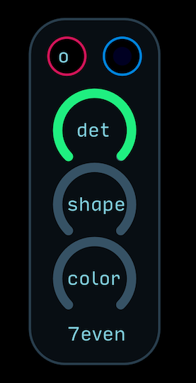

An easy to use supersaw using 7 detuned saw oscillators. Det or detune controls the amount of detuning spread between the oscillators. The shape controls an extra level of supersaw shaping, for up to 14 virtual saw oscillators. The color knob is a high pass filter on the output for adjusting the overall tone.

### Waveshape
These VCO modules combine oscillators or create them from scratch using mixing or waveshaping algorithms. Great go-to modules for unique, often aggressive and punchy sounds.

---
**Crossfade VCO**  

Quickly crossfades between two wave shapes using a third oscillator. The oct control adjusts the octave of the oscillator and wav controls adjust the two wave shapes.

---
**Skew Sine VCO**  

A waveshaping sine VCO with a linear FM input. The skew control adjusts the tilt of the sine wave to reverse ramp-like to sine to saw-like. The octave control sets an offset from the octave input from -4 to 4. The fine tune control adjusts the pitch of the oscillator -/+ one semitone. When this control is set to 0.5, the oscillator is in tune

---
**Skew Triangle VCO**  

A waveshaping triangle VCO with a linear FM input. The skew control adjusts the tilt of the sine wave to reverse ramp to triangle to saw. The octave control sets an offset from the octave input from -4 to 4. The fine tune control adjusts the pitch of the oscillator -/+ one semitone. When this control is set to 0.5, the oscillator is in tune.

---
**Wavebender VCO**  

Uses two mapper nodes to create the positive and negative swings of an oscillator. The octave control sets an offset from the octave input from -4 to 4. The fine tune control adjusts the pitch of the oscillator -/+ one semitone. When this control is set to 0.5, the oscillator is in tune. The overdrive knobs controls the total amount of output distortion.

## Visual

These patches do not make any sound, but instead highlight the visual aspects of Audulus, mostly by using Light and RGB nodes.

---
**8 Point 3D Visualizer**  

An imaginary cube with xyz coordinates. As the coordinate approaches one of the 8 lights (8 vertices), they light up.

---
**9 Point 3D Visualizer**  

An imaginary cube with xyz coordinates. As the coordinate approaches one of the 9 lights (8 vertices and one center), they light up.

---
**27 Point 3D Visualizer**  

An imaginary cube with xyz coordinates. As the coordinate approaches one of the 27 lights (8 vertices, one center, and multiple lights in between), they light up.

---
**Pong v1**  

A real, honest-to-goodness recreation of the classic Atari game Pong in Audulus built using Audulus nodes only! An amazing feat of engineering by Audulus user @alexander. Press the start button to get the ball rolling. The speed control adjusts the speed of the ball. p1 and p2 knobs control the paddles for player one and player two. Try mapping these controls to MIDI controller knobs for the classic experience of supremely terrible ergonomics of the original game.

---
**RGB TV**  

A recreation of the metaphor of how a monitor works. The Scan, Color, and Brightness inputs accepts a 0 to 1 modulation source. As the modulation scans from left to right, top to bottom, each light node will sample the values present at the brightness and color inputs and store that sample as a value. With enough patience you could sequence frames of animation! However, the best way to use this module might be as a music visualizer. Attach an LFO that you synth is using to the color input and an envelope to the brightness input and you will get pulsing, color changing lights that track the movement of your patch.

