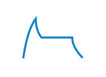

<style>
body {
  background-color: black;
  color: rgb(136, 136, 136);
  font-family: 'Input Sans', sans-serif;
}

img, video {
  max-width: 100%;
}

img[alt=icon] { 
  width: 100px;
  border: 2px solid #293E4D;
  border-radius: 5px;
}

h2 {
 color: #2a9fd6;
}

h3 {
 color: white;
}

h4 {
 color: white;
}

</style>

# Nodes Reference

## Synthesis

### ADSR

  

Input        | Signal Range (Default / Maximum)
:------------- | :-------------
gate   | `Gate`
Attack (knob 1)   | `0 to 1 second / 0 to >1 (hour)`
Decay (knob 2)   | `0 to 1 second / 0 to >1 (hour)`
Sustain (knob 3)   | `0 to 1`
Release (knob 4)   | `0 to 1 second / 0 to >1 (hour)`

Output        | Signal Range
:------------- | :-------------
Control Signal (Envelope)   | `0 to Gate Height`

**iOS Symbol**



**Exposable Element** - Envelope shape.  Note: you cannot change the envelope shape directly - you must use knobs or modulation signals connected to the ADSR knob inputs.

  

**Warnings** - Do not apply negative numbers to any control.  Sustain values >1 will cause distortion of envelope shape.

**Typical Use** - Modulating volume of oscillators and their filters' cutoff frequencies.

The ADSR (Attack, Decay, Sustain, Release) node generates a special type of control signal called an envelope. Envelopes are often used to modulate the volume of an oscillator. With different envelope settings you can make an oscillator sound like a drum, organ, or violin. The trick is all in knowing how to set the Attack, Decay, Sustain, and Release.


The ADSR node creates a signal that begins at 0, increases to the gate height (Attack), dips (Decay) to a constant level (Sustain), and finally, once the gate goes low (e.g., when the key is released), it tapers off back to 0 (Release).

To test the ADSR node, attach a MIDI Trigger node to its input, then attach both a Waveform and Value node to its output as pictured below. Tap the trigger a few times, hold it down, and adjust the ADSR node's settings to see how they react.


The ADSR node creates a control signal, meaning the ADSR node does not create sound by itself.

In its most common use, an ADSR signal is like an invisible hand turning the volume control on an oscillator.


Those familiar with hardware modular synthesis might note the absence of a VCA, or Voltage Controlled Amplifier. Separate VCA modules are unnecessary in Audulus because their functions can be replicated in several different ways (see below).


The maximum gate height used in the Audulus Module Library is 1.  The ADSR node will accept larger gates, but it typically makes more sense to create a 0-1 envelope, and then multiply the envelope signal into the range you need it to be.


Despite its illustration, the output of the ADSR node is linear. This means the ADR periods have linear slopes to them.

Many instruments, especially percussive ones, have non-linear volume envelopes. The easiest way to make a non-linear envelope is to square the ADSR's output with a Multiplication node (see below).


You can also use the Mapper and Spline nodes to create unique envelope shapes (see below).


If the Attack, Decay, or Release settings are set to 0, they may sometimes cause an audible clicking noise.  To prevent this from happening, you can adjust their ranges with an expression node (see below) or set their value ranges directly by clicking or tapping on the knob.  Any small non-zero value will do.


**Suggested ADSR settings for various instrument analogs**

Instrument        | A / D / S / R Values
:------------- | :-------------
Snare   | `0.01 / 0.1 / 0 / 0.15`
Kick / Tom   | `0.01 / 0.1 / 0 / 0.75`
Hi-Hat (Closed)   | `0.01 / 0.15 / 0 / 0.2`
Hi-Hat (Open)     | `0.01 / 0.9 / 0 / 0.2`
Violin (Bowed)     | `2 / 0 / 1 / 1` 
Organ     | `0.01 / 0 / 1 / 0.01` 
Horn Stab     | `0.05 / 0.15 / 0.3 / 0.5`
Ocean Surf     | `4 / 4 / 0 / 4` (Env^2)

Often you will find two different envelopes in a patch - one controlling the oscillator's volume and the other controlling a filter's cutoff frequency.

Using two different envelopes allows you to create an enormous variety of sounds. Try creating a patch like the one pictured below and play around with different ADSR settings for each node. Make sure you use a harmonic-rich waveform like the square or saw wave to really hear what's happening.


You might find you want to add some more control to the filter's sweep range. The patch above makes the filter move through its entire range. To make the envelope move the filter between two set frequencies, you can make a patch like the one pictured below (available HERE on the Audulus Forum). Go ahead and also attach a knob to the resonance setting and play around with that (just be careful you don't leave it set all the way up or it will squeal in self-oscillation).

Also note the added volume control before the Speaker node, which you'll need to prevent clipping your output.


### Osc

  

Input        | Signal Range
:------------- | :-------------
Hz (Hertz / Frequency)   | `0 to 20,000`
amp (Amplitude)   | `0 to any positive 32-bit number*`
sync   | `Gate (rising edge only)`
shp (Shape)   | `0 to 1 (only modifies saw and square waves)`
Wave Shape   | `Click/tap to cycle - sine, square, triangle, saw`
* - the maximum audio output for Audulus is -1 to 1. Beyond that range causes hard clipping.


Output        | Signal Range
:------------- | :-------------
Anti-Aliased Waveform   | `-amp to +amp`

**iOS Symbol**


**Exposable Element**

  

**Warnings** - Because this is an anti-aliased oscillator, its best use is as an audio oscillator (20Hz-20kHz).  To create LFOs (oscillators that generate control signals) use a Phasor node-based oscillator. Phasor-based oscillators use much less CPU and do not ring at their transitions (see: Gibbs Phenomenon).

**Typical Use** - Creating the voice of the synthesizer, i.e., the origin of the audio signal.

The oscillator is the foundation most types of synthesis. It is like the vocal chords of the synthesizer - the vibrating portion that creates the sound.

The Osc node has four waveforms - sine, triangle, saw, and square. The saw and square wave shapes are also variable using the shp control. Each waveform has a characteristic sound.


A waveform is a graph of amplitude over time.  As a sound wave travels through the air, it creates alternating bands of high and low pressure.

In the animation below, the darker bands represent densely packed air molecules while the lighter bands represent sparsely packed air molecules.

  
*source:* Wikipedia

The dense portion of the wave is the positive part of the oscillation (0 to 1), and the sparse portion of the wave is the negative portion of the oscillation (0 to -1). A value of 0 represents the average ambient air pressure of the space.

When a speaker cone is pushing out, it creates the high pressure (positive) portion of the wave.  When a speaker cone is pulling in, it creates a low pressure (negative) portion of the wave.  Animagraffs has an excellent animated illustration of how a speaker works here: http://animagraffs.com/loudspeaker/

To hear how different each wave sounds, create a patch like the one below and cycle through the wave shapes by tapping or clicking on the wave icon.


To understand why each wave sounds different, we have to understand a little bit about Fourier transformations.

  
*source:* Wikipedia

Joseph Fourier was a French mathematician born in the 1700s.  He discovered that all sound waves, no matter how complex, are composed of sine waves of different but related frequencies.

There is a lot of heavy math behind why this is, but you don't need to understand the math to see how it works.

First, let's have a look at the diagram below to see how a series of sine waves added together can start transforming into a square wave.

  
*source:* Wikipedia

The first sine wave oscillates at the fundamental frequency, while each additional sine wave oscillates at a multiple or harmonic of that frequency.

If you still can't picture what is going on, have a look at this animation (ignore the math if it's confusing):

  
*source:* Wikipedia

The animation first shows the square wave superimposed on a series of the 6 sine waves. When these sine waves are added together, they create the square(-ish) wave that you see.

The animation then separates these sine waves and creates a bar graph out of the amplitudes of each sine wave.  The first bar on the left is the fundamental frequency (1st harmonic), while the other bars are the 2nd-6th harmonic, related to the fundamental.

Below you can see the same transformation happening with a saw wave - this time with 50 sine waves added together.

  
*source:* Wikipedia

As you can see, the more sine waves you add, the closer your approximation of the idealized waveform becomes.

What makes wave shapes sound different are the relative loudness of their harmonics. 

A harmonic is a wave that vibrates at an integer multiple (x1, x2, x3, x4, ...etc.) of a fundamental frequency (see below).

  

If we take as our base a note that vibrates at 440Hz, then its second harmonic would be at 880Hz (440x2), its third at 1320Hz (440x3), and its fourth at 1760Hz (440x4).

A sine only has one harmonic (the 1st or fundamental). Saw waves contain all harmonics, while triangle and square waves have only odd-order harmonics (3rd, 5th, 7th, ...etc.).

The ratio of the amplitude of each harmonic is 1/N where N = the harmonic number. This means the amplitude of the 1st harmonic is 1/1; the 2nd is 1/2; the 3rd is 1/3; the 4th is 1/4; ...etc. (see below).


*source:* Wikipedia

Download the patch pictured below from the Audulus Forum to see and listen to the first six harmonics of a saw wave.

  

Adding sine wave harmonics together like this is called additive synthesis. You can make all sorts of complex sounds by varying the amplitude of each harmonic or even applying different volume envelopes to each oscillator.

A simpler place to start, however - now that we know what harmonics are and what they sound like - is subtractive synthesis.

Subtractive synthesis is a technique that starts with a harmonically rich waveform, like a saw or square wave, and uses a filter to attenuate or subtract frequencies.

Subtractive synthesis is covered in more depth under the Filter node heading, but you can look below to see the basic setup of a subtractive synthesizer. You can also download this patch at the Audulus Forum.

  

Syncing two or more oscillators together is a great way to add even more complex harmonics to your sound.

   

To understand what syncing does, first we have to understand what phase relationships are.

When you create two oscillators in Audulus, the chances of them being perfectly in phase are slim. Look at the patch below - these are two oscillators created at two different times.  Notice how their waves do not overlap perfectly.


Phase is measured in degrees (θ) from 0 to 360.

  

A wave with a 0 degree phase shift from another wave is in phase. If two identical in-phase waves are added together, their waveform is preserved and their amplitude is doubled.

A wave that is shifted 180 degrees is completely out of phase - a mirror image. When two completely out-of-phase waves are added, they cancel one another totally.

When waves are between 0 and 180 degrees out of phase from one another, they will cancel some frequencies but not others. This phenomenon is at the heart of several time-based effects like phasing, flanging, and chorus, and it also affects the sound of synced oscillators.

Back to the two oscillator patch above - to sync these we could save the patch, exit, and reopen the patch, and the oscillators would then be in sync. This would be like a hard reset on the entire patch, but it's not very useful for creating a hard-synced oscillator synthesizer!

To syncronize these oscillators without having to restart the patch, we need to pulse their sync inputs at the same time with the rising edge of a gate signal. A Trigger node will work nicely for this. Notice how the waves went from out of sync to suddenly in sync after the trigger was first pressed (see below).

  

Things get more interesting, however, if we use one oscillator to trigger the sync input of the other.

The main oscillator is called the master oscillator and the oscillator being triggered at the sync input is called the slave oscillator.

If both oscillators are running at the same frequency and they are both set sine, nothing happens.

  

If the slave oscillator is running at a slightly different speed, however, look at what happens:


As you can see above, the waves start in phase with one another, but because the master oscillator is running faster, it moves out of phase with the slave oscillator.  If we mix these oscillators together, we get interesting phase cancellations that add to harmonic complexity (see below).

  

Now look what happens when we mix different wave shapes together:

  

If we want to hear what these oscillators sound like, we'll have to adjust them so they're operating in the audible range. Make a patch like the one pictured below, or just download the example at the Audulus Forum.

The knob and expression controlling the second oscillator's frequency will dramatically shift the harmonic content of the sound.

  

Better still, do away with the detune knob and attach the volume envelope to the sync oscillator's frequency input like so:

  

The shp (shape) input only affects the saw and square waves.

Its input range is 0 to 1 which means any default knob node can attach directly to it. You can also send it envelopes as well.

For the square wave, the shape control is the pulse-width modulation (PWM) control. This determines the duty cycle, i.e., the wave's proportion of high (positive) to low (negative) time (see below).  Notice that when the shape knob is turned all the way up that the wave disappears entirely.


For the saw wave, the shape control de-phases the wave in way similar to two hard-synced saw oscillators that are locked to the same pitch, but vary in phase. When the shape knob is turned all the way up, the waveform has effectively doubled its period, causing an octave shift (with a loss of some amplitude - see below).


The Osc node is anti-aliased. This means it is optimized to be an audio oscillator. However, this also may not always work well as an LFO or control signal oscillator. 

To understand why this is, first we have to understand what aliasing is; and to understand aliasing, we first have to understand sampling.

When Audulus outputs audio, it does so at the speed of the host's sampling rate. The default for the standalone application is 44.1kHz, or 44,100 samples per second. Each sample is a 32-bit number between -1 and 1.  

At this sampling rate, a saw wave with an amplitude of 1 and a period of 1Hz is represented by a string of 44,100 numbers that begins at -1 and ends at 1.

At the same sampling rate, a saw wave with an amplitude of 1 and a period of 2Hz is reproduced in 22,050 samples.

As you can see in the table below, every time we double to frequency, the number of samples per period of the wave is halved.

Hz  (Limit of Hearing)      | # Samples @ 44.1kHz
:------------- | :-------------
`1`   | `44,100`
`2` | `22,050`
`4` | `11,025`
`8` | `5625`
`16` | `2812`
`20` (Lower) | `2205`
`32` | `1406`
`64`  | `703`
`128` | `351`
`512` | `175`
`1,024` | `87`
`2,048` | `43`
`4,096` | `21`
`8,192` | `10`
`16,384` | `5`
`20,000` (Upper) | `2`
`44,100` | `1`

For a wave to be represented digitally, it needs at least 2 samples - a high sample (speaker pushed out) and a low sample (speaker pulled in). This was determined by Harry Nyquist (below, left) who worked on high-speed telegraphs in the early 1900s, and Claude Shannon (below, right), who helped the world transistion from analog to digital signal communication.  The Nyquist-Shannon sampling theorem, as this rule is so-called, was that bridge.

   
source: Wikipedia 1, 2

Now that we understand sampling and its limits, we can understand what happens when those limits are broken - namely, aliasing.

Aliasing is a type of distortion that happens when an inadequately high sample rate is used to accurately reproduce a frequency.

To hear what aliasing sounds like, you can create a patch like the one below (or download it here at the forum). This patch reduces the sampling rate of the wave as it passes through from 20kHz all the way down to 20Hz.  As you approach 10kHz and below, the notes on the keyboard will begin to disappear, unable to be reproduced by the inadequate sampling rate.

    

Without going into the mathematical *why* of it, at a sampling rate of 44.1kHz, frequencies above 22.05kHz are "reflected" or "mirrored" below it. If these frequencies have enough amplitude and fall within the range of human hearing, we percieve them as inharmonic, ugly-sounding distortion.

Now, finally, we can return to the anti-aliased property of the Osc node. The Osc node is band-limited, meaning it sharply cuts off harmonics above the 20kHz point.  Unlike a low-pass filter, which attenuates higher frequencies at a rate of a particular number of decibels or dB per octave, band-limiting is like taking scissors and snipping off the higher frequencies.

This bandlimiting is what causes the "ringing" that you may have noticed in some of the screenshots (see below).

 


This is now a flaw, but a feature of an anti-aliased digital oscillator. If you scroll way back up to the beginning of the Osc entry, you'll see this peak forming in the saw wave with 50 harmonics animation.

This ringing is referred to as the Gibbs Phenomenon - a property of Fourier series discovered by Henry Wilbraham (photo not available) in 1848 and re-discovered by J. Willard Gibbs (below) in 1899.


When you stop and think about it, the presence of this ringing makes sense.  For a square wave to move from high to low pressure instantaneously (as it does in its idealized form), you would need an infinite series of harmonics. The maximum frequency that air can reproduce is around 5MHz, or 5,000,000Hz. 

https://www.researchgate.net/publication/230702229_Reproduction_of_Virtual_Sound_Sources_Moving_at_Supersonic_Speeds_in_Wave_Field_Synthesis

Five million Hertz may seem really fast, but in reality, 5Mhz is infinitely closer to 0Hz than it is to infinity Hz. 

Yeah, take a second and think about that one.

As a parting note on the Osc node, the Gibbs Phenomenon can become a problem when you're using a square or saw wave as control signal, and it is why you should use a Phasor-node based LFO for all of your LFO needs, which outputs an idealized digital waveform.

Even if you offset and attenuate the output of the Osc node to be between 0 and 1, the transitions will ring both lower and higher than 0 and 1, which can cause problems for time-based parameters (which can't be negative) and resonance (which can't be more than 100%).

Also, if you are using a square oscillator as an on/off switch, the ringing can cause the switch to flip open and closed rapidly. The patch below illustrates the problem with two counters. These should be exactly in sync, but as you can see, one switch is triggering the counter twice as often as the other.


This is a phenomenon that has to be accounted for in digital computer chips as well. The solution to this problem is called debouncing - filtering that can be done either with analog components or in software code.

### Phasor

  

Input        | Signal Range
:------------- | :-------------
sync   | `Gate`
frequency   | `0 to Sample Rate`

Output        | Signal Range
:------------- | :-------------
Radians   | `0 to 2π (~6.28)`

**iOS Symbol**


**Exposable Element** - None

**Warnings** - Because the Phasor node is not bandlimited, using it as an audio oscillator will result in aliasing distortion. Also NOTE: This is NOT a "Phaser" effect!

**Typical Use** - Creating low-CPU modulation sources.


The **Phasor** node outputs a sawtooth wave that ranges from 0 to 2π.


As you can see in the image above, the expression `Phasor/(2*pi)` is used to bring the 0 to 2π range into a 0 to 1 range that we can see on the Waveform node. So why does the Phasor node output a signal of 0 to 2π? Wouldn't it be easier to work with if it just output a signal of 0 to 1?

Before we answer that question, let's look more deeply at what a phasor is.

For starters, the Phasor node is *not* a phaser effect.

  
source: Wikipedia

"Phasor" is a combination of the words "phase" and "vector." A vector is a type of line that has a beginning point, an end point, and a direction (as opposed to a ray, which has a beginning but no end).


Phase is the measure of a point in a wave cycle at a given time. A sine wave like the one below begins at 0 degrees, rises to 90 degrees, falls to 270 degrees, and completes the cycle at 360 degrees.


When we combine these two concepts - phase and vector, we get something like this:


The circle pictured above is the Unit Circle - a circle with a radius of 1, centered at the origin point (0,0). The Phasor node outputs the value of the length of the arc between the point (1,0) and the vector. This measurement is called a radian.

Because the circumference of a circle is `2*pi*radius`, and the radius of the Unit Circle is 1, we get a total possible range of values of 0 to 2π.

If you're still having trouble visualizing this, watch the the animation below:


So now that you understand *why* the Phasor node outputs the range 0 to 2π, we can look at why this range is useful for creating all kinds of waves.

A phasor node can be used to create multiple waveshapes with some simple math. Of course, it naturally outputs a sawtooth wave, but how do we create a sine wave? It's easy:


If you take the sine of the output of the Phasor node, you get a sine wave - go figure, right? But why is this?

Well, remember SOH-CAH-TOA? As pictured below, the sine of angle ⍺ (alpha) is the ratio: `Opposite/Hypotenuse`.


Since we're using the Unit Circle, the hypotenuse always equals 1 (it's the radius of the circle). This makes the math really easy: `Opposite/1 = Opposite`.

The length of this opposite side becomes the set of y coordinates that make up the unit circle. The x coordinates of the unit circle are the solutions of the cosine (`Adjacent/Hypotenuse`).

When we solve the equation `y = sin(x)` (which is the same as `sin(Phasor)` in Audulus) we get an undulating line.


The animation below illustrates the relationship of the sine and cosine waves. Sonically, they are identical, but they are phase-shifted by 90 degrees (~1.57 radians).


When creating a multi-output LFO, you might find it useful to use `cos(Phasor)` instead of `sin(Phasor)`.  This is because the cosine of the Phasor node is in phase with the saw wave and other waves you'll create (see below).


To create a square wave LFO using the Phasor node, we need to use a logic expression. 

In the image below, the Phasor output has been translated from its normal 0 to 2π range into a 0 to 1 range. All LFOs should operate in a range of 0 to 1 because so many inputs (knobs, crossfade input, level node) all work from 0 to 1 by default.

The expression `Phasor/(2*pi)>.5` is true (outputs a 1) when the 0 to 1 output of the `Phasor/(2*pi)` expression is greater than 0.5. When the output of `Phasor/(2*pi)` is less than 0.5, the expression is false (outputs a 0).


To add pulse-width modulation to this LFO, all we need to do is add a Knob node (see below).


In the above example, the expression `Phasor/(2*pi)>Knob` is only true for a small period of time.  However, in the example below, the expression is true for a longer period.


To create a triangle LFO, we need to use some simple algebra.

First, we have to shift the saw LFO downwards so that half of its oscillation is negative.  `Phasor/(2*pi)-.5` shifts the 0 to 1 saw wave down by 0.5, making it oscillate between -0.5 and +0.5.


The `abs(x)` expression returns the absolute value of x - usually notated as `|x|`.

`abs(Phasor/(2*pi)-.5)` takes the absolute value of that shifted expression and turns the saw wave into a triangle wave.


We can then take this 0 to 0.5 wave and multiply it by 2 to get a triangle wave that oscillates between 0 and 1.


**Fun Fact:** *Another name for the absolute value is the "modulus," which was the original name of Audulus in an early beta!*


### Sample & Hold


The **Sample & Hold** (S & H) node samples a value from its input when
its trigger input increases across zero (the positive edge). The current
sampled value is written to the output.

S & H is often used to generate stair-step functions by sampling a LFO
or random (noise) waveform and periodic intervals. It can also be used
for syncronization of notes with a master clock.

### Seq16


The **Seq16** is a simple 16 step sequencer which cycles through its
inputs. When the clock input receives a signal increasing across zero
(the rising edge), it moves to the next input.

The **step** output indicates the current step.

The **reset** input resets the sequencer back to step 1 whenever it is
greater than zero.

---

## Utilities

### FeedbackDelay


The **FeedbackDelay** node controls where a delay occurs in a feedback
loop. Audulus indicates where a feedback delay occurs with a "z" in an
input.

### Speaker


The **Speaker** node sends two channels of audio to the speakers or
plugin outputs. If multiple speaker nodes are present in a patch,
then the output of each node is mixed together equally.

### Mic


The **Mic** node recieves two channels of audio input from your audio device or plugin audio input.

### Text


**Text** is editable text that can be used to label things and write
comments. To edit the text, invoke the context menu on the text.

### Timer


The **Timer** node outputs the time (in seconds) after its input is
triggered.

To see how it works, connect a \#Trigger node to its input and a \#Value
node to its output.

### ZeroCross


The **ZeroCross** node can be used to detect the pitch of a simple
waveform. It outputs the frequency of zero-crossings of its input signal
in Hertz.

To see how it works, connect a \#Osc node to its input and a \#Value
node to its output. The zero-cross will esitmate the pitch of the
oscillator.

## Poly

### MonoToQuad


The **MonoToQuad** node converts four mono signals to one four-channel
polyphonic signal. It is the inverse of the \#QuadToMono Node.

### MonoToStereo


The **MonoToStereo** node converts two mono signals to a stereo signal.
Use the \#StereoToMono node to convert back.

### PolyToMono


The **PolyToMono** node mixes a polyphonic input (denoted by a thick
wire) to a monophonic output (thin wire). Each voice is mixed equally.

Typically, you'll want to place linear effects (reverb, delay, EQ) after
the PolyToMono, since it will sound the same as placing them before but
only a single voice needs to be processed. On the other hand, nonlinear
effects, such as \#Distortion will have quite a different effect if
placed before the PolyToMono versus after.

### QuadToMono


The **QuadToMono** node converts a four-channel polyphonic signal to
four monophonic signals. It is the inverse of the \#MonoToQuad Node.

### StereoToMono


The **StereoToMono** node converts a stereo signal to two mono signals.
Use the \#MonoToStereo node to convert two mono signals to stereo.

## Sub-Patches

### Patch


The **Patch** node is a patch within a patch (or a *sub-patch*). The
patch node's inputs and outputs correspond to the input and output nodes
within the sub-patch.

To enter the sub-patch, double-click on the patch node. To exit, select
"Exit Sub-Patch" from the View menu.

### Input


The **Input** node is only used within sub-patches.
It creates an input on the front-panel of the patch node.

### Output


The **Output** node is only used within sub-patches.
It creates an output on the front-panel of the patch node.

### Knob


The **Knob** node creates a knob on the front-panel of the patch node.

## Math

### Add


The **add** node adds its two inputs, **a** and **b**. Addition of
signals is the same as mixing, so the add node can also be used to mix
signals (equally).

### Expr


The Math Expression Node (**Expr**) allows the entry of a textual
mathematical expression, like `2*x + y + z`. The node creates an input
for each variable and a single output for the result of the expression.

It has a variety of uses, including: unit conversion, control-signal
mapping, wave-shaping or building custom oscillators.

For example, to convert from MIDI note numbers to Hz, use `(440 / 32) * pow(2, (x - 9) / 12)`.

To edit the expression, use "Set Expression" from the node's context menu.

The Math Expression Node includes the following operators and functions:

#### Operators

Sytax             | Semantics
:---------------- | :------------
`(x)`             | parenthetical grouping
`-x`              | negation
`x^y`             | exponentiation
`x * y, x / y`    | multiplication, division
`x + y, x - y`    | addition, subtraction
`x < y, x > y`    | less, greater. 1 if true, 0 if false
`x <= y, x >= y`  | less than or equal, greater than or equal. 1 if true, 0 if false.
`x == y`          | equality. 1 if true, 0 if false
`x ? a : b`       | conditional. b if x is 0, otherwise a


#### Functions

Trigonometric functions (angles are in radians)

Syntax         | Semantics
:------------- | :-------------
`sin(angle)`   | sine
`cos(angle)`   | cosine
`tan(angle)`   | tangent
`asin(x)`      | arc sine
`acos(x)`      | arc cosing
`atan(x)`      | arc tangent


Exponential functions

Syntax      | Semantics
:---------- | :---------------------------------------
`pow(x,y)`  | `x^y`
`exp(x)`    | `e^x`
`ln(x)`     | Natural logarithm
`log2(x)`   | Base-2 logarithm
`log10(x)`  | Base-10 logarithm
`exp2(x)`   | `2^x`
`sqrt(x)`   | square root

Common functions

Syntax                | Semantics
:-------------------- | :------------------------------------------------
`abs(x)`              | absolute value
`floor(x)`            | rounds down to the nearest integer
`ceil(x)`             | rounds up to the nearest integer
`fract(x)`            | x - floor(x)
`mod(x,y)`            | remainder of x / y
`min(x,y)`            | returns the lesser of x and y
`max(x,y)`            | returns the greater of x and y
`clamp(x,a,b)`        | restricts x to the interval [a, b]
`step(x, edge)`       | 1 if x \> edge, otherwise 0. Hard step.
`smoothstep(x, a, b)` | smooth step from 0 to 1 on the interval [a, b]

#### Constants

Syntax                | Semantics
:-------------------- | :------------------------------------------------
`pi`                  | [&pi;](http://en.wikipedia.org/wiki/Pi)
`e`                   | [e](http://en.wikipedia.org/wiki/E_(mathematical_constant))

### Mult

The **mult** node multiplies its two inputs, **a** and **b**.

### Random

The **Random** node outputs random numbers in the range [0, 1].

---

## MIDI

### Keyboard


The keyboard node converts MIDI note messages as well as interaction
with its on-screen keyboard into **pitch** and **velocity** signals.

Pitch is expressed as the fundamental frequency of the note in Hertz.
MIDI note velocities are scaled to a zero-to-one range.

The keybaord has two modes:

-   *Legato*. Only one note at a time, and notes will not be
    re-triggered.
-   *Poly (2-16)*. Polyphonic - multiple notes can be played simultaneously. The number of voices is specified in parenthesis: 2, 4, 8, or 16.

When in poly mode, the keybaord's pitch and velocity outputs become
polyphonic, shown as thicker connections. Polyphonic processing can consume considerably more CPU time than monophoic processing. To support polyphony
efficiently in your patch, use the \#PolyToMono node, which will mix the
polyphonic signals to monophonic. Also, don't use more voices than you need.

### Trigger


The **Trigger** node outputs one when its button is pressed, and zero
otherwise.

To assign the button to a MIDI key, right-click on the button, select
*Learn Midi Note* and then press a key on your controller. To unassign
the MIDI key, select *Unassign Note* from the button's right-click menu.

### Pitch Bend


The **Pitch Bend** node outputs the current MIDI pitch bend value.

## Effects

### Delay


The **Delay** node time-delays the input signal by a duration specified
by the **Time** knob, in seconds. Time may be modulated.

The **Mix** knob controls how much of the output is from the delay.

The **Feedback** knob controls how much of the output is fed back into
the input, which determines the level of repeats.

### Distortion


The **Distortion** node adds harmonics to a signal by applying a sigmoid
function to the signal. As the input signal becomes larger, the sigmoid
behaves more like a step function.

To create a great rock distortion sound for electric guitar, run a
[HighPass](#highpass) node before the distortion, to give the guitar some
tightness and a [LowPass](#lowpass) node after as a tone control. Adjust the
[HighPass](#highpass) for more of a fuzzy sound. Connect this to a good old tube
amp and commence rocking.

### Filter


The **Filter** node is a 12db/octave low-pass filter with resonance. To
change the filter cutoff frequency and resonance, drag on the filter
graph.

The **Hz** input controls the cutoff frequency of the filter in
units of Hertz. The filter's cutoff frequency ranges between 20 Hz and
half the current sample rate (e.g. 22 kHz for standard 44 kHz audio).

Resonance amplifies the frequencies close to the cutoff frequency.
Resonance may be modulated using the **res** input. Range: 0 to 1.

In the future, this node will be improved with more filter types.

### PitchShift


The **PitchShift** node changes the pitch of its **in** input according
to the value of its **shift** input. If shift is one, the input signal
is unchanged. If shift is two, the output will be the input shifted one
octave up. If shift is 1/2, the output will be the input shifted one
octave down. Best results are achieved when shift is between 1/2 and 2.

The **PitchShift** node uses the FFT-based phase vocoder algorithm,
which is polyphonic.

### Reverb


The **Reverb** node provides a very basic reverb. with decay time
determined by the **Decay** knob. The **Mix** knob controls the level of
the reverb.

---

## Level

### Constant


The **Constant** node outputs a constant value specified by its knob.

### EnvFollow


The **EnvFollow** node is a simple envelope follower with preset attack
and release.

### Level


The **Level** node applies gain to its input.

### Mapper


The **Mapper** node transforms input according to a curve. Three control
points manipulate the curve. For the more technically inclined among
you, the curve is a quadratic Bezier.

### Range


The **Range** clamps its input within a range specified by the **min**
and **max** inputs.

### Spline


The **Spline** node provides an arbitrary piecewise-linear envelope.
That is, it connects some points with lines to make a function. The
node's input takes the x-coordinate and output provides the
y-coordinate.

Among the **Spline** node's uses are pitch envelopes, amplitude
envelopes, oscillator waveforms, velocity curves, and automation
control.

-   To create a control point, double tap on the function area.
-   To move a control point, drag it.
-   To delete a control point, double tap on it.

The red dot shows the current input and output values.

---

## Mixer

### Crossfade


The **Crossfade** node blends between its two inputs according to the
value of the **mix** knob.

### Mixer4x1


The **Mixer4x1** node mixes its four inputs equally. \#Level nodes may
be used to vary the level of each channel prior to mixing.

---

## Metering

### Light


The **Light** node will light up when its input has a value greater than
zero.

### RGBLight


The **RGBLight** node will display a color according to its inputs. Each color
channel is in the range [0,1].

### Meter


The **Meter** node implements a simple level meter.

This node will be improved with better metering and options in the
future.

### Value


The **Value** node displays the current value of its input.

### Waveform


The **Waveform** node shows a signal as a horizontally scrolling
waveform. Hook an output of a node to its input to see what the signal
looks like over time. Its a great debugging tool.

---

## DSP

### BiQuad


The **BiQuad** node implements a bi-quadratic filter using following
equation:

```
out[n] = a1 * in[n] + a2 * in[n-1] + a3 * in[n-2]
       - ( b1 * out[n-1] + b2 * out[n-2] )
```

The coefficients `a1`, `a2`, `a3`, `b1` and `b2` are inputs, allowing the filter
to be modulated at audio rate.

Cookbook formulas for using the **BiQuad** can be found [here](http://content.audulus.com/Audio-EQ-Cookbook.txt).

### DCBlocker


The **DCBlocker** node prevents a signal from being slowly ofsetted from
zero.

### HighPass


The **HighPass** node implements a 12db/octave high-pass filter. Its
implementation is very simple and efficient.

### LowPass


The **LowPass** node implements a 12db/octave low-pass filter. Its
implementation is very simple and efficient.

### SampleRate


The **SampleRate** node outputs the current sample rate. The sample rate
is usually 44.1kHz but may be higher if the audio interface is running
at a higher rate.

### UnitDelay


**WARNING: This node is currently in beta. CPU usage will be considerably higher when it is present.**

The **UnitDelay** node is a single-sample delay. Like the
[FeedbackDelay](#Feedbackdelay) node, the UnitDelay can be used to determine where a delay occurs in a feedback loop.

A UnitDelay is required whenever you need to express feedback with a single sample. For example, implementing the following recurrance requires using a UnitDelay:

```
y[n] = a * x[n] + b * y[n-1]
```

The `y[n-1]` term is the output delayed by one sample, fed back into the input.

Many types of digital filters (those that incorporate feedback) require using a UnitDelay. 

The presence of a UnitDelay node in the patch causes Audulus to switch into single-sample processing mode. This requires considerably more CPU.

---

## Switch

### Demux8


The **Demux8** node is an 8-way demultiplexer. The **sel** input selects
which of the 8 outputs the input is routed to.

### Mux8


The **Mux8** node is an 8-way multiplexer. The **sel** input selects
which of the 8 inputs are routed to the output.
