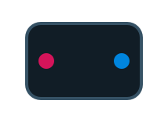

<style>
body {
  background-color: black;
  color: rgb(136, 136, 136);
  font-family: 'Input Sans', sans-serif;
}

img, video {
  max-width: 100%;
}

img[alt=icon] { 
  width: 100px;
  border: 2px solid #293E4D;
  border-radius: 5px;
}

h2 {
 color: #2a9fd6;
}

h3 {
 color: white;
}

h4 {
 color: white;
}

</style>

# Nodes Reference

## Synthesis

### ADSR


The ADSR (**A**ttack **D**ecay **S**ustain **R**elease) node controls
the envelope of a note. The control signal can be used for the note's
volume, or to vary some other parameter such as a filter cutoff.


The envelope starts when the **gate** input becomes greater than
zero and decays when the gate returns to zero. The envelope goes
through four stages of *attack, decay, sustain,* and *release* each
controlled by a knob.

- The **Attack** knob specifies how long in seconds until the note reaches
full volume after the gate becomes greater than zero.

- The **Decay** knob specifies how long until (in seconds) the note fades
to the sustain level which is, in turn, controlled by the **Sustain**
knob.

- The **Release** knob specifies how long (in seconds) until the note
fades after the gate returns to zero.

### Noise


The **Noise** node outputs filtered noise. It is a convenient
combination of the \#Random node and the \#LowPass node.

### Osc


The **Osc**illator node is the foundation of most synthesizers -- it's
where the sound begins. An oscillator produces a periodic waveform, a
waveform that repeats. The length of the period determines the pitch of
the sound.

Use the waveform menu to select the type of wave:

-   *sine* - A neutral waveform with no harmonics.
-   *triangle* - A mellow waveform with a hollow character due to odd harmonics.
-   *square* - The Square waveform has a hollow character like the triangle, due to
only odd harmonics being present. However the harmonics are much louder,
so the sound is brighter.
-   *sawtooth* - A bright-sounding waveform. This sounds especially nice when several are mixed together, all detuned slightly.

To see what these waveforms look like, set the oscillator's **pitch**
input to 1 and attach the **out** output to a \#Waveform node.

#### Inputs

The **Hz** input controls the pitch of the oscillator.

The **amp** input controls the oscillator amplitude.

The **sync** input will reset the oscillator whenever it crosses 0. To
see this in action, hook another low-frequency oscillator to the sync
input and watch the waveform node.

The **shape** input controls the pulse width of the square wave, and the de-phasing of the sawtooth wave. Modulate this for a fatter sound.

### Phasor


The **Phasor** node outputs a sawtooth wave that ranges from 0 to 2π. To
create a sin oscillator, connect the Phasor to a Sin node. Or connect
the Phasor to a Math Expression Node (\#Expr) to create your own
oscillator or LFO.

### Sample & Hold


The **Sample & Hold** (S & H) node samples a value from its input when
its trigger input increases across zero (the positive edge). The current
sampled value is written to the output.

S & H is often used to generate stair-step functions by sampling a LFO
or random (noise) waveform and periodic intervals. It can also be used
for syncronization of notes with a master clock.

### Seq16


The **Seq16** is a simple 16 step sequencer which cycles through its
inputs. When the clock input receives a signal increasing across zero
(the rising edge), it moves to the next input.

The **step** output indicates the current step.

The **reset** input resets the sequencer back to step 1 whenever it is
greater than zero.

---

## Utilities

### FeedbackDelay


The **FeedbackDelay** node controls where a delay occurs in a feedback
loop. Audulus indicates where a feedback delay occurs with a "z" in an
input.

### Speaker


The **Speaker** node sends two channels of audio to the speakers or
plugin outputs. If multiple speaker nodes are present in a patch,
then the output of each node is mixed together equally.

### Mic


The **Mic** node recieves two channels of audio input from your audio device or plugin audio input.

### Text


**Text** is editable text that can be used to label things and write
comments. To edit the text, invoke the context menu on the text.

### Timer


The **Timer** node outputs the time (in seconds) after its input is
triggered.

To see how it works, connect a \#Trigger node to its input and a \#Value
node to its output.

### ZeroCross


The **ZeroCross** node can be used to detect the pitch of a simple
waveform. It outputs the frequency of zero-crossings of its input signal
in Hertz.

To see how it works, connect a \#Osc node to its input and a \#Value
node to its output. The zero-cross will esitmate the pitch of the
oscillator.

## Poly

### MonoToQuad


The **MonoToQuad** node converts four mono signals to one four-channel
polyphonic signal. It is the inverse of the \#QuadToMono Node.

### MonoToStereo


The **MonoToStereo** node converts two mono signals to a stereo signal.
Use the \#StereoToMono node to convert back.

### PolyToMono


The **PolyToMono** node mixes a polyphonic input (denoted by a thick
wire) to a monophonic output (thin wire). Each voice is mixed equally.

Typically, you'll want to place linear effects (reverb, delay, EQ) after
the PolyToMono, since it will sound the same as placing them before but
only a single voice needs to be processed. On the other hand, nonlinear
effects, such as \#Distortion will have quite a different effect if
placed before the PolyToMono versus after.

### QuadToMono


The **QuadToMono** node converts a four-channel polyphonic signal to
four monophonic signals. It is the inverse of the \#MonoToQuad Node.

### StereoToMono


The **StereoToMono** node converts a stereo signal to two mono signals.
Use the \#MonoToStereo node to convert two mono signals to stereo.

## Sub-Patches

### Patch



The **Patch** node is a patch within a patch (or a *sub-patch*). The
patch node's inputs and outputs correspond to the input and output nodes
within the sub-patch.

To enter the sub-patch, double-click on the patch node. To exit, select
"Exit Sub-Patch" from the View menu.

### Input


The **Input** node is only used within sub-patches.
It creates an input on the front-panel of the patch node.

### Output


The **Output** node is only used within sub-patches.
It creates an output on the front-panel of the patch node.

### Knob


The **Knob** node creates a knob on the front-panel of the patch node.

## Math

### Add


The **add** node adds its two inputs, **a** and **b**. Addition of
signals is the same as mixing, so the add node can also be used to mix
signals (equally).

### Expr


The Math Expression Node (**Expr**) allows the entry of a textual
mathematical expression, like `2*x + y + z`. The node creates an input
for each variable and a single output for the result of the expression.

It has a variety of uses, including: unit conversion, control-signal
mapping, wave-shaping or building custom oscillators.

For example, to convert from MIDI note numbers to Hz, use `(440 / 32) * pow(2, (x - 9) / 12)`.

To edit the expression, use "Set Expression" from the node's context menu.

The Math Expression Node includes the following operators and functions:

#### Operators

Sytax             | Semantics
:---------------- | :------------
`(x)`             | parenthetical grouping
`-x`              | negation
`x^y`             | exponentiation
`x * y, x / y`    | multiplication, division
`x + y, x - y`    | addition, subtraction
`x < y, x > y`    | less, greater. 1 if true, 0 if false
`x <= y, x >= y`  | less than or equal, greater than or equal. 1 if true, 0 if false.
`x == y`          | equality. 1 if true, 0 if false
`x ? a : b`       | conditional. b if x is 0, otherwise a


#### Functions

Trigonometric functions (angles are in radians)

Syntax         | Semantics
:------------- | :-------------
`sin(angle)`   | sine
`cos(angle)`   | cosine
`tan(angle)`   | tangent
`asin(x)`      | arc sine
`acos(x)`      | arc cosing
`atan(x)`      | arc tangent


Exponential functions

Syntax      | Semantics
:---------- | :---------------------------------------
`pow(x,y)`  | `x^y`
`exp(x)`    | `e^x`
`ln(x)`     | Natural logarithm
`log2(x)`   | Base-2 logarithm
`log10(x)`  | Base-10 logarithm
`exp2(x)`   | `2^x`
`sqrt(x)`   | square root

Common functions

Syntax                | Semantics
:-------------------- | :------------------------------------------------
`abs(x)`              | absolute value
`floor(x)`            | rounds down to the nearest integer
`ceil(x)`             | rounds up to the nearest integer
`fract(x)`            | x - floor(x)
`mod(x,y)`            | remainder of x / y
`min(x,y)`            | returns the lesser of x and y
`max(x,y)`            | returns the greater of x and y
`clamp(x,a,b)`        | restricts x to the interval [a, b]
`step(x, edge)`       | 1 if x \> edge, otherwise 0. Hard step.
`smoothstep(x, a, b)` | smooth step from 0 to 1 on the interval [a, b]

#### Constants

Syntax                | Semantics
:-------------------- | :------------------------------------------------
`pi`                  | [&pi;](http://en.wikipedia.org/wiki/Pi)
`e`                   | [e](http://en.wikipedia.org/wiki/E_(mathematical_constant))

### Mult

The **mult** node multiplies its two inputs, **a** and **b**.

### Random

The **Random** node outputs random numbers in the range [0, 1].

---

## MIDI

### Keyboard


The keyboard node converts MIDI note messages as well as interaction
with its on-screen keyboard into **pitch** and **velocity** signals.

Pitch is expressed as the fundamental frequency of the note in Hertz.
MIDI note velocities are scaled to a zero-to-one range.

The keybaord has two modes:

-   *Legato*. Only one note at a time, and notes will not be
    re-triggered.
-   *Poly (2-16)*. Polyphonic - multiple notes can be played simultaneously. The number of voices is specified in parenthesis: 2, 4, 8, or 16.

When in poly mode, the keybaord's pitch and velocity outputs become
polyphonic, shown as thicker connections. Polyphonic processing can consume considerably more CPU time than monophoic processing. To support polyphony
efficiently in your patch, use the \#PolyToMono node, which will mix the
polyphonic signals to monophonic. Also, don't use more voices than you need.

### Trigger


The **Trigger** node outputs one when its button is pressed, and zero
otherwise.

To assign the button to a MIDI key, right-click on the button, select
*Learn Midi Note* and then press a key on your controller. To unassign
the MIDI key, select *Unassign Note* from the button's right-click menu.

### Pitch Bend


The **Pitch Bend** node outputs the current MIDI pitch bend value.

## Effects

### Delay


The **Delay** node time-delays the input signal by a duration specified
by the **Time** knob, in seconds. Time may be modulated.

The **Mix** knob controls how much of the output is from the delay.

The **Feedback** knob controls how much of the output is fed back into
the input, which determines the level of repeats.

### Distortion


The **Distortion** node adds harmonics to a signal by applying a sigmoid
function to the signal. As the input signal becomes larger, the sigmoid
behaves more like a step function.

To create a great rock distortion sound for electric guitar, run a
[HighPass](#highpass) node before the distortion, to give the guitar some
tightness and a [LowPass](#lowpass) node after as a tone control. Adjust the
[HighPass](#highpass) for more of a fuzzy sound. Connect this to a good old tube
amp and commence rocking.

### Filter


The **Filter** node is a 12db/octave low-pass filter with resonance. To
change the filter cutoff frequency and resonance, drag on the filter
graph.

The **Hz** input controls the cutoff frequency of the filter in
units of Hertz. The filter's cutoff frequency ranges between 20 Hz and
half the current sample rate (e.g. 22 kHz for standard 44 kHz audio).

Resonance amplifies the frequencies close to the cutoff frequency.
Resonance may be modulated using the **res** input. Range: 0 to 1.

In the future, this node will be improved with more filter types.

### PitchShift


The **PitchShift** node changes the pitch of its **in** input according
to the value of its **shift** input. If shift is one, the input signal
is unchanged. If shift is two, the output will be the input shifted one
octave up. If shift is 1/2, the output will be the input shifted one
octave down. Best results are achieved when shift is between 1/2 and 2.

The **PitchShift** node uses the FFT-based phase vocoder algorithm,
which is polyphonic.

### Reverb


The **Reverb** node provides a very basic reverb. with decay time
determined by the **Decay** knob. The **Mix** knob controls the level of
the reverb.

---

## Level

### Constant


The **Constant** node outputs a constant value specified by its knob.

### EnvFollow


The **EnvFollow** node is a simple envelope follower with preset attack
and release.

### Level


The **Level** node applies gain to its input.

### Mapper


The **Mapper** node transforms input according to a curve. Three control
points manipulate the curve. For the more technically inclined among
you, the curve is a quadratic Bezier.

### Range


The **Range** clamps its input within a range specified by the **min**
and **max** inputs.

### Spline


The **Spline** node provides an arbitrary piecewise-linear envelope.
That is, it connects some points with lines to make a function. The
node's input takes the x-coordinate and output provides the
y-coordinate.

Among the **Spline** node's uses are pitch envelopes, amplitude
envelopes, oscillator waveforms, velocity curves, and automation
control.

-   To create a control point, double tap on the function area.
-   To move a control point, drag it.
-   To delete a control point, double tap on it

The value boxes on the left control the min and max value of the
function. Control for the scale of the x-axis will be added in a future
version.

The red dot shows the current input and output values.

---

## Mixer

### Crossfade


The **Crossfade** node blends between its two inputs according to the
value of the **mix** knob.

### Mixer4x1


The **Mixer4x1** node mixes its four inputs equally. \#Level nodes may
be used to vary the level of each channel prior to mixing.

---

## Metering

### Light


The **Light** node will light up when its input has a value greater than
zero.

### RGBLight


The **RGBLight** node will display a color according to its inputs. Each color
channel is in the range [0,1].

### Meter


The **Meter** node implements a simple level meter.

This node will be improved with better metering and options in the
future.

### Value


The **Value** node displays the current value of its input.

### Waveform


The **Waveform** node shows a signal as a horizontally scrolling
waveform. Hook an output of a node to its input to see what the signal
looks like over time. Its a great debugging tool.

---

## DSP

### BiQuad


The **BiQuad** node implements a bi-quadratic filter using following
equation:

```
out[n] = a1 * in[n] + a2 * in[n-1] + a3 * in[n-2]
       - ( b1 * out[n-1] + b2 * out[n-2] )
```

The coefficients `a1`, `a2`, `a3`, `b1` and `b2` are inputs, allowing the filter
to be modulated at audio rate.

Cookbook formulas for using the **BiQuad** can be found [here](http://content.audulus.com/Audio-EQ-Cookbook.txt).

### DCBlocker


The **DCBlocker** node prevents a signal from being slowly ofsetted from
zero.

### HighPass


The **HighPass** node implements a 12db/octave high-pass filter. Its
implementation is very simple and efficient.

### LowPass


The **LowPass** node implements a 12db/octave low-pass filter. Its
implementation is very simple and efficient.

### SampleRate


The **SampleRate** node outputs the current sample rate. The sample rate
is usually 44.1kHz but may be higher if the audio interface is running
at a higher rate.

### UnitDelay


**WARNING: This node is currently in beta. CPU usage will be considerably higher when it is present.**

The **UnitDelay** node is a single-sample delay. Like the
[FeedbackDelay](#Feedbackdelay) node, the UnitDelay can be used to determine where a delay occurs in a feedback loop.

A UnitDelay is required whenever you need to express feedback with a single sample. For example, implementing the following recurrance requires using a UnitDelay:

```
y[n] = a * x[n] + b * y[n-1]
```

The `y[n-1]` term is the output delayed by one sample, fed back into the input.

Many types of digital filters (those that incorporate feedback) require using a UnitDelay. 

The presence of a UnitDelay node in the patch causes Audulus to switch into single-sample processing mode. This requires considerably more CPU.

---

## Switch

### Demux8


The **Demux8** node is an 8-way demultiplexer. The **sel** input selects
which of the 8 outputs the input is routed to.

### Mux8


The **Mux8** node is an 8-way multiplexer. The **sel** input selects
which of the 8 inputs are routed to the output.
