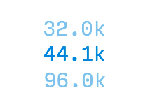

<style>
body {
  background-color: black;
  color: rgb(136, 136, 136);
  font-family: 'Input Sans', sans-serif;
}

img, video {
  max-width: 100%;
}

img[alt=icon] { 
  width: 100px;
  border: 2px solid #293E4D;
  border-radius: 5px;
}

h2 {
 color: #2a9fd6;
}

h3 {
 color: white;
}

h4 {
 color: white;
}

</style>

# Nodes Reference

## Synthesis

### ADSR

  

Input        | Signal Range (Default / Maximum)
:------------- | :-------------
Gate   | `Gate (rising edge)`
Attack (knob 1)   | `0 to 1 second / 0 to >1 (hour)`
Decay (knob 2)   | `0 to 1 second / 0 to >1 (hour)`
Sustain (knob 3)   | `0 to 1`
Release (knob 4)   | `0 to 1 second / 0 to >1 (hour)`

Output        | Signal Range
:------------- | :-------------
Control Signal (Envelope)   | `0 to Gate Height`

**iOS Symbol**


**Exposable Element** - Envelope shape.  Note: you cannot change the envelope shape directly - you must use knobs or modulation signals connected to the ADSR knob inputs.

  

**Warnings** - Do not apply negative numbers to any control.  Sustain values >1 will cause distortion of envelope shape.

**Typical Use** - Modulating volume of oscillators and their filters' cutoff frequencies.

The ADSR (Attack, Decay, Sustain, Release) node generates a special type of control signal called an envelope. Envelopes are often used to modulate the volume of an oscillator. With different envelope settings you can make an oscillator sound like a drum, organ, or violin. The trick is all in knowing how to set the Attack, Decay, Sustain, and Release.


The ADSR node creates a signal that begins at 0, increases to the gate height (Attack), dips (Decay) to a constant level (Sustain), and finally, once the gate goes low (e.g., when the key is released), it tapers off back to 0 (Release).

To test the ADSR node, attach a MIDI Trigger node to its input, then attach both a Waveform and Value node to its output as pictured below. Tap the trigger a few times, hold it down, and adjust the ADSR node's settings to see how they react.


The ADSR node creates a control signal, meaning the ADSR node does not create sound by itself.

In its most common use, an ADSR signal is like an invisible hand turning the volume control on an oscillator.


Those familiar with hardware modular synthesis might note the absence of a VCA, or Voltage Controlled Amplifier. Separate VCA modules are unnecessary in Audulus because their functions can be replicated in several different ways (see below).


The maximum gate height used in the Audulus Module Library is 1.  The ADSR node will accept larger gates, but it typically makes more sense to create a 0-1 envelope, and then multiply the envelope signal into the range you need it to be.


Despite its illustration, the output of the ADSR node is linear. This means the ADR periods have linear slopes to them.

Many instruments, especially percussive ones, have non-linear volume envelopes. The easiest way to make a non-linear envelope is to square the ADSR's output with a Multiplication node (see below).


You can also use the Mapper and Spline nodes to create unique envelope shapes (see below).


If the Attack, Decay, or Release settings are set to 0, they may sometimes cause an audible clicking noise.  To prevent this from happening, you can adjust their ranges with an expression node (see below) or set their value ranges directly by clicking or tapping on the knob.  Any small non-zero value will do.


**Suggested ADSR settings for various instrument analogs**

Instrument        | A / D / S / R Values
:------------- | :-------------
Snare   | `0.01 / 0.1 / 0 / 0.15`
Kick / Tom   | `0.01 / 0.1 / 0 / 0.75`
Hi-Hat (Closed)   | `0.01 / 0.15 / 0 / 0.2`
Hi-Hat (Open)     | `0.01 / 0.9 / 0 / 0.2`
Violin (Bowed)     | `2 / 0 / 1 / 1` 
Organ     | `0.01 / 0 / 1 / 0.01` 
Horn Stab     | `0.05 / 0.15 / 0.3 / 0.5`
Ocean Surf     | `4 / 4 / 0 / 4` (Env^2)

Often you will find two different envelopes in a patch - one controlling the oscillator's volume and the other controlling a filter's cutoff frequency.

Using two different envelopes allows you to create an enormous variety of sounds. Try creating a patch like the one pictured below and play around with different ADSR settings for each node. Make sure you use a harmonic-rich waveform like the square or saw wave to really hear what's happening.


You might find you want to add some more control to the filter's sweep range. The patch above makes the filter move through its entire range. To make the envelope move the filter between two set frequencies, you can make a patch like the one pictured below (available HERE on the Audulus Forum). Go ahead and also attach a knob to the resonance setting and play around with that (just be careful you don't leave it set all the way up or it will squeal in self-oscillation).

Also note the added volume control before the Speaker node, which you'll need to prevent clipping your output.


### Osc

  

Input        | Signal Range
:------------- | :-------------
Hz (Hertz / Frequency)   | `0 to 20,000`
amp (Amplitude)   | `0 to any positive 32-bit number*`
sync   | `Gate (rising edge only)`
shp (Shape)   | `0 to 1 (only modifies saw and square waves)`
Wave Shape   | `Click/tap to cycle - sine, square, triangle, saw`
* - the maximum audio output for Audulus is -1 to 1. Beyond that range causes hard clipping.


Output        | Signal Range
:------------- | :-------------
Anti-Aliased Waveform   | `-amp to +amp`

**iOS Symbol**


**Exposable Element** - Wave shape.

  

**Warnings** - Because this is an anti-aliased oscillator, its best use is as an audio oscillator (20Hz-20kHz).  To create LFOs (oscillators that generate control signals) use a Phasor node-based oscillato. Phasor-based oscillators use much less CPU and do not ring at their transitions (see: Gibbs Phenomenon).

**Typical Use** - Creating the voice of the synthesizer, i.e., the origin of the audio signal.

The oscillator is the foundation most types of synthesis. It is like the vocal chords of the synthesizer - the vibrating portion that creates the sound.

The Osc node has four waveforms - sine, triangle, saw, and square. The saw and square wave shapes are also variable using the shp control. Each waveform has a characteristic sound.


A waveform is a graph of amplitude over time.  As a sound wave travels through the air, it creates alternating bands of high and low pressure.

In the animation below, the darker bands represent densely packed air molecules while the lighter bands represent sparsely packed air molecules.

  
*source:* Wikipedia

The dense portion of the wave is the positive part of the oscillation (0 to 1), and the sparse portion of the wave is the negative portion of the oscillation (0 to -1). A value of 0 represents the average ambient air pressure of the space.

When a speaker cone is pushing out, it creates the high pressure (positive) portion of the wave.  When a speaker cone is pulling in, it creates a low pressure (negative) portion of the wave.  Animagraffs has an excellent animated illustration of how a speaker works here: http://animagraffs.com/loudspeaker/

To hear how different each wave sounds, create a patch like the one below and cycle through the wave shapes by tapping or clicking on the wave icon.


To understand why each wave sounds different, we have to understand a little bit about Fourier transformations.

  
*source:* Wikipedia

Joseph Fourier was a French mathematician born in the 1700s.  He discovered that all sound waves, no matter how complex, are composed of sine waves of different but related frequencies.

There is a lot of heavy math behind why this is, but you don't need to understand the math to see how it works.

First, let's have a look at the diagram below to see how a series of sine waves added together can start transforming into a square wave.

  
*source:* Wikipedia

The first sine wave oscillates at the fundamental frequency, while each additional sine wave oscillates at a multiple or harmonic of that frequency.

If you still can't picture what is going on, have a look at this animation (ignore the math if it's confusing):

  
*source:* Wikipedia

The animation first shows the square wave superimposed on a series of the 6 sine waves. When these sine waves are added together, they create the square(-ish) wave that you see.

The animation then separates these sine waves and creates a bar graph out of the amplitudes of each sine wave.  The first bar on the left is the fundamental frequency (1st harmonic), while the other bars are the 2nd-6th harmonic, related to the fundamental.

Below you can see the same transformation happening with a saw wave - this time with 50 sine waves added together.

  
*source:* Wikipedia

As you can see, the more sine waves you add, the closer your approximation of the idealized waveform becomes.

What makes wave shapes sound different are the relative loudness of their harmonics. 

A harmonic is a wave that vibrates at an integer multiple (x1, x2, x3, x4, ...etc.) of a fundamental frequency (see below).

  

If we take as our base a note that vibrates at 440Hz, then its second harmonic would be at 880Hz (440x2), its third at 1320Hz (440x3), and its fourth at 1760Hz (440x4).

A sine only has one harmonic (the 1st or fundamental). Saw waves contain all harmonics, while triangle and square waves have only odd-order harmonics (3rd, 5th, 7th, ...etc.).

The ratio of the amplitude of each harmonic is 1/N where N = the harmonic number. This means the amplitude of the 1st harmonic is 1/1; the 2nd is 1/2; the 3rd is 1/3; the 4th is 1/4; ...etc. (see below).


*source:* Wikipedia

Download the patch pictured below from the Audulus Forum to see and listen to the first six harmonics of a saw wave.

  

Adding sine wave harmonics together like this is called additive synthesis. You can make all sorts of complex sounds by varying the amplitude of each harmonic or even applying different volume envelopes to each oscillator.

A simpler place to start, however - now that we know what harmonics are and what they sound like - is subtractive synthesis.

Subtractive synthesis is a technique that starts with a harmonically rich waveform, like a saw or square wave, and uses a filter to attenuate or subtract frequencies.

Subtractive synthesis is covered in more depth under the Filter node heading, but you can look below to see the basic setup of a subtractive synthesizer. You can also download this patch at the Audulus Forum.

  

Syncing two or more oscillators together is a great way to add even more complex harmonics to your sound.

   

To understand what syncing does, first we have to understand what phase relationships are.

When you create two oscillators in Audulus, the chances of them being perfectly in phase are slim. Look at the patch below - these are two oscillators created at two different times.  Notice how their waves do not overlap perfectly.


Phase is measured in degrees (θ) from 0 to 360.

  

A wave with a 0 degree phase shift from another wave is in phase. If two identical in-phase waves are added together, their waveform is preserved and their amplitude is doubled.

A wave that is shifted 180 degrees is completely out of phase - a mirror image. When two completely out-of-phase waves are added, they cancel one another totally.

When waves are between 0 and 180 degrees out of phase from one another, they will cancel some frequencies but not others. This phenomenon is at the heart of several time-based effects like phasing, flanging, and chorus, and it also affects the sound of synced oscillators.

Back to the two oscillator patch above - to sync these we could save the patch, exit, and reopen the patch, and the oscillators would then be in sync. This would be like a hard reset on the entire patch, but it's not very useful for creating a hard-synced oscillator synthesizer!

To syncronize these oscillators without having to restart the patch, we need to pulse their sync inputs at the same time with the rising edge of a gate signal. A Trigger node will work nicely for this. Notice how the waves went from out of sync to suddenly in sync after the trigger was first pressed (see below).

  

Things get more interesting, however, if we use one oscillator to trigger the sync input of the other.

The main oscillator is called the master oscillator and the oscillator being triggered at the sync input is called the slave oscillator.

If both oscillators are running at the same frequency and they are both set sine, nothing happens.

  

If the slave oscillator is running at a slightly different speed, however, look at what happens:


As you can see above, the waves start in phase with one another, but because the master oscillator is running faster, it moves out of phase with the slave oscillator.  If we mix these oscillators together, we get interesting phase cancellations that add to harmonic complexity (see below).

  

Now look what happens when we mix different wave shapes together:

  

If we want to hear what these oscillators sound like, we'll have to adjust them so they're operating in the audible range. Make a patch like the one pictured below, or just download the example at the Audulus Forum.

The knob and expression controlling the second oscillator's frequency will dramatically shift the harmonic content of the sound.

  

Better still, do away with the detune knob and attach the volume envelope to the sync oscillator's frequency input like so:

  

The shp (shape) input only affects the saw and square waves.

Its input range is 0 to 1 which means any default knob node can attach directly to it. You can also send it envelopes as well.

For the square wave, the shape control is the pulse-width modulation (PWM) control. This determines the duty cycle, i.e., the wave's proportion of high (positive) to low (negative) time (see below).  Notice that when the shape knob is turned all the way up that the wave disappears entirely.


For the saw wave, the shape control de-phases the wave in way similar to two hard-synced saw oscillators that are locked to the same pitch, but vary in phase. When the shape knob is turned all the way up, the waveform has effectively doubled its period, causing an octave shift (with a loss of some amplitude - see below).


The Osc node is anti-aliased. This means it is optimized to be an audio oscillator. However, this also may not always work well as an LFO or control signal oscillator. 

To understand why this is, first we have to understand what aliasing is; and to understand aliasing, we first have to understand sampling.

When Audulus outputs audio, it does so at the speed of the host's sampling rate. The default for the standalone application is 44.1kHz, or 44,100 samples per second. Each sample is a 32-bit number between -1 and 1.  

At this sampling rate, a saw wave with an amplitude of 1 and a period of 1Hz is represented by a string of 44,100 numbers that begins at -1 and ends at 1.

At the same sampling rate, a saw wave with an amplitude of 1 and a period of 2Hz is reproduced in 22,050 samples.

As you can see in the table below, every time we double to frequency, the number of samples per period of the wave is halved.

Hz  (Limit of Hearing)      | # Samples @ 44.1kHz
:------------- | :-------------
`1`   | `44,100`
`2` | `22,050`
`4` | `11,025`
`8` | `5625`
`16` | `2812`
`20` (Lower) | `2205`
`32` | `1406`
`64`  | `703`
`128` | `351`
`512` | `175`
`1,024` | `87`
`2,048` | `43`
`4,096` | `21`
`8,192` | `10`
`16,384` | `5`
`20,000` (Upper) | `2`
`44,100` | `1`

For a wave to be represented digitally, it needs at least 2 samples - a high sample (speaker pushed out) and a low sample (speaker pulled in). This was determined by Harry Nyquist (below, left) who worked on high-speed telegraphs in the early 1900s, and Claude Shannon (below, right), who helped the world transistion from analog to digital signal communication.  The Nyquist-Shannon sampling theorem, as this rule is so-called, was that bridge.

   
source: Wikipedia 1, 2

Now that we understand sampling and its limits, we can understand what happens when those limits are broken - namely, aliasing.

Aliasing is a type of distortion that happens when an inadequately high sample rate is used to accurately reproduce a frequency.

To hear what aliasing sounds like, you can create a patch like the one below (or download it here at the forum). This patch reduces the sampling rate of the wave as it passes through from 20kHz all the way down to 20Hz.  As you approach 10kHz and below, the notes on the keyboard will begin to disappear, unable to be reproduced by the inadequate sampling rate.

    

Without going into the mathematical *why* of it, at a sampling rate of 44.1kHz, frequencies above 22.05kHz are "reflected" or "mirrored" below it. If these frequencies have enough amplitude and fall within the range of human hearing, we percieve them as inharmonic, ugly-sounding distortion.

Now, finally, we can return to the anti-aliased property of the Osc node. The Osc node is band-limited, meaning it sharply cuts off harmonics above the 20kHz point.  Unlike a low-pass filter, which attenuates higher frequencies at a rate of a particular number of decibels or dB per octave, band-limiting is like taking scissors and snipping off the higher frequencies.

This bandlimiting is what causes the "ringing" that you may have noticed in some of the screenshots (see below).

 


This is now a flaw, but a feature of an anti-aliased digital oscillator. If you scroll way back up to the beginning of the Osc entry, you'll see this peak forming in the saw wave with 50 harmonics animation.

This ringing is referred to as the Gibbs Phenomenon - a property of Fourier series discovered by Henry Wilbraham (photo not available) in 1848 and re-discovered by J. Willard Gibbs (below) in 1899.


When you stop and think about it, the presence of this ringing makes sense.  For a square wave to move from high to low pressure instantaneously (as it does in its idealized form), you would need an infinite series of harmonics. The maximum frequency that air can reproduce is around 5MHz, or 5,000,000Hz. 

https://www.researchgate.net/publication/230702229_Reproduction_of_Virtual_Sound_Sources_Moving_at_Supersonic_Speeds_in_Wave_Field_Synthesis

Five million Hertz may seem really fast, but in reality, 5Mhz is infinitely closer to 0Hz than it is to infinity Hz. 

Yeah, take a second and think about that one.

As a parting note on the Osc node, the Gibbs Phenomenon can become a problem when you're using a square or saw wave as control signal, and it is why you should use a Phasor-node based LFO for all of your LFO needs, which outputs an idealized digital waveform.

Even if you offset and attenuate the output of the Osc node to be between 0 and 1, the transitions will ring both lower and higher than 0 and 1, which can cause problems for time-based parameters (which can't be negative) and resonance (which can't be more than 100%).

Also, if you are using a square oscillator as an on/off switch, the ringing can cause the switch to flip open and closed rapidly. The patch below illustrates the problem with two counters. These should be exactly in sync, but as you can see, one switch is triggering the counter twice as often as the other.


This is a phenomenon that has to be accounted for in digital computer chips as well. The solution to this problem is called debouncing - filtering that can be done either with analog components or in software code.

### Phasor

  

Input        | Signal Range
:------------- | :-------------
sync   | `Gate`
frequency   | `0 to Sample Rate/2`

Output        | Signal Range
:------------- | :-------------
Radians   | `0 to 2π (~6.28)`

**iOS Symbol**


**Exposable Element** - None.

**Warnings** - Because the Phasor node is not bandlimited, using it as an audio oscillator will result in aliasing distortion. Also NOTE: This is NOT a "Phaser" effect!

**Typical Use** - Creating low-CPU modulation sources.


The **Phasor** node outputs a sawtooth wave that ranges from 0 to 2π. It's used to create oscillators, and is most useful as an LFO (low frequency oscillator).


As you can see in the image above, the expression `Phasor/(2*pi)` is used to bring the 0 to 2π range into a 0 to 1 range that we can see on the Waveform node. So why does the Phasor node output a signal of 0 to 2π? Wouldn't it be easier to work with if it just output a signal of 0 to 1?

Before we answer that question, let's look more deeply at what a phasor is.

For starters, the Phasor node is *not* a phaser effect.

  
source: Wikipedia

"Phasor" is a combination of the words "phase" and "vector." A vector is a type of line that has a beginning point, an end point, and a direction (as opposed to a ray, which has a beginning but no end).


Phase is the measure of a point in a wave cycle at a given time. A sine wave like the one below begins at 0 degrees, rises to 90 degrees, falls to 270 degrees, and completes the cycle at 360 degrees.


When we combine these two concepts - phase and vector, we get something like this:


The circle pictured above is the Unit Circle - a circle with a radius of 1, centered at the origin point (0,0). The Phasor node outputs the value of the length of the arc between the point (1,0) and the vector. This measurement is called a radian.

Because the circumference of a circle is `2*pi*radius`, and the radius of the Unit Circle is 1, we get a total possible range of values of 0 to 2π.

If you're still having trouble visualizing this, watch the the animation below:


So now that you understand *why* the Phasor node outputs the range 0 to 2π, we can look at why this range is useful for creating all kinds of waves.

A phasor node can be used to create multiple waveshapes with some simple math. Of course, it naturally outputs a sawtooth wave, but how do we create a sine wave? It's easy:


If you take the sine of the output of the Phasor node, you get a sine wave - go figure, right? But why is this?

Well, remember SOH-CAH-TOA? As pictured below, the sine of angle ⍺ (alpha) is the ratio: `Opposite/Hypotenuse`.


Since we're using the Unit Circle, the hypotenuse always equals 1 (it's the radius of the circle). This makes the math really easy: `Opposite/1 = Opposite`.

The length of this opposite side becomes the set of y coordinates that make up the unit circle. The x coordinates of the unit circle are the solutions of the cosine (`Adjacent/Hypotenuse`).

When we solve the equation `y = sin(x)` (which is the same as `sin(Phasor)` in Audulus) we get an undulating line.


The animation below illustrates the relationship of the sine and cosine waves. Sonically, they are identical, but they are phase-shifted by 90 degrees (~1.57 radians).


When creating a multi-output LFO, you might find it useful to use `cos(Phasor)` instead of `sin(Phasor)`.  This is because the cosine of the Phasor node is in phase with the saw wave and other waves you'll create (see below).


To create a square wave LFO using the Phasor node, we need to use a logic expression. 

In the image below, the Phasor output has been translated from its normal 0 to 2π range into a 0 to 1 range. All LFOs should operate in a range of 0 to 1 because so many inputs (knobs, crossfade input, level node) all work from 0 to 1 by default.

The expression `Phasor/(2*pi)>.5` is true (outputs a 1) when the 0 to 1 output of the `Phasor/(2*pi)` expression is greater than 0.5. When the output of `Phasor/(2*pi)` is less than 0.5, the expression is false (outputs a 0).


To add pulse-width modulation to this LFO, all we need to do is add a Knob node (see below).


In the above example, the expression `Phasor/(2*pi)>Knob` is only true for a small period of time.  However, in the example below, the expression is true for a longer period.


To create a triangle LFO, we need to use some simple algebra.

First, we have to shift the saw LFO downwards so that half of its oscillation is negative.  `Phasor/(2*pi)-.5` shifts the 0 to 1 saw wave down by 0.5, making it oscillate between -0.5 and +0.5.


The `abs(x)` expression returns the absolute value of x - usually notated as `|x|`.

`abs(Phasor/(2*pi)-.5)` takes the absolute value of that shifted expression and turns the saw wave into a triangle wave.


We can then take this 0 to 0.5 wave and multiply it by 2 to get a triangle wave that oscillates between 0 and 1.


**Fun Fact:** *Another name for the absolute value is the "modulus," which was the original name of Audulus in an early beta!*

So that's how you can use the Phasor node to create all of the basic LFO shapes.


Why go through all the trouble of making a Phasor LFO? There are two reasons:

1) The Phasor node is much more CPU-efficient than the Osc node is. This CPU savings can make a big difference in patches like the one below with multiple LFOs.


2) The Phasor node creates waves that are not bandlimited, meaning they are "idealized" forms of each wave. This is useful for triggering switches. The little spike you see on the anti-aliased Osc node may cause a logic expression like `x>0` to trigger multiple times. (To understand why this is, refer back to the Osc node description.)


Like the Osc node, the Phasor also has a sync input. When the sync input sees the rising edge of Gate signal, the Phasor resets to 0. This can be used to create more complex waves when used in tandem with another Phasor node (see below).


### Sample & Hold


Input        | Signal Range
:------------- | :-------------
trigger   | `Gate`
in   | `any 32-bit number`

Output        | Signal Range
:------------- | :-------------
Sample   | `any 32-bit number`

**iOS Symbol**

 

**Exposable Element** - None. 

**Warnings** - When using the Sample & Hold node in a feedback configuration (such as a counter) it may be necessary to use the Feedback Delay node to ensure stable functionality.

**Typical Use** - Sampling incoming random values and using those values to modulate filter cutoff, pitch, or volume. Also great for creating downsampling distortion.

When triggered by a Gate signal, the Sample & Hold node will capture the value at its input and hold that value at its output until the node is triggered again. Below, you can see how the Sample & Hold node works with both a noise source and an oscillator.


Sample & Hold is most recognizable as a kind of sci-fi bleep-bloop noisemaker. By scaling the output of a sampled noise source to audible Hz values, you can make "computer hard at work" sounds (see below).


To make things even more interesting, you can add a filter and use a separate random Sample & Hold source to modulate its cutoff (sounds best with a high resonance value - see below).


If you want to take it a step further, square the output of the random node a couple times and watch how the filter will tend to stay in the lower pitches more often. 

(Click here to download the patch below.)


Sample & Hold can be used for much more than just adding randomness to your patches. 

In fact, it is one of the most powerful nodes available to you.

Below is a flip-flop. Flip-flops are a fundamental building blocks of computers. They can store information as a 0 or 1.


Flip-flops can be used as clock dividers, and when they are cascaded, they become a shift register. Each flip-flop divides the incoming clock speed in half.


You can also use Sample & Hold nodes in an array configuration to store multiple 32-bit numbers. This means you can build a sequencer with any number of steps and only need 2 knobs (Step Select and Value) and 1 button (Print Value to Current Step) to program it.

Below is an example of how this would work with only 4 steps for simplicity's sake. The Mono-to-Quad and Quad-to-Mono nodes help compress the patch visually - imagine there are 4 separate Sample & Hold nodes there, one for each step. The light indicates which step is selected. (If it's confusing, jump to the section on Mono-to-Quad/Quad-to-Mono.)


The only downside to this is that the Sample & Hold node is cleared of its values when the patch is reset (i.e., when you close and reopen the patch). In a future version of Audulus, we will introduce a Data node that will allow you to store values more permanently.

Another use for the Sample & Hold node is as a counter. Below is an example of a counter that counts up to a specified integer, resets to 0, and then counts up again. Counters are essential for creating step sequencers in Audulus. 


The Sample & Hold node can also be configured to detect change in an incoming signal. In the Delta change detector configuration below, the `!=` operation means "does not equal." So if the signal that is coming from the knob (or any other modulation source) does not equal the sampled signal, it will resample the incoming signal until they are equal.

This can be useful for adding a gates to a random sequencer - it would create a gate signal with each new note that could be used to trigger a volume envelope.


With a similar configuration, the Sample and Hold node can detect the high and low values of an incoming signal.


There are so many more uses for the Sample & Hold node - you're really only limited by your imagination. Below is an example of the Pulse Looper module, which uses Sample & Hold nodes in an array formation to capture the rhythm of button presses.


---

## Utilities

### FeedbackDelay

  

Input        | Signal Range
:------------- | :-------------
Signal   | `any 32-bit number`

Output        | Signal Range
:------------- | :-------------
Signal   | `any 32-bit number`

**iOS Symbol**


**Exposable Element** - None.

**Warnings** - The FeedbackDelay node is *not* used for audio or signal delays. If you want to delay something in time, use the Delay node.

**Typical Use** - Defining precise point of a processing delay in a feedback loop when critical to a patch's functionality.


The **FeedbackDelay** node controls where a delay occurs in a feedback loop. Audulus indicates where a feedback delay occurs with a "z" in an input (indicating a Z-transform). If no FeedbackDelay node is present, Audulus will automatically decide where the delay occurs. While this is fine for many applications, in some situations, a misplaced feedback delay will break the patch's functionality.

But why does a feedback delay even need to exist? The answer is simple, but can be hard to visualize at first: a computer cannot process a value before it has been created. 

Audulus computes the values at two different speeds: frames and buffers. Frames run at audio rate (44.1kHz) while buffers are executed in groups of 128 frames (~345Hz). Unless you explicitly tell Audulus to process a value sample-by-sample (see the z-1 node), Audulus will process operations in buffers. The feedback delay node is a way of marking explicitly where the order of operations during 1 buffer stops and waits until the next buffer.

To understand more deeply why the FeedbackDelay node is necessary in some cases, first follow along with the steps of a correctly made Delta Change Detector module, and then look at what happens when the module is made incorrectly.  

The Delta Change Detector module outputs a gate when it notices that the incoming value has changed from one buffer to the next. It's useful for adding a gate signal to a random melody being generated by a Sample & Hold node, as a gate will trigger each time a new value appears.

  

**Correctly Made Delta Change Detector Module**

**Buffer 1**  
The Signal input changes from 0 to 1.  Audulus calculates the inequality between the Signal and Sample inputs.  The values are different so the output is 1.  The FeedbackDelay node is between the output and the Sample & Hold trigger.  It prevents the inequality from triggering the node during this buffer.

`Module Output = 1`

**Buffer 2**  
The Signal input changes from 1 to 2.  The FeedbackDelay node releases the signal from the inequality.  The output of the inequality from the last buffer triggers the Sample & Hold node.  The Sample & Hold node captures the signal input and holds the value at its output.  Audulus calculates the inequality between the Signal and Sample inputs again.  Both the Signal and Sample match, so the inequality outputs a 0.  Again, the Feedback Delay node halts the value until the next buffer.

`Module Output = 0`

**Buffer 3**  
The Signal input changes from 2 to 3.  The FeedbackDelay node releases the 0 signal and the trigger of the Sample & Hold node goes low.  Audulus calculates the inequality again.  The sampled value from buffer 2 doesn't match the Signal input from buffer 3.  The inequality outputs a 1.  The FeedbackDelay node halts the value until the next buffer.

`Module Output = 1`

**Buffer 4**  
The Signal input stays at 3.  The FeedbackDelay node releases the 1 and the trigger of the Sample & Hold node goes high.  The Sample & Hold captures the signal input and holds the value at its output.  Audulus calculates the inequality again.  The Signal and Sample match, so the inequality outputs a 0.  The Feedback Delay node halts the value until the next buffer.

`Module Output = 0`

**Buffer 5**  
The Signal input stays at 3.  The Feedback Delay node releases the 0 and the trigger of the Sample & Hold node goes low.  Audulus calculates the inequality again.  The Signal and Sample match, so the inequality outputs a 0.

`Module Output = 0`

  
**Incorrectly Made Delta Change Detector Module**

**Buffer 1**  
The Signal input changes from 0 to 1.  Audulus calculates the inequality between the Signal and Sample inputs.  The values are different so the output is 1.  The output triggers the Sample & Hold node.  The Sample & Hold node captures the Signal input value and holds it at its output.  The Feedback Delay node halts the value until the next buffer.

`Module Output = 1`

**Buffer 2**  
The Signal input changes from 1 to 2.  The Feedback Delay node releases the Sample signal.  Audulus calculates the inequality.  The inequality is still true because the Sample (1) and the Signal (2) are still different.  The Sample & Hold node retains the same sample.  The Feedback Delay node halts the output value until the next buffer.

`Module Output = 1`

**Buffer 3**  
The Signal input changes from 2 to 3.  The Feedback Delay node releases the Sample signal. Audulus calculates the inequality.  The inequality is still true because the Sample (1) and the Signal (3) are still different.  The Sample & Hold node retains the same sample.  The Feedback Delay node halts the output value until the next buffer.

`Module Output = 1`

...and so on. If you understood that, then great! You'll be able to use that knowledge in your designs. If you didn't understand, don't worry. If you ever come across a situation where you are using feedback and something seems to work at first, but when you close and reenter the patch, it no longer works, that just means you need to play around with inserting the FeedbackDelay node at different points within your feedback loop to see what works. 

What happened was when you were putting it together, Audulus put the feedback delay in the correct position. But when you reopened the patch, the feedback delay reset and jumped to another spot where it no longer works.

And of course, if you're having trouble with a patch that uses feedback, you can always put your question to the community at the Audulus forum!


### Speaker

  

Input        | Signal Range
:------------- | :-------------
Top - Right / Audio Output 2   | `-1 to 1`
Bottom - Left / Audio Output 1    | `-1 to 1`

**iOS Symbol**


**Exposable Element** - None.

**Warnings** - Modular synthesis can cause sudden and *painful* spikes in volume if you don't know what you're doing. The #1 culprit of this is connecting a large signal to a filter's resonance input. Protect your hearing, and be careful when experimenting with headphones on or speakers turned up high.  Also, signals beyond the range of -1 to 1 will be clipped, causing distortion. It is generally best to keep outputs at 50-75% of maximum.

**Typical Use** - Sending audio and/or control voltages out of Audulus.

The **Speaker** node sends two channels of audio to the speakers or plugin outputs. If multiple speaker nodes are present in a patch, then the output of each node is mixed together equally.


However, it's better to use a single Speaker node with a master volume control to prevent output clipping.

To create a master output volume control, attach one (mono) or two (stereo) Level nodes to the Speaker node's input. A single Knob node can be used to control both Level nodes for a stereo output.


A quick way to create a master output pan control for a stereo signal is to use the same stereo configuration as above, but invert the Knob signal before it attaches to one of the level nodes.


The above solution is fine for many situations, but you'll notice it has a dip in volume towards the center (50%). The dip in volume happens because the knob signal in the example above is linear, but our perception of volume is logarithmic. A logarithmic or equal power pan will appear equal in volume across the entire stereo spectrum.

If you watch the example above, both of the level nodes are at 50% in the same moment, whereas in the example below, if one node is at 50%, the other is somewhere near 75%.


There are many ways to make an equal power pan, but this is the most simple. The first equation creates a sweep equal to 1/4 of the Unit Circle. Taking the sine and cosine of this output will result in two logarithmic curves that are 90 degrees out of phase with one another.


An output overload detector is useful to have on an audio output. A overload detector will flash when the incoming audio or control signal level exceeds the node's maximum -1 to 1 range.  Creating one is easy.


The expression `abs(Audio)>1` translates to "If the absolute value of the audio signal is greater than 1, then output a 1." When this expression outputs a 1, it will turn the RGB node red. We use the absolute value because it's possible for an audio signal to clip an output only in its negative sweep. Using the absolute value of the audio input will detect peaks in both the positive and negative portions of the wave.

The only problem with this setup is that output overload peaks can happen very quickly - too quickly to see the red light flash. We can turn the on/off flash into a on/fade-out flash with some extra nodes.


In the above example, when an overloaded audio signal is detected by `abs(Audio)>1`, it triggers the Timer node to restart from 0. The Timer node signal is then inverted by the `1-Timer` expression so that it starts at 1 and counts down in seconds. The `clamp(~)` portion of the `clamp(1-Timer,0,1)` expression constrains the output of the `Timer-1` expression to a range of 0 to 1. This ultimately turns the on/off flash into an on/fade-out flash that takes 1 second to disappear.

We then have to use an Add node to sum the output of the `abs(Audio)>1` signal and the `clamp(1-Timer,0,1)` signal so that if the output is constantly overloaded, the red light will stay constantly lit.

The Speaker node can send both audio and control voltages out of Audulus. To send control voltages to a modular synthesizer, you'll need to use a DC-coupled audio interface like the Expert Sleepers ES-8.


Most audio interfaces are AC-coupled which prevents a constant offset DC voltage from damaging speakers (to understand why this is, look at the DCBlocker node). However, because AC-coupled interfaces cannot output static voltages, they are useless for sending 1 volt-per-octave pitch signals and LFOs.

The Expert Sleepers ES-8 and other DC-coupled audio interfaces will allow you to send accurate pitch and modulation signals from Audulus to your modular. The ES-8 is a particularly good interface to use because its maximum voltage swing of -10 to 10 volts scales easily with the -1 to 1 output range of Audulus. This means that every 0.1 step in Audulus is equal to 1 volt.

Although as of this writing, you can only use the first two inputs and outputs of the ES-8, we will soon implement arbitrary I/O that expands to the number of available inputs and outputs of whatever audio interface you have selected. This also means that if you are using Audulus on a computer and have multiple ES-8 modules, you will be able to create an aggregate device to take advantage of all of their inputs and outputs.

SPECIAL OFFER: If you buy an Expert Sleepers ES-8 from Century Sound Labs, you'll recieve a free copy of Audulus on the platform of your choice! 

https://reverb.com/item/3437313-expert-sleepers-es-8-dc-coupled-audio-interface-free-audulus-3-copy

For a more in-depth discussion on how to integrate Audulus with your analog synthesizers using DC-coupled audio interfaces, refer to the Analog Audulus documentation (coming soon).


### Mic

  

Output        | Signal Range
:------------- | :-------------
Top - Right / Audio Input 2   | `-1 to 1`
Bottom - Left / Audio Input 1   | `-1 to 1`

**iOS Symbol**


**Exposable Element** - None.

**Warnings** - If a Mic node is connected to a Speaker node, it is possible to create a painfully loud feedback loop, especially on iOS. You must isolate the Mic node input from the Speaker node output (usually by plugging in headphones).

**Typical Use** - Routing audio and/or control voltages into Audulus.

The **Mic** node recieves two channels of audio input from your audio device or plugin audio input. If you want to route audio or control voltages from an external instrument into Audulus, you need to use the Mic node.

For example, if you are using Audulus on iOS in an AUM or Audiobus FX slot to create a stereo delay, you would create a patch that looks something like this:


If the audio input to Audulus is monophonic, it will usually enter through the bottom (left) input, which is input 1.


If the output track is monophonic (or you just want to use a monophonic effect), just insert the effect between Mic node input 1 and Speaker node output 1.


There are all kinds of effects you can create in Audulus, but one of the most simple is a tremolo. A tremolo effect modulates the volume of a signal, most often with a triangle or sine LFO.

Below is an example of a tremolo with speed and depth controls.


You can also make creative use of the mic node by attaching it to the amplitude input of an oscillator. Using an EnvFollow node will prevent the amplitude value from going negative.


Taking this idea further, you can use the Mic node with a threshold control to trigger an Envelope node to create drum sounds. If you set the threshold control just right, you can lay your iOS device on a table and slap the table to trigger the drum.


### Text

  

**iOS Symbol**


**Exposable Element** - The text itself. Note: The text will move the bounding of a subpatch to how it is formatted internally.

  

**Typical Use** - Labeling controls and creating visual accents on modules as well as adding patch commentary.

The **Text** node is an editable text block that can be used to label things and write comments. To edit the text, right click or tap on the text and an edit window will appear.

Below is an example of a patch with extensive commentary. Though most advanced users of Audulus can simply "read" a patch and understand what is happening, labeling nodes in a step-by-step manner greatly increases the chance that someone will understand your patch, learn from it, and create their own patches using the principles you've outlined.

  

Commentary text is displayed in a sans-serif font while text that is exposed to the surface of a subpatch is displayed in a serif font.

  

You can change the size of a text block by tapping or clicking on the text and moving the green dot on the right.

  

Knob nodes, input nodes, and output nodes can all be labeled directly by clicking or tapping on the node itself. However, there are times when you may want to condense the labels for a tighter design. Below is an example of two 8-step sequencers - one labeled directly, and one labeled with Text nodes.

  

You can get really creative with Text nodes and integrate them into the aesthetic of a module that you create like the sequencer below, where dashes mark different subdivisions of a Spline node.

  

### Timer

  

Input        | Signal Range
:------------- | :-------------
Reset   | `Gate (rising edge)`

Output        | Signal Range
:------------- | :-------------
Seconds Since Last Reset   | `0 to 68 years`

**iOS Symbol**


**Exposable Element** - None.

**Typical Use** - Lane automation, or used in conjunction with a logic expression that gives a command after n-seconds have passed, e.g., `Timer>10`.

The **Timer** node outputs the time (in seconds) after its input is triggered. You can see how it works by attaching a Trigger node to its input and a Value node to its output. In the example below, approximately 8 seconds passed since the last trigger event.

  

The Timer node may not appear very useful at first, but there are some pretty amazing things you can do with it.

One of the most useful implementations of the Timer node is to use it to turn the Spline node into an automation lane. With enough Spline nodes, you can modulate parameters to mix instrument levels, start and stop clocks, and modulate parameters - all synced to one master Timer node.

The image shows the basic idea: Take the output of the Timer node, divide it by the number of seconds of automation you want, feed the output of that expression to a Spline node, then feed the output of the Spline node to the parameter(s) you wish to automate.


If you want this automation to loop, simply add an Expression node in a feedback configuration with the Timer node's input and write `Timer>=[Max Loop Time]`. When the Timer node's output is greater than or equal to the time you want to loop, this expression will reset the Timer node. If you also use a variable for the `Timer/[Max Loop Time]` expression, you can change just one number to affect the speed of the automation and its loop point.


To add a button to toggle the looping function on and off, simply place a Mult node between the output of the `Timer>=MaxLoopTime` expression and the input of the Timer node's reset input with a Trigger node in toggle mode. You can even go a step further and add an indicator light.


Another use for the Timer node is to create a fade effect on RGB nodes. To fade a light up, use the expression `Timer/[FadeTime]` and connect the output of the expression to the inputs of an RGB node. In the example below, the light will turn all the way on after 3 seconds.


To make a light fade out, just invert the `Timer/[FadeTime]` expression. The light will flash on immediately and then fade out. This is how the overload indicator featured in the Speaker node section is made.


The Timer node can also be used to create a very low-CPU Pulse Looper. The Pulse Looper module allows you to tap in and loop a rhythm using a Trigger node. You can do something similar with a Delay node, but the Delay node has a maximum loop time of 2 seconds. The Pulse Looper has an arbitrarily long maximum loop time, and they can be chained together.


You can read all about how it works inside the module, but in short, when you tap or click the button on the module, it samples the current time value (which is looping from 0 to 4 seconds), and when the loop returns around and the sampled value matches the current time, a gate is generated.


### ZeroCross

  

Input        | Signal Range
:------------- | :-------------
Audio   | `-1 to 1`

Output        | Signal Range
:------------- | :-------------
Fundamental Pitch of the Audio in Hz   | `0 to ~20,000`

**iOS Symbol**


**Exposable Element** - None.

**Typical Use** - Pitch detecting an incoming instrument (like a guitar) to control the pitch of an oscillator or filter cutoff.

The **ZeroCross** node can be used to detect the pitch of a simple waveform. It outputs the frequency of zero-crossings of its input signal in Hertz (cycles per second, or Hz).

A zero-crossing is the moment where a wave crosses from positive to negative or negative to positive. The ZeroCross node counts these crossings and divides them by 2 to get the Hz value.

  

As you can see in the example below, the Value node displays almost exactly the correct Hz value. 

 

This margin of error is small at low Hz values, but grows with higher Hz values (notice the ~2000Hz difference in the readouts between these two oscillators).

 

The good thing is, the entire range of a piano is from about 27Hz to about 4186Hz, with most instruments falling somewhere in the middle. In the example below, the margin of error for the highest note of a piano is only 5-6%, versus the previous example's error of 20+%.

 

The reason for this margin of error has to do with sample rate. At a sample rate of 44.1kHz (the default for Audulus in standalone mode), the ZeroCross node has 44,100 samples per second to evaluate the zero-crossings of a 1Hz wave, whereas it only has 4.41 samples per second to evalute the zero-crossings of a 10,000Hz wave.

The ZeroCross node will also have a harder time estimating the pitch of an incoming signal that is harmonically rich, like a distorted electric guitar (to understand harmonics, refer back to the additive synthesis portion of the Osc node documentation). An easy way to make the ZeroCross node track more accurately with guitars, saxophones, and voice is to place a Filter node before it like in the example below.

 

The Filter node is a low-pass filter (LPF), meaning it passes frequencies below its cutoff point unaffected while attenuating frequencies above the cutoff point. An ideal pitch detector would analyze an incoming instrument and only return the fundamental frequency (i.e., the note being played). Inserting an LPF before the ZeroCross node helps the ZeroCross node ignore the high frequency content of a harmonically-rich sound source that inhibits accurate pitch detection.

Another critical point to understand is that the ZeroCross node can only track one note at a time - not chords. The output of the ZeroCross node is a single Hz value. There is no "polyphony" option because you'd need a much more sophisticated algorithm to parse a chord than simply counting the number of times the incoming wave crosses zero. There are programs that do this, but their algorithms are proprietary.

Now, the reason we've so far only discussed the limitations of the ZeroCross node is to give you a better idea of what to expect from it and how to work with its quirks. Some instruments will work better than others, and even with an LPF inserted before it, the ZeroCross node will never track perfectly - but you can still create some amazing sounds with it.

For the sake of these examples, let's assume you want to make a bass guitar synthesizer. (Bass guitars track pretty accurately with the ZeroCross node.) 

Below is an example of the most basic configuration you can make - a single oscillator that uses an EnvFollow node to gate its amplitude.

 

This sounds OK, but we can make the envelope following sound smoother by adding a Filter node after the EnvFollow node.

 

To make this synth a little more dynamic, we can add an enveloped filter, gated by an amplitude threshold trigger.


To get an even fatter sound, we can add a second oscillator set an octave above the first. Simply multiply the output of the ZeroCross node by 2 and feed that result into the second oscillator's Hz input. The example below goes a step further an adds a detune control, which can widen the sound even more.


Finally, we can add a mix control that allows you to dial in the balance of dry, unaffected bass guitar with the synthesizer sound we've created by using a Crossfade Node.


You can also use a similar configuration to play your analog synthesizers if you have an Expert Sleepers ES-8 DC-coupled audio interface. You just need to convert the Hz signal into Audulus's standardized Octave signal, and send it through the ES-8 interface output module with the o2v (Octave signal to 1 Volt Per Octave) converter - or just use this equation: `(log2(Hz/[ReferencePitch])+4)/10`. In the example below, we can use both the pitch and the filter envelope.


## Poly

### MonoToQuad / QuadToMono / MonoToStereo / StereoToMono

  

MonoToQuad Input        | Signal Range
:------------- | :-------------
in1   | `any 32-bit number`
in2   | `any 32-bit number`
in3   | `any 32-bit number`
in4   | `any 32-bit number`

MonoToQuad Output        | Signal Range
:------------- | :-------------
Poly Signal   | `4x any 32-bit number`

QuadToMono Input        | Signal Range
:------------- | :-------------
Poly Signal   | `4x any 32-bit number`

QuadToMono Output        | Signal Range
:------------- | :-------------
out1   | `any 32-bit number`
out2   | `any 32-bit number`
out3   | `any 32-bit number`
out4   | `any 32-bit number`

MonoToStereo Input        | Signal Range
:------------- | :-------------
in1   | `any 32-bit number`
in2   | `any 32-bit number`

MonoToStereo Output        | Signal Range
:------------- | :-------------
Poly Signal   | `2x any 32-bit number`

StereoToMono Input        | Signal Range
:------------- | :-------------
Poly Signal   | `2x any 32-bit number`

StereoToMono Output        | Signal Range
:------------- | :-------------
out1   | `any 32-bit number`
out2   | `any 32-bit number`


**iOS Symbols**


**Exposable Element** - None.

**Typical Use** - Condensing complex, repetitive designs into smaller packages for a tidier look that can also be easier on your GPU.

The **MonoToQuad** node converts four mono signals to one four-channel polyphonic signal. It is the inverse of the **QuadToMono** node. The **MonoToStereo** node converts two signals to one two-channel polyphonic signal. It is the inverse of the **StereoToMono** node.

People often think these nodes are labeled backwards - they are not! If it helps, think of them as "Mono Signals to Polyphonic Signal" and "Polyphonic Signal to Mono Signals."

Below is an example of a typical use where a stereo signal is routed into one Filter node. Instead of summing the left and right channels, the MonoToStereo and StereoToMono. This allows for parallel processing

These nodes make your designs more condensed and explicit. 

You cannot stack these nodes together to condense more mono signals into a larger polyphonic signal.


### PolyToMono

  

Input        | Signal Range
:------------- | :-------------
Poly Signal   | `2x to 16x any 32-bit number`

Output        | Signal Range
:------------- | :-------------
Mono Signal   | `any 32-bit number`

**iOS Symbol**


**Exposable Element** - None.

**Typical Use** - Collapsing a poly signal into a mono signal to save downstream CPU.

The **PolyToMono** node mixes a polyphonic input (denoted by a thick wire) to a monophonic output (thin wire). Each voice is mixed equally.


Typically, you'll want to place linear effects (reverb, delay, EQ) after the PolyToMono, since it will sound the same as placing them before but only a single voice needs to be processed. A linear effect is one that does not change its character based on amplitude or frequency response (i.e., loud & soft, and high & low pitches are all effected equally). 

On the other hand, nonlinear effects, such as the Distortion node, will have quite a different effect if placed before the PolyToMono versus after.


It's also a good idea to use a PolyToMono node before your audio output to accurately control the volume of your output.


## Sub-Patches

### Patch


**iOS Symbol**


**Exposable Element** - None.

**Typical Use** - Creating modules, simplifying larger patches by condensing portions of patches into smaller elements.


The **Patch** node allows you to contain a patch within a patch. You can even have Sub-Patch nodes within Sub-Patch nodes. Patches are great for condensing otherwise large and unruly patches so that they are easy to "read" and understand what is going on. They're also great for creating your own custom-packed modules, synthesizers, and effects with UIs that have only the relevant controls exposed to the surface of the Patch.

To enter the Patch, tap on the node and then tap "Open" (iOS - you may need to tap the `>` button to expand the menu), or double-click on node (computer). To exit, tap on the icon in the upper left corner (iOS) or press the Escape key (computer).

The Patch node will automatically conform to the dimensions of the elements placed furthest to the top, bottom, left and right. 

To edit the arrangement of a Patch's elements, tap or right-click on an empty space in the Patch and press "Edit UI" (User-Interface). You can now move controls, inputs and outputs, and other visual elements around on the patch.

To lock the Patch, tap or right-click on an empty space again and select "Lock UI." Until you lock the Patch, you will not be able to manipulate knobs or buttons.

You can use Patches to create your own custom modules and save them to your module library. On iOS, simply tap on a Patch and select "Enter Into Library." On a computer (in the standalone app only, not the AU/VST plugin), save the module as a separate file into your Audulus library folder, and it will appear in the right click context menu.

It is generally best to not place text or un-truncated Value nodes at the perimeter of a Patch node because they can cause the edge of the patch to bounce when zooming in or out, or when values change.

Below, we'll create an example module using a Patch a multi-shape LFO using the Phasor node. We'll follow the conventions for Patch module design laid out in the Audulus Module library, but feel free to get creative with your own module UIs.

The Phasor node is great way to make an LFO, but it can feel repetitive building a Phasor-based LFO from scratch every time you need one.

Once you've created a basic 0 to 1 Phasor saw wave LFO and attached a Waveform node to its output, select all of the nodes and then tap on one of the nodes and select "Group" (iOS) or right-click and select "Group."


The patch will disappear and be replaced by a Knob node contained within a Patch node.


Enter the Patch and you'll see the Phasor LFO there. Now go ahead and tap/click on the waveform node and select "Expose."


When you exit the Patch, you'll see that the size of the Patch has grown to accomodate the exposed Waveform node. 


Now add the rest of the LFO shapes (for more on this, refer back to the Phasor node). It's usually quicker to copy and paste nodes from ones you already have rather than menu-diving to grab new ones. If you copy the `Phasor/(2*pi)` expression and the Waveform node attached to it, you can paste it repeatedly and then simply modify the equations as necessary.


Exit the Patch and you'll notice that the Waveform nodes are all stacked on one another. Whenever you expose an element of a node to a Patch node, that element will appear at the Patch node's (0,0) origin point.


If you open an Audulus file in textEdit, you can see how Audulus keeps track of node position by using coordinates.


When creating a module, it can be useful to move exposed elements up and away from this origin point. This is because if you want to add more exposed elements later they may wind up inconveniently in the middle of your carefully arranged UI.

Now go back into the Patch node and attach an Input node to the Phasor sync input, and attach Output nodes to the outputs of each LFO Expression nodes.


If you exit the Patch node, you'll see that once again the Input and Output nodes have all stacked at the origin point. The nodes stack on one another in the order that they were created. This means the Waveform nodes are "below" the Knob node, and the Knob node is "below" the Input/Output (I/O) nodes, and the Input node is the one "on top" of everything else.


To make any exposed element jump to the "top layer," highlight the node and use a Cut/Paste command series. This is the easiest way to rearrange which exposed element is on top.

Now enter the patch again and attach RGB nodes to the LFO Expression node outputs, and attach a Light node to the sync input of the Phasor node. If you create one RGB node, expose it, then copy and paste it to use with the other LFO outputs (instead of calling up new RGB nodes), the pasted RGB nodes will also be exposed. This is another trick to save you some time from having to individually expose each node 

*Note: the distortion in the Waveform nodes in the image below is from when the Patch node was entered - this transition causes a brief pause in rendering the Waveform node, which then catches up to the current value - this does not affect the actual output of the Expression nodes themselves).*


Next, use Text nodes to label the inputs and outputs according to the convention in the module library (g = 0 or 1 gate signal, m = 0 to 1 modulation signal). Expose the Text nodes, and arrange them on the inside of the Patch node so they are near each I/O node for clarity.


To separate the waveforms but keep a compact UI, we can scale the inputs to the Waveform nodes so that they are separated top to bottom. This does not affect the output of the LFO expression nodes, which remains in a 0 to 1 range. We want them to each take up about a 1/4 of the "screen" on the module. The entire range of the Waveform node is from -1 to 1, so if we divide each wave by 2 and then shift the wave up or down in increments of .5, we can spread them out evenly.


If you exit the Patch you'll see that the waveforms are now separated.


Now is a good time to start laying out the module. Put the knobs on the left with the sync Input node, its label, and light node, and put the modulation Output nodes, their labels, and RGB nodes on the right.


It's relatively easy to tell which RGB node fits with what waveshape, but the Output nodes could be mixed up. Go back into the Patch node and temporarily label them so you can arrange them correctly.


We can now arrange the outputs correctly.


But we don't need to keep the labels because it's obvious which wave they go with. Once you've arranged them, enter the Patch node again and delete the names of the outputs.

Since we'll be labeling the Knob nodes inside their perimeter rather than directly below, delete the name of the Knob nodes. You can easily tell which knob is which by how they affect the waveforms when you turn them. Place the speed (Hz) knob on top (because it's the primary control), and the PWM knob below it (it only affects the square wave).


Now let's label both knobs and scale the output of the Hz knob. The expression `Hz^2*20` will scale the Knob to work between 0 and 20Hz in an exponential curve, meaning when the Knob is set to 50%, the Hz output will not be 10 (linear) but 5 (exponential). This makes it easier to dial in slower LFO speeds. 

Attach Value nodes to the output of this Expression node and to the PWM knob directly.


If we go back out to the UI of the Patch node, we'll see that the Value nodes look a little messy. The value nodes will display a high precision number, but that's not very useful in this situation.


To adjust the value nodes so they only display the digits we want, we can use a `floor(x)` expression. This expression discards the decimal portion of an incoming signal. We want to turn the PWM readout to 1 to 100 in steps of 1. To do this, we need to first multiply the PWM value by 100, then floor the result - written as `floor(PWM*100)`.

For the Hz readout, we want a definition to the hundredths place. To do this, we need to multiply the Hz output by 100, floor that value, then divide that floored value by 100 - written as `floor(Hz*100)/100`.


Now when we exit the Patch node, we'll see that the Value nodes read in a much more useful range.


It's generally best to place value readouts far enough below a Knob node so that when the Knob grows as you turn it, the value won't be covered.

Finally, give the module a title. It's a good idea to place the title of a module somewhere in the middle above the patch.


On the UI, it fits nicely over here by the Knob nodes.


### Input/Output

  

**iOS Symbol**


**Exposable Element** - Input/Output port.

  

**Warnings** - These are not Audio/CV/MIDI Input/Outputs. These nodes only do anything when placed inside of a Patch node. They allow you to send signals into and out of Patch nodes.

**Typical Use** - Sending signals into and out of Patch nodes.

The **Input** and **Output** nodes allow you to route a signal into and out of a Sub-Patch node. They are only useful if placed inside of a Sub-Patch node. They are *not* audio input and outputs - to route audio and/or control signals into and out of Audulus, use the Mic and Speaker nodes.

For more on how to use Input and Output nodes, refer back to the Patch node step-by-step example module.


### Knob

  

Input        | Signal Range (Default / Maximum)
:------------- | :-------------
Wire   | `Any 32-bit Number`

Output        | Signal Range
:------------- | :-------------
Signal (Unspecified)   | `Any 32-bit Number`

**iOS Symbol**


**Exposable Element** - Knob.

  

**Warnings** - Knob nodes will accept any wire signal, including ones that are outside the defined range of the knob. If the Knob is ranged 0 to 1 and you send an audio signal of -1 to 1, the audio signal will pass uneffected, but the wave will only appear to animate the knob for half of the wave cycle.

**Typical Use** - Creating an interactive parameter that can be dialed in directly by tap/click and drag, assigned a MIDI CC, or modulated directly with a wire.

The **Knob** node creates a knob on the front-panel of the Patch node.

Knobs are by default 0-1.

Best to keep knobs 0-1 and do math inside.

This is to interface with m signals.

However, if you want to edit them, tap/click, etc.


## Math

### Add

  

Input        | Signal Range (Default / Maximum)
:------------- | :-------------
Signal A (Top, Unspecified)   | `Any 32-bit Number`
Signal B (Bottom, Unspecified)   | `Any 32-bit Number`

Output        | Signal Range
:------------- | :-------------
Signal `A+B` (Unspecified)   | `Any 32-bit Number`

**iOS Symbol**


**Exposable Element** - None.

**Warnings** - The output of the Add node will not register correctly if the sum of inputs A and B exceeds the 32-bit maximum output value (`2^32` or 2,147,483,647).

**Typical Use** - Combining two signals equally.

The **Add** node combines its two inputs, **a** and **b**. Addition of signals is the same as mixing. Another word for this is "summing."

While you can use the Expression node to sum two signals with the expression `A+B`, the Add node can be a nice, simple, and explicit way to combine two signals.

You can make a small 2-input mixer using two Level nodes attached to the two inputs of the Add node.

  


### Expr


The Math Expression Node (**Expr**) allows the entry of a textual
mathematical expression, like `2*x + y + z`. The node creates an input
for each variable and a single output for the result of the expression.

It has a variety of uses, including: unit conversion, control-signal
mapping, wave-shaping or building custom oscillators.

For example, to convert from MIDI note numbers to Hz, use `(440 / 32) * pow(2, (x - 9) / 12)`.

To edit the expression, use "Set Expression" from the node's context menu.

The Math Expression Node includes the following operators and functions:

#### Operators

Sytax             | Semantics
:---------------- | :------------
`(x)`             | parenthetical grouping
`-x`              | negation
`x^y`             | exponentiation
`x * y, x / y`    | multiplication, division
`x + y, x - y`    | addition, subtraction
`x < y, x > y`    | less, greater. 1 if true, 0 if false
`x <= y, x >= y`  | less than or equal, greater than or equal. 1 if true, 0 if false.
`x == y`          | equality. 1 if true, 0 if false
`x ? a : b`       | conditional. b if x is 0, otherwise a


#### Functions

Trigonometric functions (angles are in radians)

Syntax         | Semantics
:------------- | :-------------
`sin(angle)`   | sine
`cos(angle)`   | cosine
`tan(angle)`   | tangent
`asin(x)`      | arc sine
`acos(x)`      | arc cosing
`atan(x)`      | arc tangent


Exponential functions

Syntax      | Semantics
:---------- | :---------------------------------------
`pow(x,y)`  | `x^y`
`exp(x)`    | `e^x`
`ln(x)`     | Natural logarithm
`log2(x)`   | Base-2 logarithm
`log10(x)`  | Base-10 logarithm
`exp2(x)`   | `2^x`
`sqrt(x)`   | square root

Common functions

Syntax                | Semantics
:-------------------- | :------------------------------------------------
`abs(x)`              | absolute value
`floor(x)`            | rounds down to the nearest integer
`ceil(x)`             | rounds up to the nearest integer
`fract(x)`            | x - floor(x)
`mod(x,y)`            | remainder of x / y
`min(x,y)`            | returns the lesser of x and y
`max(x,y)`            | returns the greater of x and y
`clamp(x,a,b)`        | restricts x to the interval [a, b]
`step(x, edge)`       | 1 if x \> edge, otherwise 0. Hard step.
`smoothstep(x, a, b)` | smooth step from 0 to 1 on the interval [a, b]

#### Constants

Syntax                | Semantics
:-------------------- | :------------------------------------------------
`pi`                  | [&pi;](http://en.wikipedia.org/wiki/Pi)
`e`                   | [e](http://en.wikipedia.org/wiki/E_(mathematical_constant))

### Mult

The **mult** node multiplies its two inputs, **a** and **b**.

### Random

The **Random** node outputs random numbers in the range [0, 1].

---

## MIDI

### Keyboard


The keyboard node converts MIDI note messages as well as interaction with its on-screen keyboard into **Hz** and **velocity** signals.

Pitch is expressed as the fundamental frequency of the note in Hertz.
MIDI note velocities are scaled to a zero-to-one range.

The keyboard has two modes:

-   *Legato*. Only one note at a time, and notes will not be
    re-triggered.
-   *Poly (2-16)*. Polyphonic - multiple notes can be played simultaneously. The number of voices is specified in parenthesis: 2, 4, 8, or 16.

When in poly mode, the keybaord's pitch and velocity outputs become
polyphonic, shown as thicker connections. Polyphonic processing can consume considerably more CPU time than monophoic processing. To support polyphony
efficiently in your patch, use the \#PolyToMono node, which will mix the
polyphonic signals to monophonic. Also, don't use more voices than you need.

### Trigger


The **Trigger** node outputs one when its button is pressed, and zero
otherwise.

To assign the button to a MIDI key, right-click on the button, select
*Learn Midi Note* and then press a key on your controller. To unassign
the MIDI key, select *Unassign Note* from the button's right-click menu.

### Pitch Bend


The **Pitch Bend** node outputs the current MIDI pitch bend value.

## Effects

### Delay


The **Delay** node time-delays the input signal by a duration specified
by the **Time** knob, in seconds. Time may be modulated.

The **Mix** knob controls how much of the output is from the delay.

The **Feedback** knob controls how much of the output is fed back into
the input, which determines the level of repeats.

### Distortion


The **Distortion** node adds harmonics to a signal by applying a sigmoid
function to the signal. As the input signal becomes larger, the sigmoid
behaves more like a step function.

To create a great rock distortion sound for electric guitar, run a
[HighPass](#highpass) node before the distortion, to give the guitar some
tightness and a [LowPass](#lowpass) node after as a tone control. Adjust the
[HighPass](#highpass) for more of a fuzzy sound. Connect this to a good old tube
amp and commence rocking.

### Filter


The **Filter** node is a 12db/octave low-pass filter with resonance. To
change the filter cutoff frequency and resonance, drag on the filter
graph.

The **Hz** input controls the cutoff frequency of the filter in
units of Hertz. The filter's cutoff frequency ranges between 20 Hz and
half the current sample rate (e.g. 22 kHz for standard 44 kHz audio).

Resonance amplifies the frequencies close to the cutoff frequency.
Resonance may be modulated using the **res** input. Range: 0 to 1.

In the future, this node will be improved with more filter types.

### PitchShift


The **PitchShift** node changes the pitch of its **in** input according
to the value of its **shift** input. If shift is one, the input signal
is unchanged. If shift is two, the output will be the input shifted one
octave up. If shift is 1/2, the output will be the input shifted one
octave down. Best results are achieved when shift is between 1/2 and 2.

The **PitchShift** node uses the FFT-based phase vocoder algorithm,
which is polyphonic.

### Reverb


The **Reverb** node provides a very basic reverb. with decay time
determined by the **Decay** knob. The **Mix** knob controls the level of
the reverb.

---

## Level

### Constant


The **Constant** node outputs a constant value specified by its knob.

### EnvFollow


The **EnvFollow** node is a simple envelope follower with preset attack
and release.

### Level


The **Level** node applies gain to its input.

### Mapper


The **Mapper** node transforms input according to a curve. Three control
points manipulate the curve. For the more technically inclined among
you, the curve is a quadratic Bezier.

### Spline


The **Spline** node provides an arbitrary piecewise-linear envelope.
That is, it connects some points with lines to make a function. The
node's input takes the x-coordinate and output provides the
y-coordinate.

Among the **Spline** node's uses are pitch envelopes, amplitude
envelopes, oscillator waveforms, velocity curves, and automation
control.

-   To create a control point, double tap on the function area.
-   To move a control point, drag it.
-   To delete a control point, double tap on it.

The red dot shows the current input and output values.

---

## Mixer

### Crossfade


The **Crossfade** node blends between its two inputs according to the
value of the **mix** knob.

### Mixer4x1


The **Mixer4x1** node mixes its four inputs equally. \#Level nodes may
be used to vary the level of each channel prior to mixing.

---

## Metering

### Light


The **Light** node will light up when its input has a value greater than
zero.

### RGBLight


The **RGBLight** node will display a color according to its inputs. Each color
channel is in the range [0,1].

### Meter


The **Meter** node implements a simple level meter.

This node will be improved with better metering and options in the
future.

### Value


The **Value** node displays the current value of its input.

### Waveform


The **Waveform** node shows a signal as a horizontally scrolling
waveform. Hook an output of a node to its input to see what the signal
looks like over time. Its a great debugging tool.

---

## DSP

### BiQuad


The **BiQuad** node implements a bi-quadratic filter using following
equation:

```
out[n] = a1 * in[n] + a2 * in[n-1] + a3 * in[n-2]
       - ( b1 * out[n-1] + b2 * out[n-2] )
```

The coefficients `a1`, `a2`, `a3`, `b1` and `b2` are inputs, allowing the filter
to be modulated at audio rate.

Cookbook formulas for using the **BiQuad** can be found [here](http://content.audulus.com/Audio-EQ-Cookbook.txt).

### DCBlocker


The **DCBlocker** node prevents a signal from being slowly ofsetted from
zero.

### HighPass


The **HighPass** node implements a 12db/octave high-pass filter. Its
implementation is very simple and efficient.

### LowPass


The **LowPass** node implements a 12db/octave low-pass filter. Its
implementation is very simple and efficient.

### SampleRate



The **SampleRate** node outputs the current sample rate. The sample rate
is usually 44.1kHz but may be higher if the audio interface is running
at a higher rate.

### UnitDelay


The **UnitDelay** node is a single-sample delay. Like the
[FeedbackDelay](#Feedbackdelay) node, the UnitDelay can be used to determine where a delay occurs in a feedback loop.

A UnitDelay is required whenever you need to express feedback with a single sample. For example, implementing the following recurrance requires using a UnitDelay:

```
y[n] = a * x[n] + b * y[n-1]
```

The `y[n-1]` term is the output delayed by one sample, fed back into the input.

Many types of digital filters (those that incorporate feedback) require using a UnitDelay. 

---

## Switch

### Demux8


The **Demux8** node is an 8-way demultiplexer. The **sel** input selects
which of the 8 outputs the input is routed to.

### Mux8


The **Mux8** node is an 8-way multiplexer. The **sel** input selects
which of the 8 inputs are routed to the output.
